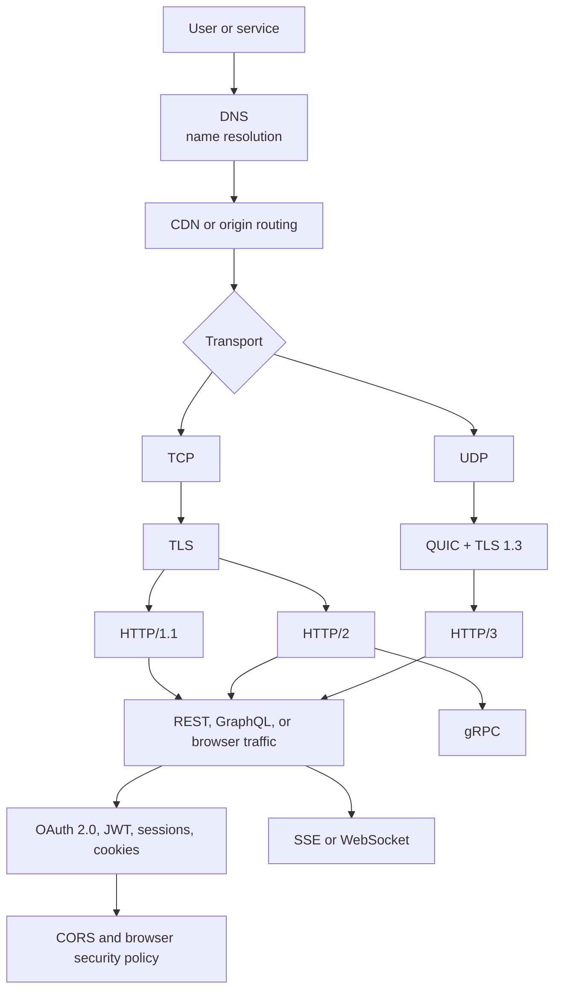

# Module 02: Networking — Topic Guides

[← Back to Main Documentation Index](../README.md) · [Read the Complete Module Guide](../02-networking.md)

Welcome to the topic-wise deep-dive study guide directory for **Module 02: Networking**. প্রতিটি ফাইলে বেসিক থেকে Senior/Staff Engineer লেভেল পর্যন্ত বিস্তারিত নেটওয়ার্কিং ধারণা, প্যাকেট ও রিকোয়েস্ট ফ্লো আর্কিটেকচার ডায়াগ্রাম, বাস্তব প্রোডাকশন উদাহরণ, ট্রেড-অফ টেবিল, ফেইলিউর মোড এবং ১৫টি করে ইন্টারভিউ প্রশ্ন ও সমাধান অন্তর্ভুক্ত রয়েছে।

---

## 📘 Download the Visual PDF Guide

[**Networking: A Visual Guide — by Masud Rana**](../../output/pdf/networking-visual-guide-masud-rana.pdf)

This polished 22-page handbook includes a designed cover, a categorized table of contents, and one easy-to-understand page with a minimal flow chart for every networking topic in this module.

---

## 🗺️ Networking Topic Relationship Map

The map shows how the guides fit together: naming and edge routing select a destination, transport moves data, TLS protects it, application protocols define message semantics, and identity or browser controls decide who may use the resulting capabilities.

---

## 📚 Categorized Topic Map

### ১. Transport Layer Protocols (ট্রান্সপোর্ট লেয়ার প্রোটোকল)
- 📌 [TCP/IP Protocol Suite](tcp-ip.md) — 3-Way Handshake, 4-Way Teardown, Sliding Window Flow Control, Congestion Control (CUBIC/BBR), and `TIME_WAIT` socket tuning.
- 📌 [UDP (User Datagram Protocol)](udp.md) — 8-byte lightweight header, connectionless fire-and-forget streaming, WebRTC, DNS, and Forward Error Correction (FEC).
- 📌 [QUIC Protocol](quic.md) — UDP-based transport, 0-RTT connection resumption, solving transport Head-of-Line blocking, and Connection Migration across Wi-Fi/Cellular.

---

### ২. Web Application Protocols (ওয়েব অ্যাপ্লিকেশন প্রোটোকল)
- 📌 [HTTP/1.1 Protocol](http-1-1.md) — Persistent Connections (Keep-Alive), Chunked Transfer Encoding, failed pipelining, and domain sharding workarounds.
- 📌 [HTTP/2 Protocol](http-2.md) — Binary Framing layer, stream multiplexing over a single TCP stream, HPACK header compression, and TCP packet-loss vulnerability.
- 📌 [HTTP/3 Protocol](http-3.md) — QUIC-based HTTP, QPACK out-of-order header compression, independent stream delivery, and edge deployment strategies.
- 📌 [HTTPS (HTTP Secure)](https.md) — TLS encapsulation, Symmetric vs Asymmetric hybrid cryptography, HSTS Preloading, and OCSP Stapling.

---

### ৩. Naming, Routing & Edge (নেমিং, রাউটিং ও এজ নেটওয়ার্ক)
- 📌 [DNS (Domain Name System)](dns.md) — Hierarchical resolution tree (Root, TLD, Authoritative), Record types (A, AAAA, CNAME, ALIAS, NS, MX, TXT), Anycast DNS, and DNSSEC.
- 📌 [Content Delivery Network (CDN)](cdn.md) — Edge PoPs, Push vs Pull CDN, `Cache-Control` directives, Origin Shielding, Dynamic Site Acceleration (DSA), and Cache Stampede prevention.

---

### ৪. Network Security & Encryption (নেটওয়ার্ক সিকিউরিটি ও এনক্রিপশন)
- 📌 [SSL/TLS (Transport Layer Security)](ssl-tls.md) — TLS 1.2 vs TLS 1.3 handshakes, Ephemeral Diffie-Hellman (ECDHE), Perfect Forward Secrecy (PFS), Mutual TLS (mTLS), and ACME / Let's Encrypt automation.

---

### ৫. Real-Time Communication (রিয়েল-টাইম কমিউনিকেশন)
- 📌 [WebSocket Protocol](websocket.md) — HTTP Upgrade handshake, full-duplex persistent bidirectional TCP streaming, ping/pong heartbeats, and Redis Pub/Sub horizontal scaling.
- 📌 [Server-Sent Events (SSE)](server-sent-events.md) — Unidirectional server-to-client streaming, `text/event-stream`, native auto-reconnection with `Last-Event-ID`, and LLM/GenAI token streaming.

---

### ৬. API Styles & Architectural Contracts (এপিআই স্টাইল ও চুক্তি)
- 📌 [REST API Architecture](rest-api.md) — Roy Fielding's 6 constraints, Richardson Maturity Model (Levels 0-3 / HATEOAS), Idempotent verbs, and Cursor-based pagination.
- 📌 [gRPC Remote Procedure Calls](grpc.md) — Protocol Buffers (Protobuf v3), HTTP/2 transport, 4 communication modes (Unary, Server/Client/Bi-directional streaming), and HTTP Trailers.
- 📌 [GraphQL Query Language](graphql.md) — Declarative client-driven data fetching, solving Over/Under-fetching, DataLoader for the $N+1$ problem, and query complexity / depth limiting.

---

### ৭. Identity, Browser Security & Sessions (আইডেন্টিটি ও ব্রাউজার সিকিউরিটি)
- 📌 [OAuth 2.0 & OpenID Connect (OIDC)](oauth-2.md) — Delegated authorization, Authorization Code Flow with PKCE, Grant types, and `id_token` vs `access_token`.
- 📌 [JWT (JSON Web Token)](jwt.md) — Header, Payload, Signature, Base64URL encoding, HS256 vs RS256 with JWKS, and the stateless revocation dilemma.
- 📌 [CORS (Cross-Origin Resource Sharing)](cors.md) — Same-Origin Policy (SOP), Preflight `OPTIONS` requests, core headers, and the fact that CORS does not protect against curl/Postman.
- 📌 [HTTP Cookies & Browser State](cookies.md) — `HttpOnly`, `Secure`, `SameSite` (Strict/Lax/None), XSS defense, CSRF mitigation, and third-party tracking phase-out.
- 📌 [Session Management](session-management.md) — Server-side sessions with distributed Redis clusters, CSPRNG session IDs, Sliding vs Absolute expiration, and "Logout from all devices".

---

## 💡 How to Use These Topic Guides
1. প্রতিটি টপিকের শুরুতে **Learning Checklist** পর্যবেক্ষণ করুন।
2. **Deep Dive Notes**-এ বাস্তব জীবনের অ্যানালজি, আর্কিটেকচার ডায়াগ্রাম এবং ইন্ডাস্ট্রির বাস্তব কেস স্টাডিগুলো পড়ুন।
3. **Senior / Staff Engineer Interview Defense** সেকশনে দেওয়া কৌশল ও ফলো-আপ প্রশ্নগুলো পর্যালোচনা করুন।
4. **Practice Questions** সেকশনের ১৫টি প্রশ্নের উত্তর নিজে নিজে দেওয়ার চেষ্টা করুন এবং শেষে ড্রপডাউনে **Answer Key** মিলিয়ে নিজের দক্ষতা যাচাই করুন।
