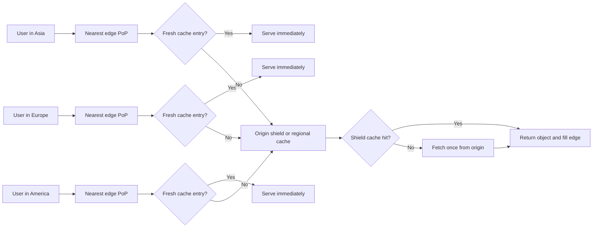

# Content Delivery Network (CDN)

[Back to Networking topics](README.md) · [Module guide](../02-networking.md)

## 📌 Learning Checklist
- [ ] Understand the architecture of a CDN: Edge Servers, Points of Presence (PoPs), and Origin Servers.
- [ ] Grasp Push CDN vs Pull CDN models.
- [ ] Master Cache Keys, `Cache-Control` headers (public, private, max-age, s-maxage, no-cache, no-store).
- [ ] Analyze Cache Invalidation strategies (Purge by URL, Tag/Surrogate-Key Invalidation, and Cache Busting).
- [ ] Understand Origin Shielding and Dynamic Site Acceleration (DSA).
- [ ] Defend CDN economics, edge computing (Cloudflare Workers/Lambda@Edge), and Cache Stampede in Staff-level interviews.

---

## 🗺️ CDN Request and Cache-Fill Diagram



**Diagram walkthrough:** DNS or Anycast routes each user to a nearby point of presence. Fresh objects are served at the edge; misses are coalesced through a shield so the origin sees fewer duplicate requests, after which cache headers determine freshness, revalidation, and eviction behavior.

---

## 📖 Deep Dive Notes

### 1. সহজ সংজ্ঞা ও Intuitive Mental Model

**CDN (Content Delivery Network)** হলো বিশ্বজুড়ে ভৌগোলিকভাবে বিস্তৃত ক্যাশিং প্রক্সি সার্ভারসমূহের (Edge Servers / Points of Presence - PoPs) একটি বিশাল ডিস্ট্রিবিউটেড নেটওয়ার্ক যা ব্যবহারকারীর শারীরিক অবস্থানের সবচেয়ে কাছাকাছি প্রান্ত (Network Edge) থেকে দ্রুততম সময়ে ওয়েব কনটেন্ট (ইমেজ, ভিডিও, জাভাস্ক্রিপ্ট, এপিআই রেসপন্স) ডেলিভার করে।

```
Without CDN (Origin in US East, User in Dhaka):
[ User in Dhaka ] ─── 10,000 miles across oceans (Latency: ~250ms) ───► [ Origin Server (Virginia) ]

With CDN (Cloudflare Edge PoP in Dhaka):
[ User in Dhaka ] ─── Local Fiber (Latency: <5ms!) ───► [ CDN Edge PoP (Dhaka) ] (Cached!)
                                                                 │
                                                   (Cache Miss)  ▼
                                                        [ Origin Server ]
```

> 🧠 **Intuitive Mental Model (আন্তর্জাতিক বই প্রকাশক ও স্থানীয় বুকস্টোর):**
> একটি বিখ্যাত বই আমেরিকার একটি ছাপাখানা থেকে ছাপা হয় (**Origin Server**)।
> - **সিডিএন ছাড়া:** বাংলাদেশের যেকোনো পাঠক বই কিনতে চাইলে প্রতিবার আমেরিকা থেকে এয়ার কুরিয়ারে বই আনতে হয়। বই পৌঁছাতে ২ সপ্তাহ সময় লাগে এবং বিশাল আন্তর্জাতিক শিপিং খরচ হয় (**High Latency & Bandwidth Cost**)।
> - **সিডিএন সহ:** প্রকাশক বিশ্বের প্রতিটি বড় শহরে (যেমন ঢাকা, লন্ডন, টোকিও) একটি করে স্থানীয় বুকস্টোর বা গুদাম (**Edge PoP**) খুলে রেখেছেন। প্রথমবার বইটি এনে লোকাল বুকস্টোরে ১০০ কপি রেখে দেওয়া হলো (**Caching**)। এবার বাংলাদেশের যে কেউ অর্ডার দিলে মাত্র ১০ মিনিটে পাশের গলি থেকে বইটি হাতে পেয়ে যায় (**Sub-5ms Latency**)! আমেরিকার মূল ছাপাখানায় কোনো অতিরিক্ত ভিড় হয় না (**Origin Offloading**)।

---

### 2. Push CDN বনাম Pull CDN

| বৈশিষ্ট্য | Pull CDN (স্বয়ংক্রিয় ক্যাশিং) | Push CDN (ম্যানুয়াল আপলোড) |
|---|---|---|
| **কীভাবে কাজ করে?** | ইউজার যখন প্রথমবার কোনো ফাইল চায়, এজ সার্ভারে ক্যাশ মিস হলে সে নিজে গিয়ে অরিজিন থেকে ফাইলটি এনে ক্লায়েন্টকে দেয় এবং লোকালি ক্যাশ করে। | ইঞ্জিনিয়ার বা সিআই/সিডি স্ক্রিপ্ট নতুন বিল্ডের সময় সমস্ত ফাইল সরাসরি সিডিএন স্টোরেজে আপলোড করে পুশ করে দেয়। |
| **রিসোর্স ট্রাফিক** | শুধু যেসব ফাইল ইউজার দেখতে চায় কেবল সেগুলোই ক্যাশে থাকে (সাশ্রয়ী মেমোরি)। | অপ্রয়োজনীয় বা অপ্রচলিত ফাইলও সিডিএন স্টোরেজে জায়গা দখল করে থাকে। |
| **ফার্স্ট-ইউজার ল্যাটেন্সি** | প্রথম ইউজারের ক্ষেত্রে "Cache Miss" হয় (সামান্য স্লো)। | প্রথম ব্যবহারকারীও সাথে সাথে ১০০% "Cache Hit" পায়। |
| **আদর্শ ব্যবহার** | ভারী ওয়েব অ্যাপ্লিকেশন, এপিআই, মিডিয়া স্ট্রিমিং (Cloudflare, Fastly, CloudFront)। | সফটওয়্যার ইন্সটলার, ওএস প্যাচ, গেম ইনস্টল ফাইল (GBs of static binaries)। |

---

### 3. HTTP Caching Headers: গভীর কারিগরি ব্যবচ্ছেদ

```
Cache-Control: public, max-age=3600, s-maxage=86400, stale-while-revalidate=60
```

- **`public`:** যেকোনো মধ্যবর্তী প্রক্সি ও সিডিএন রেসপন্সটি ক্যাশ করতে পারে।
- **`private`:** শুধুমাত্র ইউজারের ব্রাউজার ক্যাশ করতে পারে; কোনো পাবলিক সিডিএন এটি ক্যাশ করবে না (ব্যক্তিগত ড্যাশবোর্ড বা ইউজারের প্রোফাইল ডেটার জন্য)।
- **`max-age=3600`:** ইউজারের ব্রাউজারে ক্যাশটি ১ ঘণ্টা (৩৬০০ সেকেন্ড) তাজা (Fresh) থাকবে।
- **`s-maxage=86400`:** শেয়ার্ড ক্যাশ বা সিডিএন এজ সার্ভারে এটি ২৪ ঘণ্টা (৮৬,৪০০ সেকেন্ড) ক্যাশ থাকবে (ব্রাউজার `max-age`-কে ওভাররাইড করে)।
- **`no-cache`:** ক্যাশ করা যাবে, কিন্তু প্রতিবার ব্যবহার করার আগে সার্ভারে গিয়ে ভ্যালিডেট (`ETag` দিয়ে 304 Not Modified চেক) করে আসতে হবে।
- **`no-store`:** কোনো অবস্থাতেই মেমোরি বা ডিস্কে ডেটা সেভ করা যাবে না (যেমন: ক্রেডিট কার্ড বা পাসওয়ার্ড ডেটা)।
- **`stale-while-revalidate=60`:** ক্যাশের মেয়াদ শেষ হয়ে গেলেও পরবর্তী ৬০ সেকেন্ড পর্যন্ত ইউজারকে পুরোনো ক্যাশড ডেটা ইনস্ট্যান্টলি দেখাও, এবং ব্যাকগ্রাউন্ডে অরিজিন থেকে নতুন ডেটা ফেচ করে ক্যাশ আপডেট করে নাও (জিরো ইউজার ল্যাটেন্সি!)।

---

### 4. Cache Invalidation & Cache Busting

ক্যাশে থাকা ফাইল যখন ওয়েবসাইটে পরিবর্তন হয়, তখন ইউজারকে কীভাবে নতুন ফাইল দেবেন?

1. **Content-Hash Cache Busting (গোল্ডেন স্ট্যান্ডার্ড):**
   - ফাইলের নামেই তার কন্টেন্টের হ্যাশ যুক্ত করা: `bundle.a8f9c2.js`।
   - কোড পরিবর্তন হলে বিল্ড সিস্টেমে নতুন নাম হবে: `bundle.d4e1b7.js`।
   - ফলে সিডিএন ও ব্রাউজারে `max-age=31536000` (১ বছর) ক্যাশ কনফিগার করা যায়! নাম বদলে যাওয়ায় কোনো ক্যাশ ইনভ্যালিডেশন রিকোয়েস্ট ছাড়াই ইউজার ইনস্ট্যান্ট নতুন ফাইল পায়।
2. **Surrogate-Keys / Cache-Tags (Fastly & Cloudflare):**
   - অরিজিন রেসপন্সের সাথে একটি হেডার পাঠায়: `Surrogate-Key: product-123 blog-456`।
   - প্রোডাক্ট ১২৩-এর দাম আপডেট হলে ব্যাকএন্ড থেকে সিডিএন এপিআই-তে একটি মাত্র পার্জ কল পাঠানো হয়: `Purge-Tag: product-123`। মুহূর্তের মধ্যে বিশ্বের সমস্ত এজ নোড থেকে ওই প্রোডাক্টের সমস্ত ক্যাশড পেজ ইনভ্যালিডেট হয়ে যায়।

---

### 5. Origin Shielding & Dynamic Site Acceleration (DSA)

```
[ 100 Edge PoPs across the globe ]
                 │ (100 parallel cache-misses)
                 ▼
     ┌───────────────────────┐
     │     Origin Shield     │  <-- Single dedicated Regional CDN Cache
     │  (AWS us-east-1 POP)  │      Buffers & absorbs all edge misses!
     └───────────┬───────────┘
                 │ (Only 1 request to Origin!)
                 ▼
     [ Customer Origin Server ]
```

1. **Origin Shielding:** বিশ্বের ১০০টি এজ সার্ভারে একই সাথে ক্যাশ মিস হলে অরিজিন সার্ভারের ওপর ট্রাফিকের সুনামি হতে পারে। অরিজিনের ঠিক সামনে একটি সেন্ট্রাল সিডিএন শিল্ড রাখা হয়, যা এজ মিসগুলোকে শুষে নিয়ে অরিজিনে মাত্র ১টি রিকোয়েস্ট পাঠায়।
2. **Dynamic Site Acceleration (DSA):** ডাইনামিক ডেটা যা ক্যাশ করা যায় না (যেমন: লাইভ স্টক মার্কেট রেট বা কার্ট চেকআউট), সেখানেও সিডিএন লাভজনক!
   - ব্যবহারকারীর মোবাইল থেকে নিকটবর্তী এজ পপ পর্যন্ত ইন্টারনেট দ্রুততম পাথে পৌঁছায়।
   - এজ পপ থেকে অরিজিন সার্ভার পর্যন্ত সিডিএন কোম্পানির নিজস্ব অপটিমাইজড প্রাইভেট ফাইবার ব্যাকবোন এবং **Pre-warmed Long-lived TCP/TLS Connection Pool** দিয়ে ডেটা পাঠানো হয়—যা পাবলিক ইন্টারনেটের চেয়ে ৩ গুণ দ্রুততর।

---

### 6. Failure Modes & Production Mitigations

#### Failure Mode 1: Cache Stampede (Thundering Herd on Cache Expiry)
- **ঝুঁকি:** একটি হাই-ট্রাফিক হোমপেজ বা টিকিটের পেজের ক্যাশ মেয়াদ শেষ হলো। ১ সেকেন্ডের মধ্যে ১০০,০০০ কনকারেন্ট রিকোয়েস্ট ক্যাশ মিস পেয়ে একসাথে মূল অরিজিন সার্ভারে গিয়ে আঘাত করল। অরিজিন ডাটাবেজ ক্র্যাশ করল।
- **প্রতিরোধ (Mitigation):** **Origin Request Collapsing (Fastly / Nginx proxy_cache_use_stale):** প্রথম রিকোয়েস্টটিকে অরিজিনে পাঠিয়ে বাকি ৯৯,৯৯৯টি রিকোয়েস্টকে এজ প্রক্সিতে ১ সেকেন্ড অপেক্ষা করানো অথবা `stale-while-revalidate` দিয়ে পুরোনো ক্যাশ রিটার্ন করা।

---

### 7. Senior / Staff Engineer Interview Defense

> **ইন্টারভিউয়ার:** *"আমাদের সিস্টেমে ক্যাশিং থাকা সত্ত্বেও নতুন প্রোডাক্ট রিলিজের পর অরিজিন সার্ভার আউটেজে পড়ে যায়। ক্যাশ কি (Cache Key) ডিজাইন এবং স্ট্যাম্পিড রোধে আপনি কী করবেন?"*
>
> 💡 **Staff-Level উত্তরের কাঠামো:**
> "এটি অত্যন্ত পরিচিত Cache Stampede এবং Poor Cache Key Normalization সমস্যা। আমাদের সমাধান হবে ত্রিস্তরীয়:
> 1. **Cache Key Normalization:** বাই ডিফল্ট সিডিএন পুরো ইউআরএলকে ক্যাশ কি বানায়। ইউজাররা ট্র্যাকিং প্যারামিটার (যেমন `?utm_source=facebook` বা `?ref=twitter`) দিয়ে ঢুকলে প্রতি লিঙ্কে ক্যাশ ফ্র্যাগমেন্টেশন (Cache Miss) ঘটে। আমরা এজে সিডিএন রুলে অপ্রয়োজনীয় ট্র্যাকিং কুয়েরি প্যারামিটারগুলো স্ট্রিপ (Strip) করে ক্যাশ হিট রেশিও (Hit Ratio) ৯৯%-এ উন্নীত করব।
> 2. **Request Collapsing (Coalescing):** সিডিএন এজে `proxy_cache_use_stale updating` এবং রিকোয়েস্ট কোয়ালেসিং এনাবল করব। ক্যাশ মিসের মুহূর্তে শুধুমাত্র একটি একক রিকোয়েস্ট অরিজিনে যাবে; বাকি সমস্ত কনকারেন্ট ক্লায়েন্ট এজেই বাফার হবে এবং প্রথম কলের রেসপন্স একসাথে শেয়ার করবে।
> 3. **Origin Shielding ও Stale-While-Revalidate:** অরিজিনের ঠিক মুখে একটি ডেডিকেটেড শিল্ড রিজিয়ন রাখব এবং রেসপন্সে `stale-while-revalidate` যুক্ত করব যাতে ব্যাকএন্ড ডেটা আপডেট করার সময়ও গ্রাহকরা সাব-৫ms ল্যাটেন্সিতে প্রিভিয়াস ক্যাশড পেজ দেখতে পান—কোনো ইউজার এরর ফেস করবে না।"

---

## 📝 Practice Questions

```markdown
### Basic Practice Questions
1. CDN-এর মূল সংজ্ঞা কী এবং এটি কীভাবে ওয়েব ল্যাটেন্সি নাটকীয়ভাবে কমায়?
2. Point of Presence (PoP) বলতে কী বোঝায়?
3. Pull CDN এবং Push CDN-এর মধ্যে মূল পার্থক্য কী?
4. `Cache-Control: private` এবং `Cache-Control: public`-এর মধ্যে পার্থক্য কী?
5. `no-cache` এবং `no-store` হেডারের মধ্যে সূক্ষ্ম পার্থক্যটি কী?

### Intermediate Practice Questions
6. Cache Stampede (বা Thundering Herd on Cache Expiry) কী এবং রিকোয়েস্ট কোয়ালেসিং কীভাবে এটি সমাধান করে?
7. `stale-while-revalidate` হেডার কীভাবে ইউজার ল্যাটেন্সি শূন্য রেখে ব্যাকগ্রাউন্ডে ক্যাশ ফ্রেশ করে?
8. Content-Hash Cache Busting (যেমন `app.3a8f9.js`) কেন সবচেয়ে নিরাপদ ক্যাশিং কৌশল?
9. Origin Shielding কী এবং এটি কীভাবে ক্যাশ মিসের সময় অরিজিন সার্ভারের ওপর লোড কমায়?
10. Dynamic Site Acceleration (DSA) কীভাবে নন-ক্যাশেবল ডাইনামিক এপিআই রিকোয়েস্টের ল্যাটেন্সি অপ্টিমাইজ করে?

### Advanced / Staff-Level Questions
11. Surrogate-Keys (বা Cache-Tags) কীভাবে হাজার হাজার সম্পর্কিত ক্যাশড পেজকে একটিমাত্র এপিআই কলে গ্লোবালি ইনভ্যালিডেট করতে ব্যবহৃত হয়?
12. Edge Computing (যেমন Cloudflare Workers / Fastly Compute@Edge / AWS Lambda@Edge) কীভাবে এপিআই গেটওয়ে ও অথেনটিকেশনের কাজকে অরিজিন সার্ভার থেকে অফলোড করে?
13. ই-কমার্স প্ল্যাটফর্মে পারসোনালাইজড কনটেন্ট (যেমন "স্বাগতম, জন") ক্যাশ করতে Edge Side Includes (ESI) বা সার্ভার-স্লাইস ক্যাশিং কীভাবে কাজ করে?
14. ক্যাশ কি-তে কুকি বা অথেনটিকেশন হেডার অন্তর্ভুক্ত করলে ক্যাশ হিট রেশিও এবং সিকিউরিটির মধ্যে যে দ্বন্দ্ব তৈরি হয়, তা কীভাবে অপ্টিমাইজ করবেন?
15. সিডিএন প্রোভাইডার আউটেজের সময় (যেমন Fastly বা Cloudflare-এর ঐতিহাসিক গ্লোবাল বিভ্রাট) Multi-CDN আর্কিটেকচার এবং ডাইনামিক ডিএনএস স্টিয়ারিং কীভাবে ব্যবসায়িক ধারাবাহিকতা রক্ষা করে?
```

---

## 🔑 Answer Key & Self-Test Evaluation

<details>
<summary>👉 <b>Answer Key ও সমাধান দেখতে এখানে ক্লিক করুন</b></summary>

1. **সংজ্ঞা:** বিশ্বজুড়ে বিস্তৃত ক্যাশিং এজ সার্ভারের নেটওয়ার্ক যা ইউজারের ভৌগোলিক নিকটবর্তী স্থান থেকে কনটেন্ট পরিবেশন করে ল্যাটেন্সি কমায়।
2. **PoP:** পয়েন্ট অফ প্রেজেন্স; কোনো নির্দিষ্ট শহরে সিডিএন কোম্পানির লোকাল ডেটাসেন্টার যেখানে এজ সার্ভারগুলো বসানো থাকে।
3. **Pull vs Push:** Pull ক্যাশ মিস হলে অরিজিন থেকে নিজে ডেটা টানে; Push-এ ডেভেলপার আগে থেকেই সমস্ত ডেটা সিডিএন স্টোরেজে আপলোড করে রাখে।
4. **public vs private:** public যেকোনো পাবলিক সিডিএন ও প্রক্সি ক্যাশ করতে পারে; private কেবল ইউজারের ব্রাউজারের লোকাল মেমোরির জন্য নির্ধারিত।
5. **no-cache vs no-store:** no-cache ক্যাশ সেভ করে কিন্তু ব্যবহারের আগে সার্ভারে ETag ভ্যালিডেশন চায়; no-store মেমোরি বা ডিস্কে কোনো ডেটা সেভ করতেই নিষেধ করে।
6. **Cache Stampede:** ক্যাশ শেষ হলে হাজার হাজার ইউজার একসাথে অরিজিনে রিকোয়েস্ট পাঠায়। কোয়ালেসিং প্রথম রিকোয়েস্ট অরিজিনে পাঠিয়ে বাকিগুলোকে এজেই বাফার করে রেজাল্ট শেয়ার করায়।
7. **stale-while-revalidate:** মেয়াদোত্তীর্ণ ক্যাশ ইউজারকে সাথে সাথে দিয়ে দেয় এবং ব্যাকগ্রাউন্ডে নতুন ফাইল এনে পরবর্তী ইউজারের জন্য প্রস্তুত রাখে।
8. **Hash Busting:** কন্টেন্ট বদলালেই ফাইলের নাম বদলে যায়, ফলে ১ বছর ক্যাশ করলেও কোনো পুরোনো ফাইল দেখানোর ঝুঁকি থাকে না।
9. **Origin Shielding:** সমস্ত এজ পপের মাঝে একটি সেন্ট্রাল ক্যাশিং লেয়ার রাখা, ফলে ১০০টি এজ মিস হলেও অরিজিনে মাত্র ১টি রিকোয়েস্ট যায়।
10. **DSA সুবিধা:** সিডিএন-এর অপটিমাইজড প্রাইভেট ফাইবার রুট এবং প্রি-কানেক্টেড টিসিপি/টিএলএস কানেকশন পুল ব্যবহার করায় ডাইনামিক ডেটাও ইন্টারনেটের চেয়ে দ্রুত পৌঁছায়।
11. **Surrogate-Keys:** রেসপন্সে ট্যাগ যুক্ত করা। অরিজিন সিডিএনকে বলে `Purge-Tag: shoes` দিলে ওই ট্যাগের সমস্ত পেজ ১ সেকেন্ডে বিশ্বজুড়ে মুছে যায়।
12. **Edge Computing:** এজ সার্ভারে লাইটওয়েট V8 আইসোলেটে জাভাস্ক্রিপ্ট/Wasm কোড চালিয়ে ইউজারের জিও-আইপি রাউটিং, অথেনটিকেশন ও হেডার রিরাইট করা।
13. **Edge Side Includes (ESI):** মূল পেজের ৯০% স্ট্যাটিক অংশ সিডিএন ক্যাশ থেকে নেয় এবং ইউজারের নামের ছোট ফ্র্যাগমেন্টটি অরিজিন থেকে এনে এজে অ্যাসেম্বল করে ইউজারকে পাঠায়।
14. **Cache Key Optimization:** পুরো কুকি ক্যাশ কি-তে না রেখে কেবল ইউজারের কান্ট্রি কোড বা কারেন্সি কোড ক্যাশ কি-তে রাখা, বাকি ব্যক্তিগত ডেটা ক্লায়েন্ট সাইড এপিআই দিয়ে ফেচ করা।
15. **Multi-CDN:** দুটি আলাদা সিডিএন (Cloudflare ও CloudFront) রাখা। এজ হেলথ চেক ফেইল করলে রুট৫৩ বা মেনডেলসন রাউটার ট্রাফিক অন্য সিডিএনে ঘুরিয়ে দেয়।

</details>
