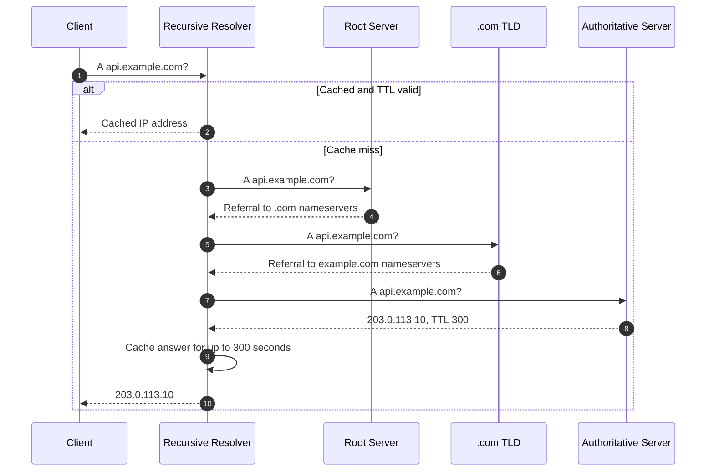

# DNS (Domain Name System)

[Back to Networking topics](README.md) · [Module guide](../02-networking.md)

## 📌 Learning Checklist
- [ ] Understand the hierarchical architecture of DNS (Root, TLD, Authoritative, and Recursive Resolvers).
- [ ] Master Recursive vs Iterative resolution flows.
- [ ] Learn core DNS Record Types: A, AAAA, CNAME, ALIAS/ANAME, NS, MX, TXT, and PTR.
- [ ] Understand DNS Caching, TTLs (Time to Live), and Propagation delays.
- [ ] Analyze modern DNS routing: Anycast DNS, GeoDNS, Latency-based routing, and Failover.
- [ ] Defend DNS-based DDoS mitigation and modern encrypted DNS (DoH / DoT) in Staff-level interviews.

---

## 🗺️ DNS Resolution Diagram



**Diagram walkthrough:** The client asks one recursive resolver for a complete answer. On a miss, that resolver follows iterative referrals from the root to the TLD and then the domain’s authoritative server; caching at each level reduces latency and load until the relevant TTL expires.

---

## 📖 Deep Dive Notes

### 1. সহজ সংজ্ঞা ও Intuitive Mental Model

**DNS (Domain Name System)** হলো সমগ্র ইন্টারনেটের বৈশ্বিক ফোনবুক বা ডিরেক্টরি সার্ভিস। কম্পিউটার বা রাউটাররা একে অপরকে চেনে নিউমেরিক আইপি অ্যাড্রেস (যেমন: `142.250.190.46` বা IPv6 `2607:f8b0:4005::200e`) দিয়ে, যা মানুষের পক্ষে মুখস্থ রাখা প্রায় অসম্ভব। 

DNS মানুষের বোধগম্য ডোমেন নামকে (যেমন: `google.com`) কম্পিউটারের বোধগম্য আইপি অ্যাড্রেসে স্বয়ংক্রিয়ভাবে অনুবাদ করে।

```
[ Human User ] ─── Enters "example.com" ───► [ DNS RESOLVER ]
                                                     │
                                                     ▼
                                        Returns: "93.184.216.34"
                                                     │
[ Human User ] ◄── Connects to Server ───────────────┘
```

> 🧠 **Intuitive Mental Model (মোবাইল ফোনের কন্টাক্ট লিস্ট অ্যানালজি):**
> আপনার ফোনে ৫০০ জন বন্ধুর নম্বর সেভ করা আছে। 
> আপনি কাউকে কল দিতে চাইলে তার ১০ বা ১১ ডিজিটের ফোন নম্বর মনে রাখেন না; আপনি সার্চ বক্সে লেখেন "Rahim" এবং কল বাটনে চাপ দেন। 
> আপনার ফোনের ব্যাকগ্রাউন্ড অপারেটিং সিস্টেম "Rahim" নামটির সাথে লিংক করা আসল ফোন নম্বরটি খুঁজে বের করে কল ডায়াল করে। DNS হলো পুরো বিশ্বের বিলিয়ন কম্পিউটারের জন্য ঠিক এই কন্টাক্ট লিস্ট!

---

### 2. The Hierarchical Resolution Tree & Architecture

DNS কোনো একক সার্ভারে চলে না; এটি একটি বিশাল ডিস্ট্রিবিউটেড হায়ারার্কিক্যাল ডাটাবেজ:

```
[ Root DNS Servers "." ] (13 Root Server Identities: A through M, 1000+ Anycast instances)
          │
          ▼
[ Top-Level Domain (TLD) Servers ] (".com", ".org", ".edu", ".io")
          │
          ▼
[ Authoritative Nameservers ] (AWS Route 53, Cloudflare - holds actual DNS records)
```

#### Recursive বনাম Iterative DNS Resolution Flow:

```
[ Client Browser ]
        │ (1) "What is api.example.com?"
        ▼
[ Recursive Resolver (ISP / Google 8.8.8.8 / Cloudflare 1.1.1.1) ]
        │
        │ ─── (2) Ask Root ("."): "Where is .com?" ─────────────────► [ Root Server ]
        │ <── (3) Root replies: "Go to .com TLD at 192.5.6.30" ───────┘
        │
        │ ─── (4) Ask TLD: "Where is example.com?" ─────────────────► [ TLD Server (.com) ]
        │ <── (5) TLD replies: "Go to Authoritative NS (Route53)" ───┘
        │
        │ ─── (6) Ask Authoritative: "What is IP of api.example.com?" ─► [ Authoritative NS ]
        │ <── (7) Authoritative replies: "It is 104.21.45.10 (TTL=300s)" ─┘
        ▼
[ Client Browser ] <── (8) Returns IP: 104.21.45.10 (Cached locally!)
```

---

### 3. অপরিহার্য DNS রেকর্ডসমূহ (Core Record Types)

| রেকর্ড টাইপ | কাজ ও উদ্দেশ্য | বাস্তব উদাহরণ |
|---|---|---|
| **A** | একটি ডোমেন নামকে IPv4 অ্যাড্রেসে ম্যাপ করে | `example.com -> 93.184.216.34` |
| **AAAA** | একটি ডোমেন নামকে আধুনিক ১২৮-বিট IPv6 অ্যাড্রেসে ম্যাপ করে | `example.com -> 2606:2800:220:1::` |
| **CNAME** | একটি ডোমেন নামকে অন্য একটি ডোমেন নামের সাথে এলিয়াস (Canonical Name) করে | `www.example.com -> example.com` |
| **ALIAS / ANAME** | রুট বা অ্যাপেক্স ডোমেনে (`example.com`) সি-নেম লাইক রাউটিং দেয় (RFC স্পেক ভায়োলেশন ছাড়া) | `example.com -> my-alb-123.amazonaws.com` |
| **NS** | ডোমেনটির জন্য দায়িত্বপ্রাপ্ত অথরিটেটিভ নেমসার্ভার তালিকা | `ns1.awsdns.com`, `ns2.awsdns.com` |
| **MX** | ইমেইল রিসিভ করার জন্য মেইল সার্ভার তালিকা ও প্রায়োরিটি | `10 aspmx.l.google.com` |
| **TXT** | টেক্সট স্টোর করা; ডোমেন ওনারশিপ ভেরিফিকেশন ও স্প্যাম প্রোটেকশন (SPF, DKIM, DMARC) | `v=spf1 include:_spf.google.com ~all` |
| **PTR** | রিভার্স ডিএনএস (Reverse DNS): আইপি অ্যাড্রেস থেকে ডোমেন নাম খোঁজা | `34.216.184.93.in-addr.arpa -> example.com` |

---

### 4. আধুনিক DNS রাউটিং পলিসিসমূহ (Advanced Routing)

1. **Anycast DNS:** একটি একক আইপি অ্যাড্রেস বিশ্বের ২০০টিরও বেশি ডেটাসেন্টার থেকে BGP রাউটিংয়ে অ্যানাউন্স করা হয়। ইন্টারনেট স্বয়ংক্রিয়ভাবে নিকটবর্তী ডেটাসেন্টারে প্যাকেট পাঠায় (ল্যাটেন্সি কমায় এবং DDoS প্রতিরোধ করে)।
2. **GeoDNS (Geolocation Routing):** ব্যবহারকারী কোন দেশে বা মহাদেশে আছেন তার আইপি দেখে নিকটবর্তী রিজিওনের সার্ভার আইপি রিটার্ন করা (যেমন ইউরোপের ইউজারকে ফ্রাঙ্কফুর্টের আইপি, এশিয়ার ইউজারকে সিঙ্গাপুরের আইপি)।
3. **Latency-based Routing:** বিভিন্ন ক্লাউড রিজিওনের নেটওয়ার্ক ল্যাটেন্সি মেপে ক্লায়েন্টের জন্য সর্বনিম্ন ল্যাটেন্সির আইপি প্রদান করা।
4. **Weighted Round Robin:** ট্রাফিকের ৮০% বর্তমান ক্লাস্টারে এবং ২০% ক্যানারি ক্লাস্টারে রাউট করা।
5. **DNS Failover:** নিয়মিত সার্ভারে হেলথ চেক করা; কোনো রিজিওন ক্র্যাশ করলে ডিএনএস রেকর্ড থেকে তার আইপি অবিলম্বে সরিয়ে ব্যাকআপ রিজিওনের আইপি দেওয়া।

---

### 5. Failure Modes & Production Mitigations

#### Failure Mode 1: Long TTL causing Outage Trapping
- **ঝুঁকি:** আপনি একটি ডাটাবেজ বা ওয়েব সার্ভার মাইগ্রেশন করছেন। আপনার DNS রেকর্ডের TTL ছিল ৮৬,৪০০ সেকেন্ড (২৪ ঘণ্টা)। সার্ভার ডাউন হয়ে যাওয়ার পর আপনি DNS রেকর্ড পরিবর্তন করলেও বিশ্বের লক্ষ লক্ষ ইউজারের ব্রাউজার ও আইএসপি পুরোনো ক্যাশ ধরে রেখে ২৪ ঘণ্টা ধরে ক্র্যাশ পেজ দেখতে থাকে।
- **প্রতিরোধ (Mitigation):** কোনো পরিকল্পিত মাইগ্রেশন বা রিলিজের অন্তত ৪৮ ঘণ্টা আগে **TTL কমিয়ে ৬০ বা ৩০০ সেকেন্ড (১-৫ মিনিট)** করে রাখা। মাইগ্রেশন সফলভাবে শেষ হওয়ার পর পুনরায় TTL বাড়ানো।

#### Failure Mode 2: DNS Poisoning (Kaminsky Attack)
- **ঝুঁকি:** আক্রমণকারী ক্ষতিকর ভুয়া আইপি দিয়ে রিকার্সিভ রেজলভারের ক্যাশ করাপ্ট করে দেয়, ফলে আসল ওয়েবসাইটে ঢুকতে গিয়ে ব্যবহারকারীরা হ্যাকারের ফিশিং সাইটে চলে যায়।
- **প্রতিরোধ:** **DNSSEC (DNS Security Extensions)** এনাবল করা যা ক্রিপ্টোগ্রাফিক ডিজিটাল সিগনেচার দিয়ে প্রতিটি ডিএনএস রেকর্ডের সত্যতা প্রমাণ করে।

---

### 6. Senior / Staff Engineer Interview Defense

> **ইন্টারভিউয়ার:** *"কেন CNAME রেকর্ড কখনও রুট ডোমেনে (যেমন `example.com`-এর Apex/Zone apex-এ) ব্যবহার করা যায় না? এবং আধুনিক ক্লাউডে (AWS Route53 / Cloudflare) কীভাবে এই সমস্যা সমাধান করা হয়?"*
>
> 💡 **Staff-Level উত্তরের কাঠামো:**
> "এটি DNS স্পেসিফিকেশনের (RFC 1034 এবং RFC 2181) একটি অত্যন্ত মৌলিক আর্কিটেকচারাল সীমাবদ্ধতা:
> 1. **RFC স্পেক সংঘাত:** RFC নিয়ম অনুযায়ী, কোনো জোনের নোডে যদি একটি CNAME রেকর্ড থাকে, তবে সেই নোডে অন্য কোনো রেকর্ড থাকতে পারবে না। কিন্তু একটি রুট অ্যাপেক্স ডোমেনে (`example.com`) ডোমেন পরিচালনার জন্য অবশ্যই **SOA (Start of Authority)** এবং **NS (Name Server)** রেকর্ড থাকা বাধ্যতামূলক। ফলে রুট ডোমেনে CNAME বসালে ডিএনএস স্ট্যান্ডার্ড ভেঙে পুরো জোন করাপ্ট হয়ে যায়।
> 2. **ক্লাউড যুগে এর সমস্যা:** আধুনিক ক্লাউড লোড ব্যালেন্সারগুলো (যেমন AWS ALB) কোনো ফিক্সড আইপি দেয় না, তারা একটি ডাইনামিক হোস্টনেম দেয় (`my-lb.elb.amazonaws.com`)। ফলে রুটে CNAME ব্যবহার করতে না পারায় বিশাল জটিলতা তৈরি হতো।
> 3. **আধুনিক সমাধান (Route53 Alias / Cloudflare CNAME Flattening):**
>    - ক্লাউড প্রোভাইডাররা ভার্চুয়াল **ALIAS / ANAME** রেকর্ড উদ্ভাবন করেছে।
>    - নেমসার্ভারটি রুট ডোমেনের কুয়েরি পেলে ইন্টারনালি নিজে ক্লাউড লোড ব্যালেন্সারের হোস্টনেমটি সমাধান করে আসল 'A' রেকর্ড হিসেবে আইপি রিটার্ন করে।
>    - ফলে বাইরের ইন্টারনেটের চোখে এটি একটি নিখুঁত স্ট্যান্ডার্ড 'A' রেকর্ড, অথচ ব্যাকএন্ডে এটি CNAME-এর মতো ডাইনামিকালি ক্লাউড হোস্টনেমকে ট্র্যাক করে!"

---

## 📝 Practice Questions

```markdown
### Basic Practice Questions
1. DNS-এর মূল কাজ কী এবং এটি কোন পোর্টে চলে?
2. A Record এবং CNAME Record-এর মধ্যকার মৌলিক পার্থক্য কী?
3. Recursive DNS Resolver এবং Authoritative DNS Server-এর মধ্যে পার্থক্য কী?
4. DNS TTL (Time To Live) কী এবং এর কাজ কী?
5. একটি ওয়েবপেজ ব্রাউজারে খোলার সময় কম্পিউটার প্রথমে কোথায় DNS রেকর্ড খোঁজে?

### Intermediate Practice Questions
6. কেন রুট অ্যাপেক্স ডোমেনে (Zone Apex) সরাসরি CNAME রেকর্ড ব্যবহার করা নিষিদ্ধ এবং AWS Alias বা Cloudflare Flattening কীভাবে এটি সমাধান করে?
7. Anycast DNS কী এবং কীভাবে এটি গ্লোবালি ডিএনএস রেজোলিউশন ল্যাটেন্সি ৫ মিলিসেকেন্ডের নিচে নামিয়ে আনে?
8. GeoDNS কীভাবে কাজ করে এবং কনটেন্ট লোকালাইজেশন বা রেগুলেশনে এর ভূমিকা কী?
9. DNSSEC কী এবং কীভাবে এটি ক্রিপ্টোগ্রাফিক চেইন অফ ট্রাস্ট দিয়ে DNS Spoofing / Cache Poisoning প্রতিরোধ করে?
10. সার্ভার মাইগ্রেশনের পূর্বে কেন DNS TTL সাময়িকভাবে কমিয়ে আনা বাধ্যতামূলক?

### Advanced / Staff-Level Questions
11. DoH (DNS over HTTPS) এবং DoT (DNS over TLS) কীভাবে কাজ করে? কেন ঐতিহ্যবাহী পোর্ট ৫৩ আন-এনক্রিপ্টেড ডিএনএস একটি বিশাল প্রাইভেসি ঝুঁকি ছিল?
12. DNS-based Failover কেন একটি ডাটাবেজ ক্লাস্টারের জন্য একক ডিজাস্টার রিকভারি মেকানিজম হিসেবে ঝুঁকিপূর্ণ (আইএসপি ক্যাশিং এবং ব্রাউজার পিন্ড সকেটের প্রভাব)?
13. ক্লাউড এজ আর্কিটেকচারে EDNS Client Subnet (ECS - RFC 7871) কীভাবে সিডিএন রেজলভারকে ব্যবহারকারীর নিকটবর্তী এজ সার্ভারের আইপি রিটার্ন করতে সহায়তা করে এবং এর প্রাইভেসি ট্রেড-অফ কী?
14. DDoS মিটিগেশনে Anycast BGP কীভাবে টেরাবিট ভলিউমের ডিএনএস ফ্লাড আক্রমণকে বিশ্বজুড়ে শত শত এজ নোডে ছড়িয়ে দিয়ে স্বাভাবিক সেবা চালু রাখে?
15. Kubernetes ইন্টারনাল ক্লাস্টার নেটওয়ার্কিংয়ে CoreDNS কীভাবে সার্ভিস ডিসকভারি হ্যান্ডেল করে এবং "ndots:5" মিসকনফিগারেশন কীভাবে ক্লাস্টারে বিশাল ডিএনএস ওভারহেড তৈরি করে?
```

---

## 🔑 Answer Key & Self-Test Evaluation

<details>
<summary>👉 <b>Answer Key ও সমাধান দেখতে এখানে ক্লিক করুন</b></summary>

1. **সংজ্ঞা:** ডোমেন নামকে আইপিতে রূপান্তরকারী গ্লোবাল ডিরেক্টরি; এটি পোর্ট ৫৩-তে চলে (সাধারণত UDP, বড় ডেটাতে TCP)।
2. **A vs CNAME:** A রেকর্ড সরাসরি আইপি অ্যাড্রেস দেয়; CNAME একটি ডোমেনকে অন্য একটি ডোমেন নামের সাথে এলিয়াস করে।
3. **Recursive vs Authoritative:** Recursive ক্লায়েন্টের হয়ে সারা ইন্টারনেটে ঘুরে ঘুরে আইপি খুঁজে আনে; Authoritative ডোমেনের আসল মাস্টার রেকর্ডের মালিক।
4. **TTL:** একটি ডিএনএস রেকর্ড লোকাল ক্যাশে কত সেকেন্ড সংরক্ষণ থাকবে।
5. **লোকাল লুকআপ:** ব্রাউজার ক্যাশ $\rightarrow$ ওএস হোস্টস ফাইল ও কার্নেল ক্যাশ $\rightarrow$ লোকাল রাউটার $\rightarrow$ আইএসপির রিকার্সিভ রেজলভার।
6. **Apex CNAME সমস্যা:** RFC অনুযায়ী CNAME থাকলে আর কোনো রেকর্ড থাকতে পারে না, কিন্তু রুটে NS ও SOA বাধ্যতামূলক। Alias রেকর্ড ইন্টারনালি কুয়েরি করে স্ট্যান্ডার্ড 'A' রেকর্ড রিটার্ন করে সমস্যা সমাধান করে।
7. **Anycast DNS:** একটি একক আইপিতে শত শত ডেটাসেন্টার থাকে। রাউটার ইউজারের নিকটবর্তী সেন্টারে পাঠায়, ফলে প্যাকেট দ্রুত পৌঁছায় এবং বিশাল DDoS অ্যাটাক ড্রপ হয়।
8. **GeoDNS:** ক্লায়েন্টের আইপি দেখে তার ভৌগোলিক অবস্থানের নিকটবর্তী ডেটাসেন্টারের আইপি রিটার্ন করা।
9. **DNSSEC:** প্রতিটি ডিএনএস জোনে পাবলিক/প্রাইভেট কি দিয়ে ডিজিটাল সিগনেচার করা থাকে। রেজলভার সিগনেচার ভ্যালিডেট করে নিশ্চিত হয় রেকর্ডটি মাঝপথে টেম্পারড হয়নি।
10. **Pre-migration TTL:** মাইগ্রেশনের দিন নতুন আইপি দিলে যাতে পুরোনো ক্যাশ দ্রুত শেষ হয়ে ইউজার নতুন সার্ভারে যেতে পারে এবং ট্রাফিকের বিভ্রান্তি না হয়।
11. **DoH/DoT:** ঐতিহ্যবাহী ডিএনএস প্লেইন টেক্সটে যেত বলে ওয়াইফাই ও আইএসপি সব দেখত। DoH/DoT ট্র্যাফিককে TLS দিয়ে এনক্রিপ্ট করে সম্পূর্ণ গোপন রাখে।
12. **DNS Failover ঝুঁকি:** অনেক আইএসপি ও করপোরেট প্রক্সি জোর করে টিটিএল অমান্য করে পুরোনো আইপি ক্যাশ রাখে, এবং ব্রাউজার ইতিমধ্যে ওপেন থাকা টিসিপি কিপ-এলাইভ সকেট সহজে ড্রপ করে না।
13. **EDNS Client Subnet:** রেজলভার অথরিটেটিভকে ক্লায়েন্টের আইপির প্রথম ৩টি অক্টেট জানিয়ে দেয়, ফলে অথরিটেটিভ নিখুঁত লোকাল সিডিএন আইপি দেয়; তবে এটি ইউজারের সাবনেট প্রকাশ করে প্রাইভেসি কমায়।
14. **Anycast DDoS Defense:** আক্রমণ এক জায়গায় কেন্দ্রীভূত না হয়ে বিশ্বের ২০০টি ডেটাসেন্টারে ভাগ হয়ে যায়, ফলে কোনো একক পাইপ জ্যাম না হয়ে আক্রমণ এজেই বিলীন হয়ে যায়।
15. **K8s ndots:5:** ৫টির কম ডট থাকলে CoreDNS ক্লাস্টারের প্রতি সার্চ ডোমেন দিয়ে পর পর ৫টি ব্যর্থ কুয়েরি করে, যা CoreDNS পড স্যাচুরেট করে ফেলে। সমাধান: FQDN-এর শেষে ডট (`foo.bar.svc.cluster.local.`) দেওয়া।

</details>
