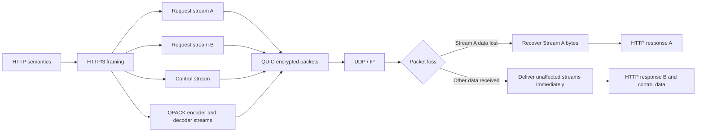

# HTTP/3 Protocol

[Back to Networking topics](README.md) · [Module guide](../02-networking.md)

## 📌 Learning Checklist
- [ ] Understand why HTTP/3 abandons TCP in favor of QUIC over UDP.
- [ ] Learn how HTTP/3 completely eliminates Transport-Level Head-of-Line (HoL) Blocking.
- [ ] Master QPACK Header Compression (the out-of-order, stream-independent evolution of HPACK).
- [ ] Analyze 0-RTT Connection Resumption and Mobile Connection Migration in production.
- [ ] Contrast HTTP/1.1 vs HTTP/2 vs HTTP/3 end-to-end performance.
- [ ] Defend HTTP/3 rollout strategies and fallbacks in Staff-level networking interviews.

---

## 🗺️ HTTP/3 over QUIC Diagram



**Diagram walkthrough:** HTTP/3 maps each exchange onto QUIC streams instead of placing every byte in one TCP sequence. QUIC still provides reliable ordered bytes within a stream, while loss recovery for one stream does not stop unrelated streams; QPACK coordinates compressed headers without recreating HTTP/2’s blocking behavior.

---

## 📖 Deep Dive Notes

### 1. সহজ সংজ্ঞা ও Intuitive Mental Model

২০২২ সালে IETF কর্তৃক প্রমিত (RFC 9114) **HTTP/3** হলো হাইপারটেক্সট ট্রান্সফার প্রোটোকলের আধুনিকতম প্রজন্ম। 

এটি গত তিন দশকের সনাতন **TCP ট্রান্সপোর্টের ইতি টেনে সম্পূর্ণভাবে UDP-ভিত্তিক QUIC প্রোটোকলের ওপর প্রতিষ্ঠিত হয়েছে**। এর ফলে ইন্টারনেটে সংযোগ স্থাপনের সময় কমে শূন্যে (0-RTT) নেমে এসেছে, প্যাকেট লস হলেও মাল্টিপ্লেক্সড স্ট্রিমগুলোতে কোনো হেড-অব-লাইন ব্লকিং ঘটে না, এবং মোবাইল ডিভাইসের ওয়াইফাই থেকে সেলুলারে আইপি পরিবর্তনে কোনো কানেকশন ড্রপ হয় না।

```
Evolution of Web Protocols:
HTTP/1.1 (1997) ──► Plain Text over TCP ───► Serial / Keep-Alive (HoL Blocking)
HTTP/2   (2015) ──► Binary over TCP ──────► Multiplexing (TCP Packet-loss Vulnerability)
HTTP/3   (2022) ──► Binary over QUIC (UDP) ► True Independent Streams + 0-RTT + Auto Mobile Migration
```

> 🧠 **Intuitive Mental Model (পৃথক ড্রোন ডেলিভারি বনাম একক মালবাহী ট্রেন):**
> - **HTTP/2 (একক মালবাহী ট্রেন):** একটি দীর্ঘ ট্রেনে ১০০টি বগি জুড়ে ১০০টি ফাইল পাঠানো হচ্ছে। ট্রেনটি একক রেললাইনের ওপর চলছে (**Single TCP stream**)। লাইনের ওপর একটি পাথর পড়ে ৩ নম্বর বগিটি লাইনচ্যুত হলো (**Packet Loss**)। পাথর না সরানো পর্যন্ত পুরো ট্রেনটি লাইনের ওপর দাঁড়িয়ে রইল—বাকি ৯৯টি বগির কোনো ক্ষতি না হলেও তারা গন্তব্যে যেতে পারছে না (**Head-of-Line Blocking**)।
> - **HTTP/3 (১০০টি স্বাধীন ড্রোন):** ১০০টি ফাইল ১০০টি আলাদা স্বায়ত্তশাসিত ড্রোনে তুলে আকাশে উড়িয়ে দেওয়া হলো (**QUIC over UDP**)। মাঝপথে বাতাসে একটি ড্রোন বিপদে পড়ে নষ্ট হলেও বাকি ৯৯টি ড্রোন তাদের নিজ নিজ গতিতে সেকেন্ডের মধ্যে গ্রাহকের বারান্দায় ল্যান্ড করল! শুধুমাত্র যে ড্রোনটি হারিয়েছে, কন্ট্রোল সেন্টার কেবল সেটিকে নতুন করে পাঠাল।

---

### 2. QPACK: স্বাধীন ও আউট-অব-অর্ডার হেডার কম্প্রেশন

HTTP/2-র HPACK কেন HTTP/3-তে কাজ করতে পারল না?
- HPACK ধরে নিয়েছিল যে সমস্ত ফ্রেম অবিকল ক্রমানুসারে (In-order) পৌঁছাবে, কারণ নিচে টিসিপি ছিল।
- কিন্তু QUIC-এ বিভিন্ন স্ট্রিম ভিন্ন ভিন্ন ক্রমে পৌঁছাতে পারে (Out-of-order delivery)। HPACK চালালে হেডার ডিকোড করতে গিয়ে আবার নতুন ধরণের ব্লকিং তৈরি হতো।
- **QPACK (RFC 9204)-এর সমাধান:**
  - এটি দুটি আলাদা ইউনিডাইরেকশনাল কন্ট্রোল স্ট্রিম ব্যবহার করে: **Encoder Stream** এবং **Decoder Stream**।
  - এনকোডার নতুন হেডার এন্ট্রি তৈরি করে এবং ডিকোডারের নিশ্চিতকরণ (Acknowledgment) পেলে তবেই সেটিকে রেফারেন্স হিসেবে ব্যবহার করে।
  - ফলে কোনো স্ট্রিম প্যাকেট লসের কারণে আটকে গেলেও অন্য স্ট্রিমগুলো স্বাধীনভাবে তাদের নিজস্ব হেডার ডিকোড করে কাজ চালিয়ে যেতে পারে।

---

### 3. Connection Migration: নিরবচ্ছিন্ন মোবাইল ইন্টারনেট

- ব্যবহারকারী ইউটিউব ভিডিও দেখতে দেখতে বাসা থেকে বের হলেন। ফোনটি ঘরের ওয়াইফাই থেকে ডিসকানেক্ট হয়ে সাথে সাথে ৪জি/৫জি সেলুলার টাওয়ারে কানেক্ট হলো।
- **HTTP/1.1 ও HTTP/2-তে কী ঘটত:** ফোনের আইপি অ্যাড্রেস বদলে যাওয়ায় টিসিপি সকেট সাথে সাথে ডেড হয়ে যেত। ভিডিও প্লেয়ার বাফারিং করত, নতুন করে ৩-ওয়ে টিসিপি এবং টিএলএস হ্যান্ডশেক করতে হতো।
- **HTTP/3-তে কী ঘটে:** QUIC আইপি অ্যাড্রেসের বদলে একটি ৬৪-বিট ক্রিপ্টোগ্রাফিক **Connection ID (CID)** ব্যবহার করে। আইপি বা পোর্ট বদলালেও ক্লায়েন্ট একই CID সহ প্যাকেট পাঠাতে থাকে। সার্ভার এক মিলিসেকেন্ডের জন্যও ভিডিও স্ট্রিমিং না থামিয়ে মসৃণভাবে নতুন আইপিতে ডেটা ট্রান্সফার অব্যাহত রাখে!

---

### 4. Alternatives & Complete Evolution Matrix

| মেট্রিক / বৈশিষ্ট্য | HTTP/1.1 | HTTP/2 | HTTP/3 |
|---|---|---|---|
| **আন্ডারলাইং ট্রান্সপোর্ট** | TCP | TCP | **QUIC (UDP)** |
| **সিকিউরিটি / এনক্রিপশন** | ঐচ্ছিক (HTTP বা HTTPS) | প্রায় বাধ্যতামূলক (TLS 1.2+) | **বাধ্যতামূলক ও ইন্টিগ্রেটেড (TLS 1.3)** |
| **কানেকশন সেটআপ ল্যাটেন্সি** | ৩-৪ RTT (TCP + TLS) | ২-৩ RTT (TCP + TLS) | **০ RTT (Reconnection) / ১ RTT (New)** |
| **হেড-অব-লাইন ব্লকিং** | অ্যাপ্লিকেশন ও ট্রান্সপোর্ট উভয় লেভেলে | শুধুমাত্র ট্রান্সপোর্ট (TCP) লেভেলে | **সম্পূর্ণ নির্মূল (Zero HoL Blocking)** |
| **হেডার কম্প্রেশন** | নেই | HPACK (Sequential) | **QPACK (Out-of-order)** |
| **মোবাইল নেটওয়ার্ক হ্যান্ডওভার** | কানেকশন ড্রপ ও রি-হ্যান্ডশেক | কানেকশন ড্রপ ও রি-হ্যান্ডশেক | **Connection Migration (Zero Disruption)** |

---

### 5. Production Adoption & Edge Deployment (Cloudflare & Google Case Studies)

```
[ Mobile / Web User ]
         │
         │ (1) Initial Request (HTTP/2 over TCP)
         ▼
[ Edge CDN / Anycast Reverse Proxy (Cloudflare / Fastly) ]
         │ <── (2) Return Header: Alt-Svc: h3=":443"; ma=86400
         │
         │ (3) Subsequent Requests (HTTP/3 over UDP 443) ──► [ Origin Core (HTTP/2 / gRPC) ]
```

- গুগল, ফেসবুক এবং ক্লাউডফ্লেয়ারের প্রোডাকশন ডেটা অনুযায়ী:
  - বিশেষ করে ভারত, লাতিন আমেরিকা এবং উন্নয়নশীল দেশগুলোতে যেখানে সেলুলার নেটওয়ার্কে প্যাকেট লস বেশি, সেখানে HTTP/3 ব্যবহারের ফলে পেজ লোড টাইম **২০% থেকে ৪০% বৃদ্ধি পেয়েছে**।
  - ভিডিও বাফারিংয়ের অনুপাত নাটকীয়ভাবে হ্রাস পেয়েছে।
- বেশিরভাগ এন্টারপ্রাইজ ইন্টারনেট ফেসিং প্রান্তে (Edge CDN) HTTP/3 টার্মিনেট করে এবং ইন্টারনাল প্রাইভেট ফাইবার ডেটাসেন্টারে HTTP/2 বা gRPC ব্যবহার করে।

---

### 6. Failure Modes & Production Mitigations

#### Failure Mode 1: UDP Throttling by ISPs
- **ঝুঁকি:** কিছু ইন্টারনেট সার্ভিস প্রোভাইডার (ISP) বা পুরনো অফিসের রাউটার টরেন্ট ও গেমিং ট্রাফিকের ভয়ে ইউডিপি ব্যান্ডউইথ ইচ্ছাকৃতভাবে থ্রোটল (Rate limit) করে রাখে। ফলে HTTP/3 চালু করলে উল্টো ট্রাফিক স্লো হয়ে যায়।
- **প্রতিরোধ (Mitigation):** **Fallback Racing:** ব্রাউজার ব্যাকগ্রাউন্ডে RTT এবং থ্রুপুট মেপে দেখে। যদি HTTP/3-র পারফরম্যান্স কোনো নেটওয়ার্কে HTTP/2-র চেয়ে খারাপ প্রমাণিত হয়, ব্রাউজার স্বয়ংক্রিয়ভাবে ওই নেটওয়ার্কের জন্য HTTP/2 ব্যবহার করে।

---

### 7. Senior / Staff Engineer Interview Defense

> **ইন্টারভিউয়ার:** *"HTTP/3 তো এসে গেছে। আমাদের কি ইন্টারনাল মাইক্রোসার্ভিসগুলোতেও অবিলম্বে HTTP/2 বাদ দিয়ে HTTP/3 (QUIC) চালু করা উচিত?"*
>
> 💡 **Staff-Level উত্তরের কাঠামো:**
> "এটি একটি চমৎকার আর্কিটেকচারাল জাজমেন্টের প্রশ্ন। উত্তর হলো: **না, ইন্টারনাল মাইক্রোসার্ভিসের জন্য HTTP/3 এই মুহূর্তে অগ্রাধিকার নয়; আমাদের হাইব্রিড এপ্রোচ নেওয়া উচিত:**
> 1. **কোথায় HTTP/3 সবচেয়ে বেশি কার্যকর (Edge-to-Client):** HTTP/3-র সবচেয়ে বড় শক্তিগুলো হলো—প্যাকেট লস হ্যান্ডলিং, মোবাইল কানেকশন মাইগ্রেশন (ওয়াইফাই থেকে সেলুলার), এবং আল্ট্রা-ফাস্ট ০-RTT কানেকশন সেটআপ। এই সমস্ত সমস্যাই বিদ্যমান থাকে **পাবলিক ইন্টারনেট ও এজ লেয়ারে**।
> 2. **কেন ইন্টারনাল নেটওয়ার্কে HTTP/2 শ্রেষ্ঠ (East-West Traffic):** আমাদের প্রাইভেট ক্লাউড ডেটাসেন্টারের (AWS VPC / Kubernetes cluster) অভ্যন্তরে সার্ভারগুলো আল্ট্রা-হাই স্পিড ফাইবার নেটওয়ার্কে যুক্ত যেখানে প্যাকেট লস কার্যত ০.০০১%। 
> 3. **রিসোর্স ওভারহেড:** লিনাক্স কার্নেলের টিসিপি কোড অত্যন্ত পরিপক্ক এবং সিপিইউ-সাশ্রয়ী। ইন্টারনালে QUIC চালু করলে অপ্রয়োজনীয় ইউজার-স্পেস ক্রিপ্টোগ্রাফির কারণে সার্ভারের সিপিইউ খরচ ২০-৩০% বেড়ে যেতে পারে।
> 4. **আমাদের স্থাপত্যিক কৌশল:** আমরা পাবলিক এজে (Cloudflare / API Gateway) ক্লায়েন্টদের জন্য **HTTP/3** চালু করব, এবং গেটওয়ে থেকে ইন্টারনাল মাইক্রোসার্ভিসে যোগাযোগের জন্য উচ্চগতির **HTTP/2 (gRPC)** ব্যবহার করব।"

---

## 📝 Practice Questions

```markdown
### Basic Practice Questions
1. HTTP/3-র মূল উদ্দেশ্য কী এবং কেন এটি টিসিপির বদলে ইউডিপি ব্যবহার করে?
2. QUIC প্রোটোকল কীভাবে HTTP/3-র ইঞ্জিন হিসেবে কাজ করে?
3. HTTP/3 কীভাবে TCP Head-of-Line Blocking সম্পূর্ণরূপে দূর করে?
4. QPACK হেডার কম্প্রেশন কীভাবে HPACK-এর সীমাবদ্ধতা দূর করেছে?
5. Alt-Svc হেডার কী এবং ব্রাউজার কীভাবে জানতে পারে যে একটি সার্ভার HTTP/3 সাপোর্ট করে?

### Intermediate Practice Questions
6. মোবাইল ফোনে ওয়াইফাই থেকে সেলুলার নেটওয়ার্কে সুইচ করার সময় HTTP/3 কীভাবে সেশন ড্রপ হওয়া রোধ করে?
7. 0-RTT Connection Resumption কীভাবে কাজ করে এবং এতে কোন ধরণের সিকিউরিটি ঝুঁকি থাকে?
8. কেন এন্টারপ্রাইজ ফায়ারওয়ালগুলোতে অনেক সময় HTTP/3 ট্রাফিক ব্লক হয়ে যায় এবং ক্লায়েন্ট কীভাবে ফলব্যাক করে?
9. HTTP/3-তে কি কোনো আন-এনক্রিপ্টেড (Plain-text HTTP) মোড আছে? TLS 1.3 কীভাবে এর সাথে সমন্বিত?
10. ভিডিও স্ট্রিমিং ও সোশ্যাল মিডিয়া প্ল্যাটফর্মে (যেমন YouTube/Instagram) HTTP/3 ব্যবহারের বাস্তব সুফল কী?

### Advanced / Staff-Level Questions
11. Nginx বা Caddy-তে HTTP/3 ডেপ্লয় করার সময় লিনাক্স কার্নেলের UDP বাফার সাইজ (`SO_RCVBUF`, `SO_SNDBUF`) এবং GSO (Generic Segmentation Offload) টিউনিং কীভাবে সিপিইউ ওভারহেড অপ্টিমাইজ করে?
12. QPACK-এর Dynamic Table-এ "Blocked Streams" সমস্যা কী এবং কীভাবে `SETTINGS_QPACK_BLOCKED_STREAMS` প্যারামিটার নিয়ন্ত্রণ করা হয়?
13. Anycast BGP নেটওয়ার্কে যখন ক্লাউড এজ রাউটারগুলো পার-প্যাকেট লোড ব্যালেন্সিং করে, তখন বিভিন্ন QUIC প্যাকেট ভিন্ন ভিন্ন সার্ভারে ল্যান্ড করার সমস্যা সমাধান করতে "QUIC Load Balancers (RFC draft)" কীভাবে কাজ করে?
14. Happy Eyeballs v3 (RFC 8305) কীভাবে ক্লায়েন্ট ব্রাউজারে TCP/H2 এবং UDP/H3-র সমান্তরাল রেসিং পরিচালনা করে সর্বনিম্ন ল্যাটেন্সি নিশ্চিত করে?
15. মাইক্রোসার্ভিস আর্কিটেকচারে এজ গেটওয়েতে HTTP/3 টার্মিনেশন এবং ইন্টারনাল ব্যাকএন্ডে gRPC over HTTP/2 প্রটোকল ট্রান্সলেশন করার সময় এন্ড-টু-এন্ড ট্রেসিং ও মেট্রিক্স কীভাবে পরিচালনা করবেন?
```

---

## 🔑 Answer Key & Self-Test Evaluation

<details>
<summary>👉 <b>Answer Key ও সমাধান দেখতে এখানে ক্লিক করুন</b></summary>

1. **সংজ্ঞা:** আধুনিকতম ওয়েব প্রোটোকল যা টিসিপির বদলে ইউডিপির ওপর চলা QUIC ব্যবহার করে আল্ট্রা-ফাস্ট ও নির্ভরযোগ্য ব্রাউজিং দেয়।
2. **QUIC-এর ভূমিকা:** এটি ট্রান্সপোর্ট, সিকিউরিটি (TLS 1.3), কনজেশন কন্ট্রোল এবং মাল্টিপ্লেক্সিংকে একক ফ্রেমওয়ার্কে একীভূত করে HTTP/3-কে ড্রাইভ করে।
3. **HoL Blocking সমাধান:** প্রতিটি স্ট্রিমের নিজস্ব সিকোয়েন্সিং থাকায় একটি স্ট্রিমের প্যাকেট হারালে শুধু সেটিই রিট্রাই করে, বাকি স্ট্রিমগুলো নির্বিঘ্নে চলে।
4. **QPACK উদ্ভাবন:** আউট-অব-অর্ডার প্যাকেটের কথা মাথায় রেখে আলাদা কন্ট্রোল স্ট্রিম ব্যবহার করে, ফলে হেডার ডিকোড করতে গিয়ে ব্লকিং ঘটে না।
5. **Alt-Svc:** সার্ভার HTTP/2 রেসপন্সে পাঠায় `Alt-Svc: h3=":443"; ma=86400`। ব্রাউজার এটি দেখে পরবর্তী রিকোয়েস্টে সরাসরি UDP ৪৪৩-এ রিকোয়েস্ট পাঠায়।
6. **Mobile Handover:** আইপি অ্যাড্রেসের বদলে ৬৪-বিট Connection ID ট্র্যাক করার কারণে আইপি বদলে গেলেও সেশন অক্ষুণ্ণ থাকে।
7. **0-RTT ঝুঁকি:** ক্লায়েন্ট প্রথম প্যাকেটেই ডেটা পাঠায়। ঝুঁকি: Replay Attack। প্রতিকার: কেবল আইডেমপোটেন্ট GET মেথড অনুমোদন করা।
8. **ফায়ারওয়াল ব্লকিং:** অনেক করপোরেট ফায়ারওয়াল ইউডিপি ৪৪৩ বন্ধ রাখে। ক্লায়েন্ট তখন ব্যাকগ্রাউন্ডে দ্রুত HTTP/2-তে ফলব্যাক করে।
9. **এনক্রিপশন:** কোনো প্লেইন-টেক্সট মোড নেই। TLS 1.3 আর্কিটেকচারালি QUIC-এর ভেতরেই ইন্টিগ্রেটেড।
10. **স্ট্রিমিং সুফল:** দুর্বল সেলুলার নেটওয়ার্কে বাফারিং টাইম ও স্টল রেট উল্লেখযোগ্যভাবে কমে যায় এবং ইনস্ট্যান্ট ভিডিও প্লেব্যাক শুরু হয়।
11. **GSO টিউনিং:** কার্নেলকে একবারে বড় চাঙ্কে প্যাকেট পাঠাতে দিলে কনটেক্সট সুইচিং কমে সার্ভার সিপিইউ ইউটিলাইজেশন সাধারণ টিসিপির কাছাকাছি চলে আসে।
12. **QPACK Blocked Streams:** ডিকোডারের কাছে প্রয়োজনীয় রেফারেন্স না থাকলে কিছু স্ট্রিম সাময়িক ব্লক হতে পারে; এই সংখ্যা নির্দিষ্ট প্যারামিটার দিয়ে বাউন্ডেড রাখা হয়।
13. **QUIC LB Routing:** কানেকশন আইডির মধ্যে সার্ভার নোড আইডি এনকোড করা থাকে, যাতে লোড ব্যালেন্সার প্যাকেট পড়ে সঠিক সার্ভারে রাউট করতে পারে।
14. **Happy Eyeballs v3:** ব্রাউজার একই সাথে H2 ও H3 ট্রাই করে; যেটি আগে কানেক্ট হয় সেটি বেছে নেয় এবং পরবর্তী কলের জন্য রেজাল্ট ক্যাশ করে।
15. **Edge Translation:** এজে কুইক টার্মিনেট করে ওপেনটেলিমেট্রি ট্রেস হেডার ইনজেক্ট করে ইন্টারনাল gRPC স্ট্রিমে ফরওয়ার্ড করা।

</details>
