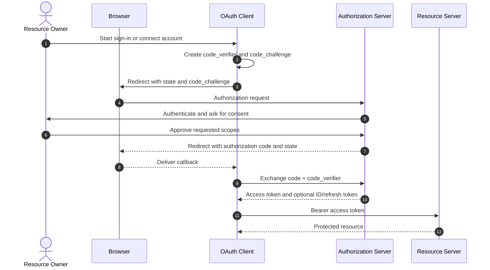

# OAuth 2.0 & OpenID Connect (OIDC)

[Back to Networking topics](README.md) · [Module guide](../02-networking.md)

## 📌 Learning Checklist
- [ ] Differentiate between Authentication (Who you are - AuthN) and Authorization (What you can do - AuthZ).
- [ ] Understand the 4 OAuth 2.0 Roles: Resource Owner, Client, Authorization Server, and Resource Server.
- [ ] Master the Authorization Code Flow with PKCE (Proof Key for Code Exchange) for modern SPAs and Mobile Apps.
- [ ] Contrast Grant Types: Authorization Code, Client Credentials, Refresh Token, and deprecated Implicit Grant.
- [ ] Understand OpenID Connect (OIDC) as the identity layer on top of OAuth 2.0 (`id_token` vs `access_token`).
- [ ] Defend token storage, CSRF with `state` parameter, and token revocation in Staff-level security interviews.

---

## 🗺️ Authorization Code with PKCE Diagram



**Diagram walkthrough:** The front channel carries only a short-lived authorization code; the token exchange happens directly with the authorization server. PKCE binds a stolen code to the client that created the verifier, while `state` protects the callback against request forgery and mix-up attacks.

---

## 📖 Deep Dive Notes

### 1. সহজ সংজ্ঞা ও Intuitive Mental Model

**OAuth 2.0 (RFC 6749)** হলো একটি ইন্ডাস্ট্রি-স্ট্যান্ডার্ড **অথরাইজেশন ফ্রেমওয়ার্ক (Delegated Authorization Framework)** যা একজন ব্যবহারকারীকে তার মূল পাসওয়ার্ড শেয়ার না করেই কোনো তৃতীয় পক্ষের অ্যাপ্লিকেশনকে তার সংরক্ষিত ডেটা বা রিসোর্সে সীমিত পরিসরে প্রবেশাধিকার (Scoped Access) দেওয়ার ক্ষমতা দেয়।

আর **OpenID Connect (OIDC)** হলো OAuth 2.0-এর ওপরে নির্মিত একটি পাতলা আইডেন্টিটি স্তর যা **অথেনটিকেশন (Authentication)** প্রদান করে ("Sign in with Google/GitHub")।

```
Authentication (AuthN)  ──► "Who are you?"       ──► Handled by OpenID Connect (OIDC - id_token)
Authorization  (AuthZ)  ──► "What can you do?"   ──► Handled by OAuth 2.0 (access_token)
```

> 🧠 **Intuitive Mental Model (হোটেলের ভ্যালেট কি বনাম মাস্টার চাবি):**
> আপনি একটি দামি গাড়ি নিয়ে হোটেলে গেলেন। হোটেলের পার্কিং বয়ের (Third-party App) কাছে গাড়ি পার্ক করার জন্য চাবি দিতে হবে।
> - **খারাপ পদ্ধতি (No OAuth):** আপনি পার্কিং বয়কে আপনার গাড়ির সমস্ত চাবি, বাড়ির চাবি এবং ব্যাংক লকারের চাবির রিং দিয়ে দিলেন (**Sharing Master Password**)। সে গাড়ি চালাতে পারবে ঠিকই, কিন্তু সে চাইলে আপনার গাড়ির গ্লাভস বক্সের গোপন ফাইলও চুরি করতে পারে!
> - **OAuth 2.0 পদ্ধতি (Valet Key):** আপনি পার্কিং বয়কে একটি বিশেষ সীমিত **"Valet Key" (Access Token)** দিলেন। এই বিশেষ চাবি দিয়ে শুধু গাড়ি স্টার্ট করা যায় এবং সামনের দিকে চালানো যায়—কিন্তু ডিকি (Trunk) বা গ্লাভস বক্স খোলা যায় না (**Scoped Permission**)। কাজ শেষ হলে হোটেলের কাজ শেষেই চাবিটির মেয়াদ শেষ হয়ে যায় (**Token Expiry**)। আপনার মূল পাসওয়ার্ড আপনি নিজের কাছেই রেখে দিলেন!

---

### 2. The 4 Fundamental Roles

1. **Resource Owner (রিসোর্স মালিক):** সাধারণ শেষ ব্যবহারকারী (User), যিনি ডেটার মালিক।
2. **Client (ক্লায়েন্ট অ্যাপ্লিকেশন):** যে তৃতীয় পক্ষের মোবাইল অ্যাপ বা ওয়েব অ্যাপ রিসোর্স এক্সেস করতে চায় (যেমন: Canva বা Spotify)।
3. **Authorization Server (অনুমোদন সার্ভার):** যে সার্ভার ইউজারের পরিচয় যাচাই করে এবং এক্সেস টোকেন ইস্যু করে (যেমন: Google Accounts বা Auth0)।
4. **Resource Server (রিসোর্স সার্ভার):** যে ব্যাকএন্ড এপিআই আসল সুরক্ষিত ডেটা সংরক্ষণ করে (যেমন: Google Drive API বা Google Photos API)।

---

### 3. Modern Production Flow: Authorization Code with PKCE

পূর্বে মোবাইল ও এসপিএ (React/Vue)-এর জন্য "Implicit Grant" ব্যবহৃত হতো, যা চরম অনিরাপদ হওয়ায় বাতিল করা হয়েছে। আধুনিক সমস্ত পাবলিক ও সিকিউর ক্লায়েন্টের জন্য একমাত্র গোল্ডেন স্ট্যান্ডার্ড হলো **Authorization Code Flow with PKCE (Proof Key for Code Exchange - RFC 7636)**:

```
[ User Browser / Mobile App ]           [ Authorization Server ]           [ Resource Server ]
             │                                     │                               │
(1) Generates Code Verifier & Code Challenge        │                               │
             │                                     │                               │
             │ ─── (2) GET /authorize? ──────────► │                               │
             │     response_type=code              │                               │
             │     code_challenge=SHA256(verifier) │                               │
             │     state=random_anti_csrf_token    │                               │
             │                                     │                               │
             │ ◄── (3) User Logs in & Consents ─── │                               │
             │                                     │                               │
             │ ◄── (4) Redirect with Auth Code ──── │                               │
             │                                     │                               │
             │ ─── (5) POST /oauth/token ────────► │                               │
             │     code=AuthCode                   │                               │
             │     code_verifier=secret_raw_code   │ (Verifies Challenge == Hash!) │
             │                                     │                               │
             │ ◄── (6) Returns Access & ID Token ─ │                               │
             │                                                                     │
             │ ─── (7) GET /api/v1/userinfo (Header: Bearer <access_token>) ──────►│
             │ ◄── (8) Returns Protected JSON Data ────────────────────────────────│
```

#### PKCE কীভাবে অথোরাইজেশন কোড ইন্টারসেপশন অ্যাটাক ঠেকায়?
- মোবাইল অ্যাপে কাস্টম ইউআরএল স্কিম (`myapp://oauth-callback`) হাইজ্যাক করে আক্রমণকারী ম্যালওয়্যার অ্যাপ যদি মাঝপথে অথোরাইজেশন কোডটি চুরিও করে ফেলে—
- সে টোকেন এক্সচেঞ্জ করতে পারবে না! কারণ আসল টোকেন পাওয়ার জন্য আসল মেমোরিতে থাকা আন-হ্যাশড **`code_verifier`** পাঠাতে হয়, যা কেবল আসল অ্যাপের মেমোরিতেই বিদ্যমান ছিল।

---

### 4. Grant Types: কখন কোনটি ব্যবহার করবেন?

| গ্রান্ট টাইপ | ব্যবহারের দৃশ্যপট | সিকিউরিটি লেভেল | রিফ্রেশ টোকেন? |
|---|---|:---:|:---:|
| **Authorization Code + PKCE** | সিঙ্গেল পেজ ওয়েব অ্যাপ (React), মোবাইল অ্যাপ (iOS/Android), ট্র্যাডিশনাল ওয়েব অ্যাপ | **সর্বোচ্চ (ইন্ডাস্ট্রি স্ট্যান্ডার্ড)** | ✅ হ্যাঁ |
| **Client Credentials** | মেশিন-টু-মেশিন (M2M) ইন্টারনাল ব্যাকএন্ড মাইক্রোসার্ভিস টু মাইক্রোসার্ভিস যোগাযোগ (কোনো ইউজার নেই) | **উচ্চ (Server Secret)** | ❌ না (সরাসরি নতুন টোকেন চায়) |
| **Refresh Token** | মেয়াদোত্তীর্ণ এক্সেস টোকেনকে ইউজারকে রি-লগইন না করিয়ে ব্যাকগ্রাউন্ডে নবায়ন করা | **উচ্চ** | ✅ হ্যাঁ (Rotation সহ) |
| **Implicit Flow** | ব্রাউজারে সরাসরি হ্যাশ ফ্র্যাগমেন্টে টোকেন রিটার্ন করা | ❌ **অনিরাপদ (সম্পূর্ণ নিষিদ্ধ)** | ❌ না |
| **Password Grant (ROPC)** | ইউজারনেম ও পাসওয়ার্ড সরাসরি ক্লায়েন্ট অ্যাপে ইনপুট নেওয়া | ❌ **অনিরাপদ (বাতিল)** | ⚠️ লিগ্যাসি |

---

### 5. OpenID Connect (OIDC): ID Token বনাম Access Token

| প্যারামিটার | Access Token (OAuth 2.0) | ID Token (OpenID Connect) |
|---|---|---|
| **উদ্দেশ্য** | **Authorization (অনুমতি):** এপিআই সার্ভারে সংরক্ষিত রিসোর্স এক্সেস করা | **Authentication (পরিচয়):** ইউজার কে তা ক্লায়েন্ট অ্যাপকে নিশ্চিত করা |
| **কাদের জন্য উদ্দিষ্ট?** | **Resource Server (API Backend)-এর জন্য** | **Client Application (Frontend App)-এর জন্য** |
| **ফরম্যাট** | অপেক (Opaque String) বা JWT হতে পারে | **কঠোরভাবে ক্রিপ্টোগ্রাফিক JWT (Signed by Auth Server)** |
| **ক্লায়েন্টের করণীয়** | ক্লায়েন্ট এটি না পড়ে শুধু বিয়ারার হিসেবে এপিআই-তে পাস করে | ক্লায়েন্ট এটি পার্স করে ইউজারের নাম, ছবি, ইমেইল ডিসপ্লে করে |

---

### 6. Failure Modes & Production Mitigations

#### Failure Mode 1: CSRF Attack on OAuth Callback (Missing `state` parameter)
- **ঝুঁকি:** আক্রমণকারী তার নিজের ফেসবুক একাউন্টের অথোরাইজেশন কোড ভিকটিমকে ক্লিক করায়। ক্লায়েন্ট ভিকটিমের লোকাল একাউন্টে আক্রমণকারীর ফেসবুক প্রোফাইল লিঙ্ক করে ফেলে।
- **প্রতিরোধ (Mitigation):** রিকোয়েস্টের শুরুতে একটি ক্রিপ্টোগ্রাফিক র্যান্ডম **`state`** টোকেন ব্রাউজার সেশনে সেভ করে পাঠানো। কলব্যাকে ফেরত আসা `state` হুবহু না মিললে পুরো অথেনটিকেশন রিজেক্ট করা।

---

### 7. Senior / Staff Engineer Interview Defense

> **ইন্টারভিউয়ার:** *"এক্সেস টোকেন এবং রিফ্রেশ টোকেন কীভাবে সংরক্ষণ করবেন? ফ্রন্টএন্ড সিঙ্গেল পেজ অ্যাপ্লিকেশনে (SPA) XSS আক্রমণ থেকে টোকেন সুরক্ষিত রাখার সর্বোত্তম আর্কিটেকচার কী?"*
>
> 💡 **Staff-Level উত্তরের কাঠামো:**
> "ব্রাউজারে টোকেন স্টোরেজ একটি ক্লাসিক্যাল সিকিউরিটি ট্রেড-অফ। `localStorage` বা `sessionStorage`-এ টোকেন রাখলে যেকোনো থার্ড-পার্টি এনপিএম লাইব্রেরির সাধারণ XSS স্ক্রিপ্ট নিমেষেই টোকেন চুরি করে নিতে পারে।
> প্রোডাকশনে আমরা **BFF (Backend-for-Frontend) Token-Mediating Architecture** প্রয়োগ করব:
> 1. **BFF প্যাটার্ন:** ব্রাউজার জাভাস্ক্রিপ্ট কখনো সরাসরি আসল OAuth Access Token বা Refresh Token স্পর্শই করবে না।
> 2. **HttpOnly, Secure, SameSite Cookie:** একটি ছোট নোডজেস/গো BFF গেটওয়ে অথোরাইজেশন সার্ভারের সাথে ওআউথ হ্যান্ডশেক করবে। টোকেনগুলো সার্ভার-সাইডে সেভ থাকবে এবং ব্রাউজারে একটি ক্রিপ্টোগ্রাফিক এনক্রিপ্টেড সেশন কুকি পাঠানো হবে যার ফ্ল্যাগ থাকবে `HttpOnly; Secure; SameSite=Lax`।
> 3. **XSS ও CSRF উভয় প্রতিরোধ:** জাভাস্ক্রিপ্ট `HttpOnly` কুকি পড়তে পারে না, ফলে XSS অ্যাটাকে টোকেন চুরি অসম্ভব; আর `SameSite=Lax` এবং অ্যান্টি-সিএসআরএফ হেডার সিএসআরএফ আক্রমণ শতভাগ প্রতিহত করে।
> 4. **Refresh Token Rotation:** যখনই একটি রিফ্রেশ টোকেন ব্যবহার করা হবে, পুরোনোটি অবিলম্বে বাতিল হয়ে একটি নতুন রিফ্রেশ টোকেন ইস্যু হবে। একই রিফ্রেশ টোকেন দুবার সাবমিট হলে সিস্টেম ধরে নেবে চুরি হয়েছে এবং ওই ইউজারের সমস্ত সেশন তৎক্ষণাৎ ইনভ্যালিডেট করে দেবে।"

---

## 📝 Practice Questions

```markdown
### Basic Practice Questions
1. Authentication (AuthN) এবং Authorization (AuthZ)-এর মধ্যে মৌলিক পার্থক্য কী?
2. OAuth 2.0-এর ৪টি প্রধান রোলের নাম এবং তাদের দায়িত্ব বলুন।
3. OpenID Connect (OIDC) কী এবং এটি কীভাবে OAuth 2.0-কে সম্প্রসারিত করেছে?
4. Access Token এবং ID Token-এর মধ্যে প্রধান পার্থক্য কী?
5. কেন আধুনিক অ্যাপ্লিকেশনগুলোতে OAuth 2.0 Implicit Grant নিষিদ্ধ করা হয়েছে?

### Intermediate Practice Questions
6. PKCE (Proof Key for Code Exchange) কীভাবে কাজ করে এবং এটি কীভাবে কোড ইন্টারসেপশন আক্রমণ প্রতিরোধ করে?
7. OAuth কলব্যাকে `state` প্যারামিটারের কাজ কী এবং এটি ছাড়া কীভাবে CSRF আক্রমণ ঘটে?
8. Client Credentials Grant কখন ব্যবহার করা হয় এবং কেন এতে কোনো রিফ্রেশ টোকেন থাকে না?
9. Refresh Token Rotation কী এবং এটি কীভাবে রিফ্রেশ টোকেন চুরির ঝুঁকি কমায়?
10. JWT এক্সেস টোকেনের মেয়াদ (Expiry) কেন খুব কম (যেমন ৫ থেকে ১৫ মিনিট) রাখা হয়?

### Advanced / Staff-Level Questions
11. SPA (Single Page Applications) এবং মোবাইল অ্যাপের জন্য Backend-for-Frontend (BFF) প্যাটার্ন কীভাবে ব্রাউজারের লোকাল স্টোরেজে টোকেন রাখার ঝুঁকি সম্পূর্ণ দূর করে?
12. ডিস্ট্রিবিউটেড মাইক্রোসার্ভিস ক্লাস্টারে একটি সেন্ট্রালাইজড অথোরাইজেশন সার্ভারে প্রতি রিকোয়েস্টে পিং না করে কীভাবে অ্যাসিমেট্রিক কি (JWKS - JSON Web Key Set) দিয়ে ডিস্ট্রিবিউটেড টোকেন ভ্যালিডেশন করবেন?
13. OAuth 2.0 Token Revocation (RFC 7009) এবং ব্যাক-চ্যানেল লগআউট (OIDC Back-Channel Logout) কীভাবে স্ট্যাটলেস আর্কিটেকচারে তাৎক্ষণিক ইউজার শাটডাউন কার্যকর করে?
14. ফিনান্সিয়াল গ্রেড এপিআই-তে (FAPI) mTLS Client Authentication এবং DPoP (Demonstrating Proof-of-Possession - RFC 9449) কীভাবে বিয়ারার টোকেন চুরি হওয়া সত্ত্বেও অপব্যবহার প্রতিরোধ করে?
15. এন্টারপ্রাইজ সিঙ্গেল সাইন-অন (SSO)-এ SAML 2.0 এবং OIDC-এর মধ্যকার প্রযুক্তিগত তুলনা এবং আধুনিক ক্লাউড মাইগ্রেশন কৌশল ব্যাখ্যা করুন।
```

---

## 🔑 Answer Key & Self-Test Evaluation

<details>
<summary>👉 <b>Answer Key ও সমাধান দেখতে এখানে ক্লিক করুন</b></summary>

1. **AuthN vs AuthZ:** Authentication পরিচয় যাচাই করে (আপনি কে?); Authorization অনুমতি যাচাই করে (আপনি কী কী কাজ করতে পারবেন?)।
2. **৪টি রোল:** Resource Owner (ইউজার), Client (অ্যাপ), Authorization Server (আইডেন্টিটি প্রদানকারী), Resource Server (সুরক্ষিত এপিআই)।
3. **OIDC:** OAuth 2.0-এর ওপরে একটি অথেনটিকেশন লেয়ার যা `id_token` ইস্যু করে তৃতীয় পক্ষকে ইউজারের প্রোফাইল নিশ্চিত করে।
4. **Access vs ID Token:** Access টোকেন এপিআই এক্সেস করার চাবি (রিসোর্স সার্ভারের জন্য); ID টোকেন ইউজারের পরিচয়পত্র (ক্লায়েন্ট ফ্রন্টএন্ড অ্যাপের জন্য)।
5. **Implicit নিষিদ্ধ কেন:** ব্রাউজারের ইউআরএল ফ্র্যাগমেন্টে সরাসরি টোকেন রিটার্ন করত যা ব্রাউজার হিস্ট্রি, রেফারার হেডার ও ম্যালওয়্যার দিয়ে চুরি হতো।
6. **PKCE মেকানিজম:** ক্লায়েন্ট একটি র‍্যান্ডম ভেরিফায়ারের হ্যাশ পাঠায় শুরুতে; কোড এক্সচেঞ্জের সময় আসল র ভেরিফায়ার পাঠায়। চোর কোড পেলেও ভেরিফায়ার ছাড়া টোকেন নিতে পারে না।
7. **state প্যারামিটার:** একটি ক্রিপ্টোগ্রাফিক র্যান্ডম স্ট্রিং যা সিএসআরএফ আক্রমণ আটকায়; কলব্যাকে স্টেট না মিললে রিকোয়েস্ট ক্যানসেল করা হয়।
8. **Client Credentials:** সার্ভিস টু সার্ভিস কলে ইউজার থাকে না; সার্ভার নিজের আইডি ও সিক্রেট দিয়ে সরাসরি টোকেন নেয়, মেয়াদ শেষ হলে নতুন টোকেন চায় তাই রিফ্রেশ টোকেন লাগে না।
9. **Token Rotation:** রিফ্রেশ টোকেন একবার ব্যবহার করলেই তা বাতিল হয়ে নতুন একটি রিফ্রেশ টোকেন পায়। কোনো টোকেন রি-ইউজ হলে সিস্টেম সম্পূর্ণ চেইন বাতিল করে দেয়।
10. **শর্ট এক্সেস টোকেন:** স্ট্যাটলেস টোকেন মাঝপথে সহজে বাতিল করা যায় না। তাই মেয়াদ ৫-১৫ মিনিট রাখা হয় যাতে চুরি হলেও ক্ষতি সীমাবদ্ধ থাকে।
11. **BFF Security:** সার্ভার-সাইড প্রক্সি টোকেন রাখে এবং ব্রাউজারে `HttpOnly; Secure; SameSite` কুকি পাঠায়, ফলে জাভাস্ক্রিপ্ট ও XSS থেকে টোকেন সম্পূর্ণ সুরক্ষিত থাকে।
12. **JWKS ভ্যালিডেশন:** অথ সার্ভার তার পাবলিক কীগুলো একটি ওয়েব এন্ডপয়েন্টে (`/.well-known/jwks.json`) রাখে। মাইক্রোসার্ভিসগুলো সেই পাবলিক কী ক্যাশ করে লোকালি অফলাইনে সিগনেচার যাচাই করে।
13. **Back-Channel Logout:** ইউজার লগআউট করলে অথ সার্ভার ব্যাকগ্রাউন্ডে সমস্ত সার্ভিসকে একটি সাইনড ইভেন্ট পাঠিয়ে তাদের লোকাল সেশন ও টোকেন ব্ল্যাকলিস্টে যুক্ত করতে বলে।
14. **DPoP:** সাধারণ বিয়ারার টোকেন যে কেউ চুরি করে চালাতে পারে; DPoP-এ ক্লায়েন্ট প্রতি রিকোয়েস্টে প্রাইভেট কী দিয়ে একটি সাইনড হেডার পাঠায়, ফলে টোকেন চুরি হলেও প্রাইভেট কী ছাড়া অকেজো থাকে।
15. **SAML vs OIDC:** SAML পুরানো এক্সএমএল-ভিত্তিক ও জটিল এন্টারপ্রাইজ এসএসও; OIDC আধুনিক হালকা JSON/REST ভিত্তিক এবং মোবাইল ও আধুনিক ক্লাউডে ১০০% সুসঙ্গত।

</details>
