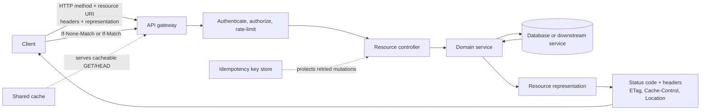

# REST API Architecture

[Back to Networking topics](README.md) · [Module guide](../02-networking.md)

## 📌 Learning Checklist
- [ ] Understand Roy Fielding's REST architectural constraints (Stateless, Client-Server, Cacheable, Uniform Interface, Layered System).
- [ ] Master the Richardson Maturity Model (Level 0 through Level 3: HATEOAS).
- [ ] Master HTTP Verb semantics: Idempotent (GET, PUT, DELETE) vs Non-Idempotent (POST, PATCH).
- [ ] Learn API Versioning strategies: URI Path vs Query Param vs Custom Request Headers.
- [ ] Analyze Pagination strategies: Offset-based vs Cursor-based (Keyset) pagination.
- [ ] Defend REST vs gRPC vs GraphQL trade-offs in Staff-level interviews.

---

## 🗺️ REST Resource Request Diagram



**Diagram walkthrough:** A REST API exposes resources through standard HTTP semantics rather than transport-specific operation names. Methods, status codes, cache validators, and representations form the contract; authorization remains server-side, and idempotency keys make ambiguous retries safer for selected mutations.

---

## 📖 Deep Dive Notes

### 1. সহজ সংজ্ঞা ও Intuitive Mental Model

২০০০ সালে ড. রয় ফিল্ডিং (Roy Fielding) তার পিএইচডি গবেষণাপত্রে **REST (Representational State Transfer)** আর্কিটেকচারাল স্টাইলের প্রস্তাব করেন। এটি কোনো প্রোটোকল বা সফটওয়্যার লাইব্রেরি নয়; এটি এমন কতগুলো সুসংহত স্থাপত্যিক সীমাবদ্ধতা ও নীতিমালার (Constraints) সমষ্টি যা ওয়েব সার্ভিসগুলোকে অত্যন্ত স্কেলযোগ্য, ক্যাশেবল, মডুলার এবং প্ল্যাটফর্ম-অজ্ঞেয়বাদী করে তোলে।

REST-এ সবকিছুকে একটি **রিসোর্স (Resource)** হিসেবে কল্পনা করা হয়, প্রতিটি রিসোর্সের একটি ইউনিক **URI (Uniform Resource Identifier)** থাকে, এবং সাধারণ HTTP মেথড দিয়ে সেই রিসোর্সের প্রতিনিধিত্ব (Representation—সাধারণত JSON বা XML) আদান-প্রদান করা হয়।

```
Standard REST Resource Operations:
GET    /api/v1/orders        ──► Retrieve all orders (Safe, Idempotent, Cacheable)
GET    /api/v1/orders/123    ──► Retrieve single order (Safe, Idempotent)
POST   /api/v1/orders        ──► Create new order (Non-Idempotent)
PUT    /api/v1/orders/123    ──► Replace complete order (Idempotent)
PATCH  /api/v1/orders/123    ──► Partially update order
DELETE /api/v1/orders/123    ──► Remove order (Idempotent)
```

> 🧠 **Intuitive Mental Model (লাইব্রেরির বই ধার নেওয়ার সিস্টেম):**
> আপনি একটি আধুনিক পাবলিক লাইব্রেরিতে গেলেন।
> - লাইব্রেরির প্রতিটি বইয়ের একটি ইউনিক ক্যাটালগ কোড বা শেলফ নম্বর আছে (**URI**)।
> - আপনি গিয়ে বইটির বিবরণ দেখতে পারেন (**GET**)। বইটির বিবরণ দেখলে লাইব্রেরির নিয়মে কোনো পরিবর্তন ঘটে না (**Safe & Cacheable**)।
> - নতুন বই অনুদান দিতে পারেন (**POST**)। পুরনো বইয়ের ছেঁড়া পাতা পরিবর্তন করতে পারেন (**PATCH**)। অথবা লাইব্রেরির মাস্টার ক্যাটালগে সম্পূর্ণ নতুন কপি দিয়ে পুরনোটি প্রতিস্থাপন করতে পারেন (**PUT**)। 
> লাইব্রেরিয়ান আপনার মুখের অবয়ব বা মেজাজ মনে রাখেন না—প্রতিবার রিকোয়েস্টের সাথে আপনাকে আপনার লাইব্রেরি কার্ড দেখাতে হয় (**Statelessness**)।

---

### 2. The Richardson Maturity Model (REST-এর ৪টি স্তর)

Leonard Richardson REST-এর পরিপক্কতাকে ৪টি ধাপে সংজ্ঞায়িত করেছেন:

```
[ Level 3: HATEOAS (Hypermedia As The Engine Of Application State) ]
                      ▲
[ Level 2: HTTP Verbs (GET, POST, PUT, DELETE) + Status Codes (200, 404, 500) ]
                      ▲
[ Level 1: Individual Resources (URIs: /orders, /users instead of single endpoint) ]
                      ▲
[ Level 0: The Swamp of POX (Single URI e.g. /endpoint, Single Verb POST, RPC style) ]
```

1. **Level 0 (The Swamp of POX):** কেবল একটি এন্ডপয়েন্ট (যেমন: `POST /api/service`) এবং পে-লোডে কোন ফাংশন রান করতে হবে তা পাঠানো (SOAP / XML-RPC স্টাইল)।
2. **Level 1 (Resources):** বিভিন্ন রিসোর্সের জন্য আলাদা আলাদা ইউআরএল বরাদ্দ করা (যেমন: `/api/users`, `/api/products`), কিন্তু সব অপারেশনে কেবল POST চালানো।
3. **Level 2 (HTTP Verbs & Status Codes):** সঠিক HTTP মেথড (GET, POST, PUT, DELETE) এবং উপযুক্ত স্ট্যাটাস কোড (`201 Created`, `404 Not Found`, `409 Conflict`) ব্যবহার করা। বেশিরভাগ আধুনিক ওয়েব এপিআই এই লেভেলে অবস্থান করে।
4. **Level 3 (HATEOAS):** রেসপন্সের ভেতরেই পরবর্তী সম্ভাব্য পদক্ষেপগুলোর হাইপারমিডিয়া লিঙ্ক সরবরাহ করা:
   ```json
   {
     "order_id": 123,
     "status": "shipped",
     "_links": {
       "self": { "href": "/orders/123" },
       "track": { "href": "/orders/123/tracking" },
       "cancel": { "href": "/orders/123/cancel", "method": "POST" }
     }
   }
   ```

---

### 3. API Versioning: ৩টি প্রধান কৌশল

| স্ট্র্যাটেজি | বাস্তব রূপ | সুবিধা | অসুবিধা |
|---|---|---|---|
| **URI Path Versioning (ইন্ডাস্ট্রি স্ট্যান্ডার্ড)** | `/api/v1/orders`<br>`/api/v2/orders` | সবচেয়ে স্পষ্ট, সহজ ডিবাগিং, সিডিএন ও ব্রাউজারে ক্যাশিং চমৎকার। | এপিআই ইউআরএল দীর্ঘ হয়; ছোট পরিবর্তনে পুরো পাথ পরিবর্তন। |
| **Custom Header Versioning** | `GET /api/orders`<br>`X-API-Version: 2` | ইউআরএল পরিষ্কার থাকে; রাউটিং মিডলওয়্যার নিয়ন্ত্রণ করতে পারে। | সিডিএন ক্যাশ কি কনফিগার করা জটিল; টেস্ট করা কঠিন। |
| **Accept Header (Content Negotiation)** | `GET /api/orders`<br>`Accept: application/vnd.app.v2+json` | সবচেয়ে একাডেমিক ও কঠোর REST ফুলনেস। | সাধারণ ডেভেলপারদের বুঝতে অসুবিধা হয় এবং ব্রাউজার ফ্রেন্ডলি নয়। |

---

### 4. Pagination Strategies: Offset-based বনাম Cursor-based

```
Offset-based (Slow & Drifts):
SELECT * FROM orders ORDER BY created_at LIMIT 10 OFFSET 100000;
(ডাটাবেজকে প্রথম ১ লাখ রো মেমোরিতে স্ক্যান করে ফেলে দিতে হয়! মারাত্মক ধীর!)

Cursor-based / Keyset (Blazing Fast):
SELECT * FROM orders WHERE id > 100000 ORDER BY id LIMIT 10;
(ইনডেক্স ব্যবহার করে সরাসরি ১০০০০১ নম্বর রোতে জাম্প করে! সাব-মিলিসেকেন্ড গতি!)
```

| প্যারামিটার | Offset-based (`?page=5&limit=20`) | Cursor-based (`?cursor=a8f9c2&limit=20`) |
|---|---|---|
| **পারফরম্যান্স** | অফসেট যত বাড়ে ($N$), ডাটাবেজ তত স্লো হয় | **অফসেটের আকার নির্বিশেষে স্থির $O(1)$ ইনডেক্স গতি** |
| **ডাটা ড্র্রিফট (প্যাজিনেশন বাগ)** | নতুন রো ইনসার্ট হলে ইউজার একই ডেটা দ্বিতীয় পেজে ডুপ্লিকেট দেখে | **১০০% নির্ভুল (কখনো ডেটা স্কিপ বা ডুপ্লিকেট হয় না)** |
| **র‍্যান্ডম জাম্প** | সরাসরি "পেজ ৫০"-এ লাফ দেওয়া যায় | কেবল "Next" এবং "Previous" যাওয়া সম্ভব |
| **আদর্শ ব্যবহার** | অ্যাডমিন ড্যাশবোর্ড, স্ট্যাটিক টেবিল | **সোশ্যাল মিডিয়া ফিড, মেসেজিং, মোবাইল ইনফিনিট স্ক্রোল** |

---

### 5. Alternatives & Architectural Comparison Matrix

| বৈশিষ্ট্য | REST API | gRPC | GraphQL |
|---|---|---|---|
| **কন্ট্রাক্ট ও স্কিমা** | ওপেনএপিআই (Swagger) ঐচ্ছিক | প্রোটোকল বাফার্স (Protobuf) বাধ্যতামূলক | GraphQL Schema (SDL) বাধ্যতামূলক |
| **পে-লোড ফরম্যাট** | JSON (টেক্সট, মানব-পাঠযোগ্য) | বাইনারি (কম্প্যাক্ট, উচ্চ গতি) | JSON |
| **আন্ডারলাইং প্রোটোকল** | HTTP/1.1 ও HTTP/2 | **কঠোরভাবে HTTP/2** | HTTP/1.1 ও HTTP/2 |
| **ওভার/আন্ডার ফেচিং** | ❌ সাধারণ সমস্যা | ❌ সাধারণ সমস্যা | ✅ **ক্লায়েন্ট চাহিদামতো ফিল্ড নির্বাচন করে** |
| **ব্রাউজার সাপোর্ট** | **১০০% নেটিভ ও সহজ** | বিশেষ প্রক্সি লাগে (gRPC-Web) | চমৎকার (Apollo / Relay) |
| **আদর্শ ক্ষেত্র** | পাবলিক ক্লায়েন্ট ফেসিং এপিআই | **ইন্টারনাল মাইক্রোসার্ভিস IPC** | জটিল সম্পর্কযুক্ত রিচ ওয়েব/মোবাইল ইউআই |

---

### 6. Failure Modes & Production Mitigations

#### Failure Mode 1: The N+1 Query Cascade over REST
- **ঝুঁকি:** একটি মোবাইল স্ক্রিনে ২০ জন ইউজারের তালিকা দেখাতে হবে এবং প্রতি ইউজারের ডিপার্টমেন্ট নাম লাগবে। ক্লায়েন্ট প্রথমে `/users` কল করে ২০টি আইডি পায়, তারপর লুপ চালিয়ে ২০ বার `/users/{id}/department` কল করে মোট ২১টি নেটওয়ার্ক রিকোয়েস্ট পাঠায়।
- **প্রতিরোধ (Mitigation):** ব্যাকএন্ডে অপটিমাইজড বাল্ক এপিআই প্রদান করা (`/users?include=department`) অথবা BFF (Backend-for-Frontend) লেয়ারে ডেটা প্রি-জয়েন করে সিঙ্গেল রেসপন্স পাঠানো।

---

### 7. Senior / Staff Engineer Interview Defense

> **ইন্টারভিউয়ার:** *"নতুন প্রজেক্টে আমাদের কি REST ব্যবহার করা উচিত নাকি GraphQL? আপনি কীভাবে উভয়ের সুবিধা ও অসুবিধার ভারসাম্য করবেন?"*
>
> 💡 **Staff-Level উত্তরের কাঠামো:**
> "এটি কোনো ধর্মীয় পছন্দ নয়; আমাদের ডাটাবেজ মডেল, ক্লায়েন্টের বৈচিত্র্য এবং ক্যাশিংয়ের প্রয়োজনীয়তার ওপর ভিত্তি করে সিদ্ধান্ত নিতে হবে:
> 1. **কখন REST শ্রেষ্ঠ (পাবলিক API ও ক্যাশিং-ভারী সিস্টেম):**
>    - REST প্রোটোকল লেভেলের HTTP ক্যাশিং (`Cache-Control`, `ETag`, CDN Edge Caching) চমৎকারভাবে ব্যবহার করতে পারে।
>    - পাবলিক থার্ড-পার্টি ডেভেলপারদের জন্য REST শেখা সহজ এবং ওপেনএপিআই স্পেসিফিকেশন দিয়ে চমৎকার এসডিকে জেনারেট করা যায়।
> 2. **কখন GraphQL শ্রেষ্ঠ (জটিল রিলেশনাল মোবাইল ইউআই):**
>    - যখন একই সাথে একাধিক স্ক্রিনে ভিন্ন ভিন্ন ডেটা দরকার হয় (যেমন ফেসবুক ফিড যাতে ইউজার, কমেন্ট, রিয়েকশন, ও ছবি একসাথে আছে)। REST-এ এটি প্রচুর ওভার-ফেচিং বা একাধিক রাউন্ড-ট্রিপ (Under-fetching) তৈরি করে। গ্রাফ-কিউএল ক্লায়েন্টকে একটিমাত্র কলে নির্দিষ্ট ফিল্ড বেছে নেওয়ার ক্ষমতা দেয়।
> 3. **গ্রাফ-কিউএল-এর লুকানো খরচ (The GraphQL Tax):**
>    - গ্রাফ-কিউএলে সমস্ত রিকোয়েস্ট `POST /graphql`-এ যাওয়ায় সিডিএন এজ ক্যাশিং কার্যত অসম্ভব হয়ে পড়ে।
>    - ক্ষতিকর ব্যবহারকারীরা জটিল নেস্টেড কুয়েরি (Query Depth Attack) পাঠিয়ে ডাটাবেজ সিপিইউ নিমেষেই ১০০% করে সার্ভার ক্র্যাশ করাতে পারে।
> 4. **আমাদের স্টাফ-লেভেল আর্কিটেকচার:** আমরা এক্সটার্নাল এপিআই ও সহজ রিসোর্সের জন্য **REST** বজায় রাখব এবং ক্যাশিং সুবিধা নেব; আর জটিল মোবাইল ক্লায়েন্টের জন্য একটি ডেডিকেটেড **BFF বা GraphQL গেটওয়ে** বসাব যাতে কঠোর কুয়েরি কমপ্লেক্সিটি ও ডেপথ লিমিট থাকবে।"

---

## 📝 Practice Questions

```markdown
### Basic Practice Questions
1. REST আর্কিটেকচারের মূল ৫টি সীমাবদ্ধতা (Constraints) কী কী?
2. HTTP PUT এবং PATCH মেথডের মধ্যকার মৌলিক পার্থক্য কী?
3. কেন HTTP GET মেথডকে "Safe" এবং "Idempotent" বলা হয়?
4. Richardson Maturity Model-এর লেভেল ২ এবং লেভেল ৩ (HATEOAS)-এর পার্থক্য কী?
5. REST API-তে HTTP 201 Created এবং HTTP 204 No Content কখন ব্যবহার করা হয়?

### Intermediate Practice Questions
6. Offset-based Pagination কেন কোটি কোটি রেকর্ডের ডাটাবেজে পারফরম্যান্স বিপর্যয় ডেকে আনে এবং Keyset/Cursor Pagination কীভাবে এটি সমাধান করে?
7. API Versioning-এর প্রধান ৩টি পদ্ধতির (Path vs Header vs Content Negotiation) সুবিধা ও অসুবিধার তুলনামূলক বিশ্লেষণ করুন।
8. রিকোয়েস্টে `ETag` এবং `If-None-Match` হেডার কীভাবে অপটিমিস্টিক কনকারেন্সি কন্ট্রোল ও ব্যান্ডউইথ সাশ্রয় নিশ্চিত করে?
9. RESTful API ডিজাইনে কেন একবচন (Singular) না ব্যবহার করে বহুবচন (Plural) নাউন ব্যবহার করা উত্তম (যেমন `/users` বনাম `/user`)?
10. N+1 API Problem কী এবং এটি কীভাবে নেটওয়ার্ক ওভারহেড বাড়ায়?

### Advanced / Staff-Level Questions
11. কোটি কোটি রিকোয়েস্টের এন্টারপ্রাইজ REST API-তে ডিস্ট্রিবিউটেড Idempotency-Key প্যাটার্ন প্রয়োগ করে ডাবল পেমেন্ট ও ইনসার্ট কীভাবে প্রতিরোধ করবেন?
12. HATEOAS আর্কিটেকচারালভাবে চমৎকার হওয়া সত্ত্বেও বাস্তব জগতের ৯৯% প্রোডাকশন পাবলিক এপিআই কেন এটি বাস্তবায়ন করে না?
13. REST এপিআই-তে Partial Response ফিল্টারিং (যেমন Google API-র `?fields=id,name,email`) কীভাবে প্রয়োগ করবেন যা ওভার-ফেচিং কমিয়ে পারফরম্যান্স বাড়ায়?
14. মাইক্রোসার্ভিস ব্যাকএন্ডে সিঙ্ক্রোনাস REST কলের পরিবর্তে অ্যাসিনক্রোনাস REST (`202 Accepted` + Polling/Webhook) কখন ব্যবহার করবেন?
15. OpenAPI 3.0 (Swagger) স্পেসিফিকেশন দিয়ে কীভাবে অটোমেটেড Contract Testing (Pact framework) এবং ক্লায়েন্ট SDK জেনারেশন পাইপলাইন আর্কিটেক্ট করবেন?
```

---

## 🔑 Answer Key & Self-Test Evaluation

<details>
<summary>👉 <b>Answer Key ও সমাধান দেখতে এখানে ক্লিক করুন</b></summary>

1. **REST Constraints:** Stateless, Client-Server, Cacheable, Uniform Interface, Layered System (এবং ঐচ্ছিক Code-on-Demand)।
2. **PUT vs PATCH:** PUT পুরো রিসোর্সকে নতুন অবজেক্ট দিয়ে সম্পূর্ণ প্রতিস্থাপন করে; PATCH অবজেক্টের নির্দিষ্ট কয়েকটি ফিল্ড আংশিক আপডেট করে।
3. **GET Safe & Idempotent:** Safe কারণ এটি সার্ভারের কোনো ডেটা বা স্টেট পরিবর্তন করে না; Idempotent কারণ এটি শতবার চালালেও ফলাফল একই থাকে।
4. **Level 2 vs Level 3:** Level 2 সঠিক HTTP মেথড ও স্ট্যাটাস কোড ব্যবহার করে; Level 3 রেসপন্সের সাথে পরবর্তী সম্ভাব্য অ্যাকশনের হাইপারমিডিয়া লিঙ্ক (HATEOAS) পাঠায়।
5. **201 vs 204:** 201 Created নতুন রিসোর্স সফলভাবে তৈরি হলে দেওয়া হয়; 204 No Content রিকোয়েস্ট সফল কিন্তু রিটার্ন করার মতো কোনো বডি নেই (যেমন সফল DELETE)।
6. **Cursor Pagination:** অফসেটে ডাটাবেজকে পেছনের সমস্ত রো মেমোরিতে রিড করে ড্রপ করতে হয়; কার্সারে ইনডেক্স ধরে সরাসরি টার্গেট আইডিতে জাম্প করায় গতি $O(1)$ থাকে।
7. **Versioning Trade-off:** Path সহজ ও ক্যাশেবল কিন্তু ইউআরএল বদলায়; Header পরিচ্ছন্ন কিন্তু সিডিএন ক্যাশ কনফিগার করা কঠিন; Content Negotiation সবচেয়ে কঠোর কিন্তু ব্রাউজারে টেস্ট করা কঠিন।
8. **ETag Caching:** সার্ভার কন্টেন্টের হ্যাশ পাঠায়। ক্লায়েন্ট পরবর্তী কলে `If-None-Match` পাঠায়; ডেটা না বদলালে সার্ভার ফাঁকা বডি সহ `304 Not Modified` ফেরত দেয় (ব্যান্ডউইথ বাঁচে)।
9. **Plural Naming:** কালেকশনকে নির্দেশ করতে বহুবচন স্ট্যান্ডার্ড (`/users` মানে সমস্ত ইউজারের কালেকশন, আর `/users/123` মানে তার ভেতরের একটি উপাদান)।
10. **N+1 API Problem:** ১টি কলে মূল তালিকা এনে তালিকার প্রতিটি উপাদানের জন্য অতিরিক্ত N সংখ্যক আলাদা নেটওয়ার্ক কল করা, যা সার্ভার ও মোবাইল উভয়কে স্লো করে।
11. **Idempotency Key:** ক্লায়েন্ট রিকোয়েস্টে UUID হেডার পাঠাবে। সার্ভার Redis-এ `SETNX` দিয়ে লক করবে এবং রেসপন্স ক্যাশ করবে। ডুপ্লিকেট রিট্রাই সরাসরি ক্যাশড রেসপন্স পাবে।
12. **HATEOAS ত্যাগ কেন:** অতিরিক্ত পে-লোড ব্যান্ডউইথ খরচ, মোবাইল অ্যাপগুলো স্ট্যাটিকালি টাইপড কোডে ইউআরএল বিল্ড করে, এবং অতিরিক্ত জটিলতা বিজনেসে কোনো বাড়তি ভ্যালু দেয় না।
13. **Partial Response:** কন্ট্রোলারে জেনেরিক ফিল্ড মাস্কিং লাইব্রেরি ব্যবহার করা যা ডাটাবেজ থেকে কেবল প্রয়োজনীয় কলামগুলো তুলে JSON সিরিয়ালাইজ করে।
14. **202 Async REST:** দীর্ঘমেয়াদী কাজ (যেমন ফাইল রূপান্তর বা রিপোর্ট জেনারেশন); সার্ভার তৎক্ষণাৎ `202 Accepted` ও একটি ট্র্যাকিং ইউআরএল দেয়, ক্লায়েন্ট ব্যাকগ্রাউন্ডে পোল করে।
15. **OpenAPI Contracts:** স্কিমা থেকে অটোমেটিক ডকার কন্টেইনারে মক সার্ভার তোলা, প্রোভাইডার-কনজিউমার চুক্তি টেস্ট করা এবং টাইপস্ক্রিপ্ট/গো ক্লায়েন্ট এসডিকে বিল্ড করা।

</details>
