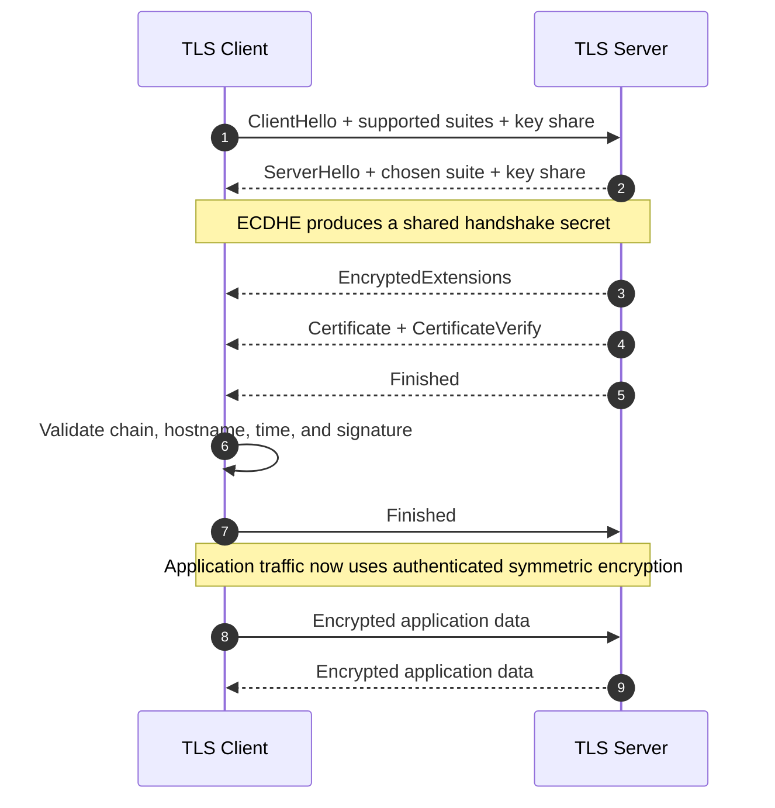

# SSL/TLS (Transport Layer Security)

[Back to Networking topics](README.md) · [Module guide](../02-networking.md)

## 📌 Learning Checklist
- [ ] Understand the evolution from SSL (1.0, 2.0, 3.0) to TLS (1.0, 1.1, 1.2, 1.3).
- [ ] Contrast TLS 1.2 Handshake (2 RTT) with TLS 1.3 Handshake (1 RTT / 0 RTT).
- [ ] Master Cipher Suites, Asymmetric Key Exchange (Diffie-Hellman), and Symmetric Bulk Encryption.
- [ ] Learn Mutual TLS (mTLS) for zero-trust microservice communication.
- [ ] Analyze Certificate Lifecycle: Certificate Signing Requests (CSR), Certificate Authorities, Intermediate CAs, and ACME (Let's Encrypt).
- [ ] Defend cryptographic choices and quantum-resistant algorithms in Staff-level interviews.

---

## 🗺️ TLS 1.3 Handshake Diagram



**Diagram walkthrough:** TLS 1.3 removes obsolete key exchanges and negotiates ephemeral ECDHE keys in the first round trip. The certificate binds the server identity to its public key, transcript verification detects tampering, and derived traffic keys provide confidentiality, integrity, and forward secrecy.

---

## 📖 Deep Dive Notes

### 1. সহজ সংজ্ঞা ও Intuitive Mental Model

**TLS (Transport Layer Security)**—যার ঐতিহাসিক পূর্বসূরির নাম ছিল **SSL (Secure Sockets Layer)**—হলো একটি ক্রিপ্টোগ্রাফিক প্রোটোকল যা ইন্টারনেটের ট্রান্সপোর্ট লেয়ারের (TCP বা UDP) ওপর এন্ড-টু-এন্ড এনক্রিপশন, ডেটা ইন্টিগ্রিটি এবং পারস্পরিক পরিচিতি (Identity Authentication) নিশ্চিত করে।

> ⚠️ **ঐতিহাসিক সত্য:** SSL-এর সমস্ত সংস্করণ (SSL 1.0, 2.0, 3.0) মারাত্মক ক্রিপ্টোগ্রাফিক দুর্বলতার কারণে ২০ বছরেরও বেশি সময় ধরে চিরতরে বাতিল ও অবলুপ্ত (Deprecated)। আজ আমরা যখন "SSL সার্টিফিকেট" বলি, বাস্তবে আমরা মূলত **TLS 1.2** বা **TLS 1.3** ব্যবহার করি।

```
OSI Model Layering:
┌───────────────────────────────────────┐
│     Application Layer (HTTP, gRPC)    │
├───────────────────────────────────────┤
│        TLS Layer (Security Wrapper)   │  <-- Encrypts, Authenticates, Verifies
├───────────────────────────────────────┤
│     Transport Layer (TCP / UDP)       │
└───────────────────────────────────────┘
```

> 🧠 **Intuitive Mental Model (রং মেশানো চাবি আদান-প্রদান অ্যানালজি - Diffie-Hellman):**
> আপনি (Alice) এবং ব্যাংক (Bob) ইন্টারনেটের খোলামেলা পাবলিক লাউডস্পিকারে কথা বলছেন।
> 1. আপনারা প্রকাশ্যে একটি কমন রং বাছাই করলেন: **হলুদ** (সবাই জানে)।
> 2. Alice মনে মনে একটি গোপন রং বেছে নিল: **লাল** (কাউকে বলল না)। সে হলুদের সাথে লাল মিশিয়ে বানাল **কমলা**, এবং লাউডস্পিকারে Bob-কে দিল।
> 3. Bob মনে মনে একটি গোপন রং বেছে নিল: **নীল** (কাউকে বলল না)। সে হলুদের সাথে নীল মিশিয়ে বানাল **সবুজ**, এবং লাউডস্পিকারে Alice-কে দিল।
> 4. এবার Alice Bob-এর দেওয়া সবুজের সাথে তার গোপন লাল মেশাল; আর Bob Alice-এর দেওয়া কমলার সাথে তার গোপন নীল মেশাল।
> 5. আশ্চর্য ব্যাপার—দুজনের হাতেই তৈরি হলো একই গোপন মিশ্রিত রং: **বাদামী (Shared Secret Key)**!
> মাঝপথে থাকা কোনো হ্যাকার লাউডস্পিকারে সব শুনেও গোপন লাল বা নীল না জানার কারণে কখনোই এই বাদামী রঙের চাবি তৈরি করতে পারবে না!

---

### 2. TLS 1.2 বনাম TLS 1.3 Handshake Architecture

```
TLS 1.2 Handshake (2 RTT - Slow & Chatty):
Client ───────────────── ClientHello (Cipher list) ─────────────────► Server
Client ◄── ServerHello (Chosen cipher) + Certificate + DH Params ─── Server (1 RTT)
Client ───────────────── ClientKeyExchange + [ChangeCipherSpec] ────► Server
Client ◄──────────────── Finished (Encrypted) ────────────────────── Server (2 RTT)
Client ───────────────── Encrypted HTTP Application Data ───────────► Server

TLS 1.3 Handshake (1 RTT - Streamlined & Secure):
Client ─── ClientHello + Supported Groups + DH Key Share Guess ─────► Server
Client ◄── ServerHello + Certificate + Server DH Share + Finished ─── Server (1 RTT!)
Client ─── Encrypted HTTP Application Data Transmitted! (Instantly!)
```

#### TLS 1.3-এর ৩টি বৈপ্লবিক সংস্কার:
1. **১টি সম্পূর্ণ RTT কমানো:** হ্যান্ডশেক ২ RTT থেকে কমে ১ RTT-তে সম্পন্ন হয়।
2. **দুর্বল ও অনিরাপদ অ্যালগরিদম চিরতরে মুছে ফেলা:** RSA কী-এক্সচেঞ্জ, CBC সাইফার, MD5/SHA-1 এবং স্ট্যাটিক ডিফি-হেলম্যান সম্পূর্ণ নিষিদ্ধ করা হয়েছে। শুধুমাত্র Perfect Forward Secrecy (PFS) প্রদানকারী আধুনিক অ্যালগরিদম (যেমন: X25519, ECDHE) অনুমোদিত।
3. **0-RTT Resumption:** পূর্ববর্তী পরিচিত ক্লায়েন্ট প্রথম প্যাকেটেই ডেটা এনক্রিপ্ট করে পাঠাতে পারে।

---

### 3. Cipher Suite Anatomy (সাইফার সুইটের ব্যবচ্ছেদ)

একটি আধুনিক TLS 1.3 সাইফার সুইট যেমন `TLS_AES_256_GCM_SHA384`:

```
TLS  _  AES_256_GCM  _  SHA384
 │            │            │
Protocol   Symmetric    Hash Algorithm (for HMAC & PRF)
Standard   Bulk Cipher
```

- **Symmetric Cipher (AES-256-GCM / ChaCha20-Poly1305):** বাল্ক ডেটা এনক্রিপশন ও অথেনটিকেশনের জন্য Authenticated Encryption with Associated Data (AEAD) সাইফার।
- **Key Exchange (ECDHE):** চাবি বিনিময়ের জন্য ইলিপটিক কার্ভ ডিফি-হেলম্যান।

---

### 4. Mutual TLS (mTLS): জিরো-ট্রাস্ট মাইক্রোসার্ভিস সিকিউরিটি

সাধারণ HTTPS-এ শুধুমাত্র ব্রাউজার যাচাই করে সার্ভার আসল কিনা (একমুখী)। কিন্তু অভ্যন্তরীণ মাইক্রোসার্ভিস বা এন্টারপ্রাইজ ব্যাংকিং সিস্টেমে সার্ভারও ক্লায়েন্টকে যাচাই করে (**দ্বিমুখী বা Mutual TLS**):

```
Client Service                                            Server Service
      │ ─── (1) ClientHello ──────────────────────────────────> │
      │ <── (2) Server Certificate + "Send Me Your Cert!" ───── │
      │ ─── (3) Client Certificate (Cryptographic Proof) ─────> │
      │                                                         │ (Validates against
      │ <── (4) Verified! Encrypted Channel Established ──────── │  Internal Private CA)
```

- **Istio / Linkerd Service Mesh:** প্রতিটি পডের পাশে থাকা Envoy প্রক্সি স্বয়ংক্রিয়ভাবে প্রতি ২৪ ঘণ্টা পর পর নতুন mTLS সার্টিফিকেট রোটেট করে, ফলে কোনো ক্লাউড নেটওয়ার্কে কোনো ডেভেলপার বা ইন্ট্রুডার ট্রাফিক স্নাইফ করতে পারে না।

---

### 5. Automated Certificate Lifecycle: ACME & Let's Encrypt

অতীতে একটি এসএসএল সার্টিফিকেট কিনতে শত শত ডলার খরচ হতো এবং ম্যানুয়াল ফাইলে সিএসআর (CSR) জেনারেট করতে হতো। **ACME (Automated Certificate Management Environment - RFC 8555)** প্রোটোকল দিয়ে Let's Encrypt এটি সম্পূর্ণ ফ্রি ও অটোমেটেড করেছে:
1. **HTTP-01 Challenge:** Let's Encrypt সার্ভারকে বলে: `/.well-known/acme-challenge/<token>` পাথে একটি গোপন ফাইল রাখো। সিএ এসে ফাইলটি চেক করে ডোমেন ওনারশিপ ভেরিফাই করে।
2. **DNS-01 Challenge:** সিএ বলে ডোমেনের ডিএনএসে একটি নির্দিষ্ট `TXT` রেকর্ড রাখো। ওয়াইল্ডকার্ড সার্টিফিকেটের (`*.domain.com`) জন্য এটি ব্যবহৃত হয়।

---

### 6. Alternatives & Version Comparison Matrix

| বৈশিষ্ট্য | SSL 3.0 (1996) | TLS 1.2 (2008) | TLS 1.3 (2018) |
|---|---|---|---|
| **নিরাপত্তা স্ট্যাটাস** | ❌ অনিরাপদ (POODLE অ্যাটাক) | ⚠️ কনফিগারেশনের ওপর নির্ভরশীল | ✅ **সর্বোচ্চ সুরক্ষিত বাই-ডিফল্ট** |
| **হ্যান্ডশেক ল্যাটেন্সি** | ২ RTT | ২ RTT | **১ RTT (০-RTT রিজিউমে)** |
| **PFS (Forward Secrecy)** | নেই | কনফিগারেশনের ওপর ঐচ্ছিক | **বাধ্যতামূলক** |
| **সাইফার সুইট সংখ্যা** | শত শত জটিল কম্বিনেশন | ৩ শতাধিক (অনেক লিগ্যাসি সাইফার) | **মাত্র ৫টি অত্যন্ত শক্তিশালী সুইট** |
| **হ্যান্ডশেক এনক্রিপশন** | সার্টিফিকেট প্লেইন টেক্সট | সার্টিফিকেট প্লেইন টেক্সট | **সার্টিফিকেট এনক্রিপ্টেড থাকে** |

---

### 7. Senior / Staff Engineer Interview Defense

> **ইন্টারভিউয়ার:** *"ইন্টারনাল সার্ভিস-টু-সার্ভিস কমিউনিকেশনে mTLS চালু করলে কি সিস্টেমের পারফরম্যান্স ও থ্রুপুট ধসে পড়বে? আপনি কীভাবে সিপিইউ ওভারহেড অপ্টিমাইজ করবেন?"*
>
> 💡 **Staff-Level উত্তরের কাঠামো:**
> "এটি একটি সাধারণ ভ্রান্ত ধারণা যে mTLS ব্যাকএন্ডকে মারাত্মক স্লো করে দেয়। আধুনিক কম্পিউটিংয়ে এর প্রভাব অত্যন্ত নগণ্য ($<2-3\%$ CPU), যদি আর্কিটেকচার সঠিকভাবে ডিজাইন করা হয়:
> 1. **হ্যান্ডশেক বনাম ডেটা সিমেট্রিক ওভারহেড:** ক্রিপ্টোগ্রাফিক ভারী কাজ ঘটে কেবল হ্যান্ডশেক ফেজে। একবার হ্যান্ডশেক সম্পন্ন হলে AES-NI (Intel/AMD হার্ডওয়্যার ইন্সট্রাকশন সেট) সরাসরি সিপিইউ সিলিকন লেভেলে হার্ডওয়্যার অ্যাক্সিলারেশনে প্রতি সেকেন্ডে কয়েক গিগাবাইট ডেটা এনক্রিপ্ট করে।
> 2. **লং-লিভড কানেকশন পুলিং (HTTP/2 / gRPC):** প্রতিটি মাইক্রোসার্ভিস কলের জন্য নতুন করে হ্যান্ডশেক করা একটি মারাত্মক ভুল। সার্ভিসগুলো gRPC বা HTTP/2-এর মাধ্যমে একটি একক লং-লিভড টিসিপি কানেকশন মাসের পর মাস ধরে রাখে। ফলে পুরো দিনে হ্যান্ডশেক করতে হয় মাত্র কয়েকবার!
> 3. **Session Resumption ও টিএলএস ১.৩:** নতুন কানেকশনের ক্ষেত্রেও TLS 1.3 ব্যবহারের ফলে হ্যান্ডশেক মাত্র ১ RTT-তে শেষ হয়।
> 4. **Sidecar Offloading:** অ্যাপ্লিকেশন কোডে ক্রিপ্টোগ্রাফি রান না করে Envoy সাইডকারের মাধ্যমে নেটওয়ার্ক থ্রেডে mTLS অফলোড করা হয়, ফলে কোর অ্যাপ্লিকেশন বিজনেস লজিক শতভাগ মুক্ত থাকে।"

---

## 📝 Practice Questions

```markdown
### Basic Practice Questions
1. SSL এবং TLS-এর মধ্যকার ঐতিহাসিক সম্পর্ক এবং পার্থক্য কী?
2. কেন SSL 3.0 এবং TLS 1.0 আধুনিক ইন্টারনেটে সম্পূর্ণ নিষিদ্ধ?
3. TLS 1.2 এবং TLS 1.3-এর হ্যান্ডশেক ল্যাটেন্সির মূল পার্থক্য কী?
4. Certificate Authority (CA) এবং Intermediate CA-র কাজ কী?
5. Certificate Signing Request (CSR) কী?

### Intermediate Practice Questions
6. Diffie-Hellman Key Exchange কীভাবে একটি পাবলিক অসুরক্ষিত চ্যানেলের ওপর দিয়ে গোপন চাবি তৈরি করতে পারে?
7. Mutual TLS (mTLS) কী এবং সাধারণ ওয়ান-ওয়ে TLS-এর চেয়ে এটি কীভাবে আলাদা?
8. Let's Encrypt-এর ACME প্রোটোকলে HTTP-01 Challenge এবং DNS-01 Challenge-এর পার্থক্য কী?
9. TLS 1.3 কেন RSA Key Exchange সম্পূর্ণ নিষিদ্ধ করেছে?
10. Session Tickets এবং Session Identifiers কীভাবে TLS সেশন রেজাম্পশনে সাহায্য করে?

### Advanced / Staff-Level Questions
11. কোটি কোটি মাইক্রোসার্ভিসের ক্লাস্টারে HashiCorp Vault বা cert-manager ব্যবহার করে ডাউনটাইম ছাড়া স্বয়ংক্রিয় mTLS সার্টিফিকেট রোটেশন পাইপলাইন কীভাবে আর্কিটেক্ট করবেন?
12. Heartbleed (OpenSSL) এবং POODLE সাইবার আক্রমণের মূল ক্রিপ্টোগ্রাফিক ত্রুটি কী ছিল এবং আধুনিক প্রোটোকল কীভাবে এগুলো চিরতরে নির্মূল করেছে?
13. Encrypted Client Hello (ECH) কীভাবে TLS 1.3-তে SNI (Server Name Indication) এনক্রিপ্ট করে আইডেন্টিটি প্রাইভেসি রক্ষা করে?
14. হাই-ফ্রিকোয়েন্সি ট্রেডিং বা আল্ট্রা-লো ল্যাটেন্সি নেটওয়ার্কে TLS টার্মিনেশনের জন্য ডেডিকেটেড হার্ডওয়্যার সিকিউরিটি মডিউল (HSM) এবং SmartNIC TLS অফলোডিং কীভাবে কাজ করে?
15. Post-Quantum TLS: কোয়ান্টাম কম্পিউটার দ্বারা বর্তমান প্রাইম ফ্যাক্টরাইজেশন (RSA) ও ডিসক্রিট লগারিদম (ECC) ভেঙে পড়ার মুখে NIST প্রস্তাবিত Post-Quantum ক্রিপ্টোগ্রাফিক অ্যালগরিদম (যেমন ML-KEM/Kyber) কীভাবে TLS-এ গৃহীত হচ্ছে?
```

---

## 🔑 Answer Key & Self-Test Evaluation

<details>
<summary>👉 <b>Answer Key ও সমাধান দেখতে এখানে ক্লিক করুন</b></summary>

1. **সম্পর্ক:** SSL ছিল Netscape-এর পুরানো প্রোটোকল; পরবর্তীতে IETF এটিকে মানসম্মত করে TLS নামকরণ করে। SSL মূলত বাতিল, বর্তমানে শুধু TLS চলে।
2. **নিষিদ্ধ কেন:** POODLE ও BEAST-এর মতো মারাত্মক ক্রিপ্টোগ্রাফিক দুর্বলতা থাকায় এগুলো হ্যাক করা সহজ।
3. **হ্যান্ডশেক পার্থক্য:** TLS 1.2 নেয় ২ RTT; TLS 1.3 প্রথম মেসেজেই কি-শেয়ার অনুমান করে পাঠিয়ে মাত্র ১ RTT-তে হ্যান্ডশেক সম্পন্ন করে।
4. **CA ও Intermediate CA:** রুট সিএ অফলাইনে নিরাপদ ভল্টে থাকে; সে ইন্টারমিডিয়েট সিএ-কে সাইন করে এবং ইন্টারমিডিয়েট সিএ পাবলিক ডোমেন সার্টিফিকেট ইস্যু করে।
5. **CSR:** পাবলিক কি ও ডোমেনের তথ্য সমৃদ্ধ একটি ডিজিটাল রিকোয়েস্ট ফাইল যা সিএ-র কাছে সাইন করার জন্য জমা দেওয়া হয়।
6. **Diffie-Hellman:** মডিউলার এরিথমেটিক ও কালার মিক্সিংয়ের মতো গাণিতিক পদ্ধতি যেখানে পাবলিক এক্সচেঞ্জ করা মান থেকেও দুপক্ষ একই গোপন চাবি তৈরি করতে পারে।
7. **mTLS:** ক্লায়েন্ট ও সার্ভার উভয়ই পরস্পরের ডিজিটাল সার্টিফিকেট ভ্যালিডেট করে দ্বিমুখী পরিচয় নিশ্চিত করে।
8. **HTTP-01 vs DNS-01:** HTTP-01 ওয়েব সার্ভারে ফাইল রেখে ভেরিফাই করে; DNS-01 ডিএনএস জোনে TXT রেকর্ড রেখে ভেরিফাই করে (ওয়াইল্ডকার্ডে প্রযোজ্য)।
9. **RSA বাদ কেন:** RSA-তে ফরোয়ার্ড সিক্রেসি (PFS) নেই; ভবিষ্যতে প্রাইভেট কী চুরি হলে পেছনের সমস্ত ট্রাফিক ডিক্রিপ্ট করা সম্ভব হতো।
10. **Session Resumption:** সার্ভার পূর্বে ক্লায়েন্টকে এনক্রিপ্টেড টিকিট দেয়, যা দেখিয়ে পরবর্তীতে পূর্ণাঙ্গ ক্রিপ্টো হ্যান্ডশেক না করে দ্রুত সেশন চালু করা যায়।
11. **Auto Rotation:** cert-manager কুবারনেটিস সিক্রেটে সার্টিফিকেট পুশ করে এবং Envoy প্রক্সি কোনো রিস্টার্ট ছাড়া মেমোরিতে ডাইনামিকালি নতুন সার্টিফিকেট সোয়াপ করে।
12. **Heartbleed & POODLE:** Heartbleed ছিল OpenSSL-এর মেমোরি বাউন্ডস চেকিং ত্রুটি যা সার্ভার র‍্যাম ফাঁস করত; POODLE ছিল SSL 3.0-এর সিবিসি প্যাডিং এক্সপ্লয়েট।
13. **ECH:** ব্রাউজার ডিএনএস থেকে সার্ভারের পাবলিক কী এনে পুরো ClientHello এনক্রিপ্ট করে, ফলে বাইরের কেউ দেখতে পায় না ইউজার কোন হোস্টনেমে কানেক্ট করছে।
14. **SmartNIC Offload:** সিপিইউ-কে মুক্ত রাখতে নেটওয়ার্ক কার্ডের হার্ডওয়্যার চিপেই সরাসরি ক্রিপ্টো ডিক্রিপশন সম্পন্ন করা।
15. **Post-Quantum TLS:** ল্যাটিস-ভিত্তিক ক্রিপ্টোগ্রাফি (ML-KEM) যা কোয়ান্টাম কম্পিউটারের শোরের (Shor's) অ্যালগরিদমেও ডিক্রিপ্ট করা তাত্ত্বিকভাবে অসম্ভব।

</details>
