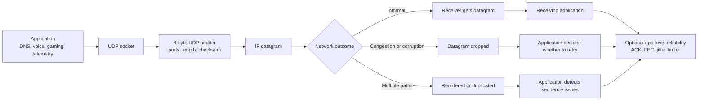

# UDP (User Datagram Protocol)

[Back to Networking topics](README.md) · [Module guide](../02-networking.md)

## 📌 Learning Checklist
- [ ] Understand the lightweight, connectionless architecture of UDP.
- [ ] Contrast the UDP 8-byte header with the TCP 20-60 byte header.
- [ ] Grasp why UDP does not provide delivery guarantees, ordering, flow control, or congestion control.
- [ ] Analyze key use cases: DNS, Live Video Streaming, VoIP (WebRTC), Multiplayer Gaming, and Metrics Ingestion (StatsD).
- [ ] Understand Reliability-on-top-of-UDP (Application-layer reliability like QUIC, KCP, and SRT).
- [ ] Defend UDP architectural choices in Staff-level low-latency interviews.

---

## 🗺️ UDP Delivery Model Diagram



**Diagram walkthrough:** UDP preserves message boundaries and adds ports plus a checksum, but it does not create a connection or promise delivery order. When an application needs recovery, pacing, or duplicate detection, it implements those features itself or uses a UDP-based protocol such as QUIC.

---

## 📖 Deep Dive Notes

### 1. সহজ সংজ্ঞা ও Intuitive Mental Model

**UDP (User Datagram Protocol - Layer 4)** হলো একটি চরম হালকা, কানেকশন-লেস (Connectionless) এবং আন-রিলায়েবল (Unreliable) ট্রান্সপোর্ট লেয়ার প্রোটোকল যা কোনো প্রারম্ভিক হ্যান্ডশেক বা সংযোগ স্থাপন ছাড়াই সরাসরি এক হোস্ট থেকে অন্য হোস্টে স্বাধীন ডেটাগ্রাম (Datagram) প্রেরণ করে।

UDP-তে কোনো অ্যাকনলেজমেন্ট (ACK), প্যাকেট রি-ট্রান্সমিশন, প্যাকেট অর্ডারিং বা কনজেশন কন্ট্রোল থাকে না—এটি সম্পূর্ণ **"Fire-and-Forget"** বা বেস্ট-এফোর্ট মডেলে চলে।

```
UDP Packet Structure (Only 8 Bytes Header!):
 0                   1                   2                   3
 0 1 2 3 4 5 6 7 8 9 0 1 2 3 4 5 6 7 8 9 0 1 2 3 4 5 6 7 8 9 0 1
+-+-+-+-+-+-+-+-+-+-+-+-+-+-+-+-+-+-+-+-+-+-+-+-+-+-+-+-+-+-+-+-+
|          Source Port          |       Destination Port        |
+-+-+-+-+-+-+-+-+-+-+-+-+-+-+-+-+-+-+-+-+-+-+-+-+-+-+-+-+-+-+-+-+
|            Length             |           Checksum            |
+-+-+-+-+-+-+-+-+-+-+-+-+-+-+-+-+-+-+-+-+-+-+-+-+-+-+-+-+-+-+-+-+
|                             Data                              |
+-+-+-+-+-+-+-+-+-+-+-+-+-+-+-+-+-+-+-+-+-+-+-+-+-+-+-+-+-+-+-+-+
```

> 🧠 **Intuitive Mental Model (লাইভ রেডিও বা টেলিভিশন সম্প্রচার অ্যানালজি):**
> আপনি রেডিওতে লাইভ ক্রিকেট খেলার ধারাভাষ্য শুনছেন বা টিভিতে ফুটবল ম্যাচ দেখছেন।
> ধারাভাষ্যকার কথা বলেই চলেছেন (**UDP Stream**)। মাঝপথে ২ সেকেন্ডের জন্য রেডিওতে সামান্য ক্যাঁচক্যাঁচ শব্দ হলো এবং আপনি একটি বলের বর্ণনা শুনতে পেলেন না (**Packet Drop**)।
> রেডিও স্টেশন কি ধারাভাষ্য থামিয়ে আপনাকে সেই মিস হওয়া ২ সেকেন্ডের কথা পুনরায় শোনানোর জন্য খেলা আটকে রাখবে? কখনোই না! কারণ আপনি চান বর্তমান মুহূর্তের লাইভ খেলা দেখতে—পুরোনো মিস হওয়া সেকেন্ডের কোনো মূল্য নেই। 
> যদি এটি টিসিপি হতো, তবে প্রতিবার প্যাকেট হারালে পুরো লাইভ ব্রডকাস্ট পজ হয়ে বাফারিং করত!

---

### 2. কেন এবং কখন UDP সেরা পছন্দ?

1. **Ultra-Low Latency (শূন্য হ্যান্ডশেক ডিলে):**
   - কোনো ৩-ওয়ে হ্যান্ডশেক লাগে না। ১ম মিলিসেকেন্ডেই ডেটা ওয়্যারে পাঠানো যায় (Zero RTT connection cost)।
2. **Small Header Overhead:**
   - TCP হেডার থাকে ২০ থেকে ৬০ বাইট; UDP হেডার মাত্র **৮ বাইট**। কোটি কোটি ছোট প্যাকেটে এটি বিশাল ব্যান্ডউইথ সাশ্রয় করে।
3. **No Head-of-Line Blocking:**
   - একটি প্যাকেট হারিয়ে গেলেও অন্য কোনো প্যাকেট আটকে থাকে না; রিসিভার তৎক্ষণাৎ পরবর্তী প্যাকেট প্রসেস করে।
4. **Multicast & Broadcast Support:**
   - একটি একক প্যাকেট একই লোকাল নেটওয়ার্কের সমস্ত ডিভাইসে ব্রডকাস্ট করা যায় (টিসিপিতে কেবল পয়েন্ট-টু-পয়েন্ট সম্ভব)।

---

### 3. বাস্তব প্রোডাকশন ব্যবহারের ক্ষেত্রসমূহ (Real-World Use Cases)

```
              [ Real-World UDP Ecosystem ]
                           │
       ┌───────────────────┼───────────────────┐
       ▼                   ▼                   ▼
[ Real-Time Media ]  [ Infrastructure ]  [ High-Throughput ]
 - VoIP (Zoom/Teams)  - DNS Resolution    - StatsD Metrics
 - WebRTC Video Calls - DHCP Assignment   - Syslog Logging
 - Multiplayer Games  - NTP Time Sync     - OpenVPN (Tunnel)
```

1. **DNS Resolution (Port 53):** একটি মাত্র কুয়েরি এবং একটি মাত্র রেসপন্স। টিসিপি হ্যান্ডশেকের ৩টি রাউন্ড ট্রিপ করা চরম অপচয়; তাই ডিফল্টভাবে UDP ব্যবহৃত হয়।
2. **Multiplayer Gaming (FPS / Battle Royale):** খেলোয়াড়ের মাউস ও কী-বোর্ড পজিশন প্রতি সেকেন্ডে ৬০ বার সার্ভারে পাঠানো হয়। ৫০ মিলিসেকেন্ড আগের হারিয়ে যাওয়া পজিশন রিট্রাই করার কোনো দরকার নেই; খেলোয়াড় বর্তমান পজিশন চায়।
3. **WebRTC & Live Video (Zoom, Google Meet):** ভিডিও ফ্রেমে সামান্য পিক্সেলেশন (Artifact) মেনে নেওয়া যায়, কিন্তু ভিডিও আটকে গিয়ে ফ্রেম ড্রপ হওয়া গ্রহণযোগ্য নয়।
4. **High-Throughput Metrics & Telemetry (StatsD):** প্রতি সেকেন্ডে সার্ভার থেকে হাজার হাজার কাউন্টার ও টাইমিং মেট্রিক্স পাঠানো হয়। দু-একটি মেট্রিক্স প্যাকেট ড্রপ হলেও অ্যাপ্লিকেশনের মূল ট্রাফিকের ওপর কোনো প্রভাব পড়তে দেওয়া যাবে না।

---

### 4. Alternatives & Trade-offs Comparison Matrix

| বৈশিষ্ট্য | UDP | TCP | SCTP |
|---|---|---|---|
| **সংযোগের ধরন** | Connectionless (হ্যান্ডশেক নেই) | Connection-oriented (3-way) | Connection-oriented (Multi-homing) |
| **হেডার ওভারহেড** | মাত্র ৮ বাইট | ২০–৬০ বাইট | ২৮ বাইট |
| **প্যাকেট লস হ্যান্ডলিং** | ড্রপ হয় (কিছুই করে না) | স্বয়ংক্রিয় রি-ট্রান্সমিশন | নির্ভরযোগ্য ও আংশিক নির্ভরযোগ্য মোড |
| **প্যাকেট সিকোয়েন্সিং** | কোনো গ্যারান্টি নেই | কঠোর গ্যারান্টি | মাল্টি-স্ট্রিম গ্যারান্টি |
| **ব্যান্ডউইথ ব্যবহার** | ন্যূনতম | অতিরিক্ত হেডার ও ACK ট্রাফিক | মাঝারি |
| **কনজেশন প্রোটেকশন** | নেই (নেটওয়ার্ক ফ্লাড হতে পারে) | বিল্ট-ইন (AIMD, CUBIC, BBR) | বিল্ট-ইন |

---

### 5. Failure Modes & Production Mitigations

#### Failure Mode 1: UDP Buffer Overflow (Silent Packet Dropping)
- **ঝুঁকি:** সেন্ডার ওএস এত দ্রুত UDP প্যাকেট পাঠাচ্ছে যে রিসিভারের ওএস সকেট বাফার (`rmem_default`) উপচে কার্নেল লেভেলে প্যাকেট সাইলেন্টলি ড্রপ হয়ে যাচ্ছে। অ্যাপ্লিকেশন জানতেও পারে না ডেটা হারিয়েছে।
- **প্রতিরোধ (Mitigation):** লিনাক্স কার্নেলে `net.core.rmem_max` বাফার সাইজ বাড়ানো এবং অ্যাপ্লিকেশনে ডেডিকেটেড রিসিভার থ্রেড দিয়ে বাফার দ্রুত ড্রেন করা।

#### Failure Mode 2: UDP Amplification DDoS Attack
- **ঝুঁকি:** আক্রমণকারী ভিকটিমের আইপি স্পুফ (Spoof) করে পাবলিক ওপেন DNS বা NTP সার্ভারে ছোট UDP রিকোয়েস্ট পাঠায়। সার্ভারগুলো ভিকটিমের আইপিতে ৫০ গুণ বড় রেসপন্স পাঠিয়ে ভিকটিমের ব্যান্ডউইথ ধ্বংস করে দেয়।
- **প্রতিরোধ:** Response Rate Limiting (RRL) প্রয়োগ করা এবং ফায়ারওয়ালে আনসলিসিটেড UDP ব্লক করা।

---

### 6. Senior / Staff Engineer Interview Defense

> **ইন্টারভিউয়ার:** *"আমরা একটি রিয়েল-টাইম অডিও/ভিডিও কনফারেন্সিং সিস্টেম (যেমন Zoom) ডিজাইন করছি। আপনি কি TCP ব্যবহার করবেন নাকি UDP? প্যাকেট হারিয়ে গেলে কোয়ালিটি কীভাবে নিশ্চিত করবেন?"*
>
> 💡 **Staff-Level উত্তরের কাঠামো:**
> "লাইভ ইন্টারঅ্যাক্টিভ অডিও/ভিডিওর জন্য TCP একটি সম্পূর্ণ অনুপযুক্ত প্রোটোকল। যদি একটি অডিও প্যাকেট ড্রপ হয়, TCP-র Head-of-Line Blocking-এর কারণে পুরো কলটি কয়েক সেকেন্ড পজ হয়ে থাকবে যা কনভারসেশন ধ্বংস করে দেবে। তাই আমরা однозначно **UDP (WebRTC / SRTP)** বেছে নেব:
> 1. **প্যাকেট লস প্রশমনে Forward Error Correction (FEC):** আমরা ভিডিও ফ্রেমের সাথে গাণিতিক রিডানড্যান্ট প্যারিটি প্যাকেট পাঠাব (যেমন: Reed-Solomon Code)। ৫টি ডেটা প্যাকেটের সাথে ১টি FEC প্যাকেট পাঠালে যেকোনো ১টি প্যাকেট হারালেও রিসিভার রিট্রান্সমিট ছাড়াই লোকালি হারিয়ে যাওয়া প্যাকেটটি রিকনস্ট্রাক্ট করতে পারে।
> 2. **Jitter Buffer:** নেটওয়ার্কের অসম দেরিতে আসা প্যাকেটগুলোকে প্লে-আউটের আগে একটি খুব ছোট অ্যাডাপ্টিভ ৫০-১০০ms বাফারে স্মুথ করে সুন্দর ক্রমানুসারে স্পিকারে বাজানো হবে।
> 3. **Selective Retransmission (NACK):** কেবল মাত্র কী-ফ্রেম (I-Frame) ড্রপ হলে ক্লায়েন্ট দ্রুত একটি NACK সংকেত পাঠিয়ে শুধুমাত্র ওই নির্দিষ্ট ফ্রেমটি রিট্রাই করবে, তবে সাধারণ অডিও ডেটাতে কোনো রিট্রাই চালানো হবে না।"

---

## 📝 Practice Questions

```markdown
### Basic Practice Questions
1. UDP প্রোটোকলের মূল সংজ্ঞা কী এবং এটি কেন Connectionless?
2. UDP হেডারে কোন ৪টি ফিল্ড থাকে এবং এর মোট আকার কত বাইট?
3. কেন DNS রেজোলিউশনের জন্য টিসিপির বদলে ডিফল্টভাবে ইউডিপি ব্যবহৃত হয়?
4. UDP প্যাকেট হারিয়ে গেলে বা উল্টোপাল্টা ক্রমে পৌঁছালে প্রোটোকল কী পদক্ষেপ নেয়?
5. কেন মাল্টিপ্লেয়ার অ্যাকশন গেমে (যেমন Counter-Strike/Valorant) TCP পরিহার করে UDP ব্যবহার করা হয়?

### Intermediate Practice Questions
6. Forward Error Correction (FEC) কীভাবে ইউডিপি স্ট্রিমিংয়ে কোনো রিট্রান্সমিশন ছাড়াই হারিয়ে যাওয়া প্যাকেট রিকভার করে?
7. WebRTC অডিও/ভিডিওতে Jitter Buffer-এর কাজ কী এবং এটি কীভাবে মসৃণ প্লে-আউট নিশ্চিত করে?
8. DNS over TCP কখন ঘটে (যেমন DNS Response Size > 512 bytes / DNSSEC)?
9. UDP Amplification DDoS আক্রমণ কীভাবে কাজ করে এবং এটি প্রতিরোধে RRL (Response Rate Limiting) কীভাবে সাহায্য করে?
10. StatsD কেন মেট্রিক্স প্রেরণের জন্য UDP বেছে নিয়েছে?

### Advanced / Staff-Level Questions
11. Reliable UDP প্রোটোকলগুলো (যেমন QUIC, KCP, RUDP, বা SRT) কীভাবে ইউডিপির লো-ল্যাটেন্সি বজায় রেখে অ্যাপ্লিকেশন লেয়ারে সিলেক্টিভ রিট্রাই ও কনজেশন কন্ট্রোল বাস্তবায়ন করে?
12. Linux কার্নেলে UDP প্যাকেট প্রসেসিং অপ্টিমাইজ করতে `SO_REUSEPORT`, UDP Segment Offload (USO) এবং `recvmmsg()` সিস্টেম কল কীভাবে কাজ করে?
13. NAT Traversal (STUN, TURN, ICE): দুটি ব্যক্তিগত ফায়ারওয়ালের পেছনে থাকা ক্লায়েন্টের মধ্যে পিয়ার-টু-পিয়ার UDP মিডিয়া স্ট্রিম কীভাবে হোল-পাঞ্চিং (Hole Punching) করে?
14. লাইভ গেমিং সার্ভার আর্কিটেকচারে ক্লায়েন্ট-সাইড প্রেডিকশন (Client-side Prediction) এবং সার্ভার রিকনসিলিয়েশন (Server Reconciliation) কীভাবে ইউডিপির প্যাকেট লস সত্ত্বেও মসৃণ গেমপ্লে দেয়?
15. টেলিকমিউনিকেশন ও মোবাইল ভয়েসে (VoLTE / SIP) প্যাকেট লস কনসিলমেন্ট (Packet Loss Concealment - PLC) কীভাবে মেশিন লার্নিং বা ইন্টারপোলেশন দিয়ে ড্রপ হওয়া ভয়েস সিন্থেসাইজ করে?
```

---

## 🔑 Answer Key & Self-Test Evaluation

<details>
<summary>👉 <b>Answer Key ও সমাধান দেখতে এখানে ক্লিক করুন</b></summary>

1. **সংজ্ঞা:** কোনো হ্যান্ডশেক বা সেশন প্রতিষ্ঠা ছাড়া সরাসরি স্বাধীন প্যাকেট পাঠানোর হালকা ট্রান্সপোর্ট প্রোটোকল।
2. **UDP হেডার ফিল্ডস:** সোর্স পোর্ট (২ বাইট), ডেস্টিনেশন পোর্ট (২ বাইট), লেন্থ (২ বাইট), চেকসাম (২ বাইট) — মোট ৮ বাইট।
3. **DNS-এ UDP:** একটি মাত্র ছোট কুয়েরি ও রেসপন্স; ৩-ওয়ে হ্যান্ডশেকের রাউন্ড ট্রিপ ওভারহেড ও সার্ভার সকেট মেমোরি বাঁচানোর জন্য।
4. **প্যাকেট লস প্রতিক্রিয়া:** UDP কিছুই করে না; কোনো রিট্রান্সমিট বা অর্ডারিং করে না, এটি অ্যাপ্লিকেশন লেয়ারের ওপর ছেড়ে দেয়।
5. **গেমিংয়ে UDP:** গেমাররা লাইভ বর্তমান অবস্থান চায়। ৫০ms আগের পুরোনো প্যাকেট রিট্রাই করে পুরো স্ক্রিন আটকে রাখা অগ্রহণযোগ্য।
6. **FEC মেকানিজম:** ডেটার সাথে অতিরিক্ত ম্যাথমেটিকাল রিডানড্যান্ট প্যাকেট পাঠানো, যাতে ৫টির মধ্যে ১টি হারালেও রিসিভার নিজে নিজেই হারিয়ে যাওয়া ডেটা গণনা করে বের করতে পারে।
7. **Jitter Buffer:** নেটওয়ার্কের ওঠানামায় আগে-পরে আসা অডিও প্যাকেটগুলোকে ৫০ms বাফারে জমিয়ে নিখুঁত বিরতিতে স্পিকারে ছাড়া।
8. **DNS over TCP:** যখন জোনে ট্রান্সফার (AXFR) হয় অথবা পে-লোড ৫১২ বাইটের বেশি হয় (DNSSEC বা বড় TXT রেকর্ড), তখন ক্লায়েন্ট টিসিপিতে ফলব্যাক করে।
9. **UDP Amplification:** স্পুফড আইপি দিয়ে ছোট রিকোয়েস্টে বিশাল রেসপন্স তৈরি করে ভিকটিমকে ভাসিয়ে দেওয়া। RRL দিয়ে একই আইপিতে প্রতি সেকেন্ডে রেসপন্স সীমিত করা হয়।
10. **StatsD UDP:** মেট্রিক্সের জন্য মূল প্রোডাকশন অ্যাপের ১ মিলি-সেকেন্ডও ব্লকিং হওয়া যাবে না। মেট্রিক্স ড্রপ হলে ক্ষতি নেই, কিন্তু অ্যাপ যেন দ্রুত থাকে।
11. **Reliable UDP / QUIC:** ইউডিপির ওপর বসে নিজস্ব সিকোয়েন্স ট্র্যাকিং, প্যাকেট-লেভেল সিলেক্টিভ রিট্রাই এবং BBR কনজেশন অ্যালগরিদম চালায়।
12. **recvmmsg() & USO:** প্রতি প্যাকেটে আলাদা ওএস সিস্টেম কল না করে একটি মাত্র সিস্টেম কলে কার্নেল থেকে একসাথে এক গুচ্ছ (Batch) UDP প্যাকেট ইউজার মেমোরিতে রিড করা।
13. **NAT Hole Punching:** ক্লায়েন্টরা পাবলিক STUN সার্ভারে প্যাকেট পাঠিয়ে নিজস্ব পাবলিক আইপি ও পোর্ট বের করে, তারপর উভয় ক্লায়েন্ট সরাসরি পরস্পরের দিকে ইউডিপি প্যাকেট ছুড়ে ফায়ারওয়াল পোর্ট ওপেন করে।
14. **Client Prediction:** ক্লায়েন্ট সার্ভারের রেসপন্সের অপেক্ষা না করে অবিলম্বে নিজের স্ক্রিনে প্লেয়ারকে এগিয়ে দেয়; পরে সার্ভার থেকে আপডেট আসলে অবস্থান ফাইন-টিউন করে।
15. **Packet Loss Concealment (PLC):** অডিও প্যাকেট হারালে সাউন্ড নীরব না করে পূর্ববর্তী ফ্রেমের ওয়েভফর্ম বিশ্লেষণ করে কৃত্রিমভাবে মসৃণ শব্দ পূরণ করা যাতে কানে খটকা না লাগে।

</details>
