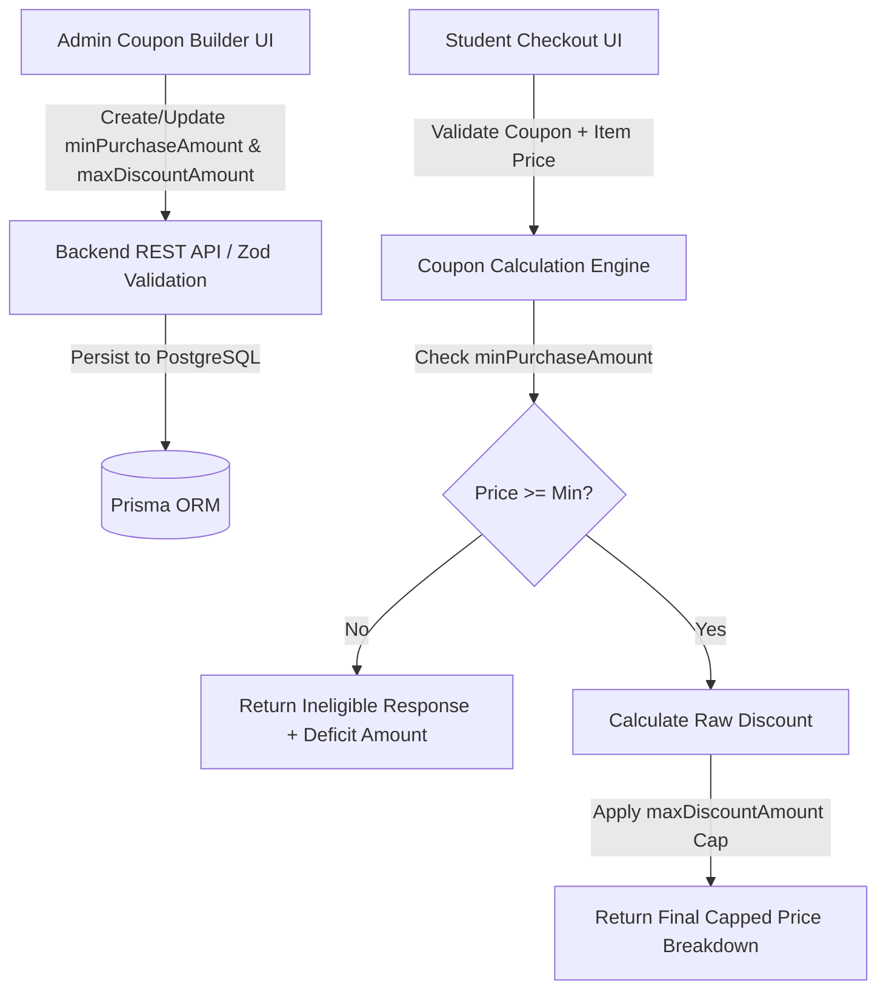

# Enterprise Implementation Plan: Coupon Price Cap & Minimum Purchase Threshold

A robust, enterprise-grade implementation for defining **Minimum Purchase Amounts** and **Maximum Discount Price Caps** on promotional coupons across the Unive monorepo stack.

---

## 🎯 Feature Overview & Business Rules

### Feature Specifications
1. **Minimum Purchase Threshold (`minPurchaseAmount`)**: Restricts coupon eligibility to purchases equal to or exceeding a specified order value.
2. **Maximum Discount Price Cap (`maxDiscountAmount`)**: Enforces an absolute upper ceiling on the monetary discount given by a coupon (especially critical for percentage-based offers).

### Business Example Scenario
- **Coupon Code**: `UNIVE10`
- **Offer**: 10% Discount
- **Min. Purchase**: `BDT 5,000`
- **Max. Discount Cap**: `BDT 500`

| Purchase Price | Qualification | Raw Discount (10%) | Cap Applied | Final Discount | Final Payable |
| :--- | :--- | :--- | :--- | :--- | :--- |
| **BDT 4,000** | ❌ Ineligible | BDT 400 | N/A | BDT 0 | BDT 4,000 *(Requires BDT 1,000 more)* |
| **BDT 5,000** | ✅ Qualified | BDT 500 | No | BDT 500 | BDT 4,500 |
| **BDT 8,000** | ✅ Qualified | BDT 800 | ⚡ Capped | **BDT 500** | BDT 7,500 |

---

## 🏛️ System Architecture & Layer Breakdown



---

## 📋 Proposed Implementation Steps

### 1. Database Schema Extensions (`apps/backend`)

#### [MODIFY] [schema.prisma](file:///c:/Users/Masud%20Rana/Desktop/unive-monorepo/apps/backend/prisma/schema.prisma)
Extend `Coupon` model with double-precision decimal/float fields:
```prisma
model Coupon {
  id                String   @id @default(uuid())
  code              String   @unique
  name              String
  description       String?
  discountValue     Float
  minPurchaseAmount Float?   // Minimum purchase threshold required to apply coupon
  maxDiscountAmount Float?   // Maximum allowable discount price cap
  usageLimit        Int?
  ...
}
```
*Execute `npx prisma generate` to update types in `@prisma/client`.*

---

### 2. Backend Business & Validation Logic (`apps/backend`)

#### [MODIFY] [coupon.constant.ts](file:///c:/Users/Masud%20Rana/Desktop/unive-monorepo/apps/backend/src/app/modules/coupon/coupon.constant.ts)
- Add `minPurchaseAmount?: number | null` and `maxDiscountAmount?: number | null` to `CouponPayload`, `ICoupon`, and `ICouponFilterRequest`.

#### [MODIFY] [coupon.validation.ts](file:///c:/Users/Masud%20Rana/Desktop/unive-monorepo/apps/backend/src/app/modules/coupon/coupon.validation.ts)
- Add `minPurchaseAmount: z.number().min(0).nullable().optional()` and `maxDiscountAmount: z.number().min(0).nullable().optional()` to create and update schemas.
- Add optional `purchaseAmount: z.number().optional()` to `validateCouponZodSchema` and `redeemCouponZodSchema`.

#### [MODIFY] [coupon.service.ts](file:///c:/Users/Masud%20Rana/Desktop/unive-monorepo/apps/backend/src/app/modules/coupon/coupon.service.ts)
- **`validateCoupon` / Calculation Engine**:
  - Evaluate `minPurchaseAmount`: If purchase amount < `minPurchaseAmount`, return structured `isValid: false` with exact deficit information.
  - Calculate raw discount: `rawDiscount = discountType === 'FLAT' ? discountValue : (purchaseAmount * discountValue) / 100`.
  - Apply price cap: `effectiveDiscount = maxDiscountAmount ? Math.min(rawDiscount, maxDiscountAmount) : rawDiscount`.
  - Return rich metadata payload: `{ isValid, coupon, originalPrice, discountAmount, isCapped, maxDiscountAmount, minPurchaseAmount, finalPrice }`.
- **`getCouponByTrainingId`**:
  - Look up training price/discountPrice and pre-evaluate eligibility per coupon.
  - Return `minPurchaseAmount` and `maxDiscountAmount` for frontend ticket rendering.
- **`createCoupon` / `updateCoupon`**:
  - Save parameters and log rich event metadata to `MainLog`.

---

### 3. Frontend State & API Layers (`apps/frontend`)

#### [MODIFY] [couponApi.ts](file:///c:/Users/Masud%20Rana/Desktop/unive-monorepo/apps/frontend/src/redux/api/adminApi/couponApi.ts)
- Inject `validateCouponWithPrice` mutation supporting `{ code, category, trainingId, purchaseAmount }`.
- Update response types to include `minPurchaseAmount` and `maxDiscountAmount`.

---

### 4. Admin Management Interface (`apps/frontend`)

#### [MODIFY] [CouponForm.tsx](file:///c:/Users/Masud%20Rana/Desktop/unive-monorepo/apps/frontend/src/app/(dashboard)/dashboard/admin/manage-live-coupon/_components/CouponForm.tsx)
- Integrate dedicated **Purchase Thresholds & Price Caps** form section:
  - Input field for **Minimum Eligible Purchase (৳)** with clear contextual microcopy.
  - Input field for **Maximum Discount Price Cap (৳)** with price cap explanation.
- Enhanced **Coupon Summary & Simulation Card**:
  - Live interactive calculation preview demonstrating how percentage and flat discounts will be capped for sample purchase values.

#### [MODIFY] [create/page.tsx](file:///c:/Users/Masud%20Rana/Desktop/unive-monorepo/apps/frontend/src/app/(dashboard)/dashboard/admin/manage-live-coupon/create/page.tsx), [edit/[id]/page.tsx](file:///c:/Users/Masud%20Rana/Desktop/unive-monorepo/apps/frontend/src/app/(dashboard)/dashboard/admin/manage-live-coupon/edit/%5Bid%5D/page.tsx), [duplicate-create/[id]/page.tsx](file:///c:/Users/Masud%20Rana/Desktop/unive-monorepo/apps/frontend/src/app/(dashboard)/dashboard/admin/manage-live-coupon/duplicate-create/%5Bid%5D/page.tsx)
- Seamless payload mapping for `minPurchaseAmount` and `maxDiscountAmount`.

#### [MODIFY] [page.tsx](file:///c:/Users/Masud%20Rana/Desktop/unive-monorepo/apps/frontend/src/app/(dashboard)/dashboard/admin/manage-live-coupon/page.tsx)
- Add badged columns to the Admin Coupon Table displaying `Min. Purchase` and `Max Cap`.

---

### 5. Student Checkout & Coupon Card Aesthetics (`apps/frontend`)

#### [MODIFY] [CouponCard.tsx](file:///c:/Users/Masud%20Rana/Desktop/unive-monorepo/apps/frontend/src/components/live-training/liveTrainingDetails/CouponCard.tsx) & [CouponCardsListOffer.tsx](file:///c:/Users/Masud%20Rana/Desktop/unive-monorepo/apps/frontend/src/components/live-training/liveTrainingDetails/CouponCardsListOffer.tsx)
- Premium ticket design upgrade:
  - Micro-badge for `Min Spend ৳X`.
  - Micro-badge for `Max Cap ৳Y`.
  - Disabled/warning state with progress indicator if purchase amount does not qualify.

#### [MODIFY] [liveTrainingDetails.tsx](file:///c:/Users/Masud%20Rana/Desktop/unive-monorepo/apps/frontend/src/components/live-training/liveTrainingDetails/liveTrainingDetails.tsx) & [ViewSkillAssessment.tsx](file:///c:/Users/Masud%20Rana/Desktop/unive-monorepo/apps/frontend/src/components/SkillAssessment/ViewSkillAssessment.tsx)
- Update client-side validation logic to check `minPurchaseAmount` and apply `maxDiscountAmount` price cap.
- Elegant toast notification:
  - If capped: `🎉 Coupon UNIVE10 applied! Saved ৳500 (Maximum price cap of ৳500 applied)`.
  - Price summary breakdown showing original price, raw discount, cap adjustment, and final total.

---

## 🧪 Verification & Testing Strategy

### 1. Automated Verification
- Run `pnpm type-check` across `apps/backend` and `apps/frontend` to ensure 100% strict TypeScript compliance.

### 2. Manual End-to-End Scenarios
1. **Admin Creation Test**: Create coupon `UNIVE10` (10% OFF, Min Spend: ৳5,000, Max Cap: ৳500).
2. **Under-Threshold Test**: Apply on ৳4,000 item -> Confirm rejection message: *"Minimum purchase of ৳5,000 required."*
3. **Threshold Qualification Test**: Apply on ৳5,000 item -> Confirm ৳500 discount applied cleanly.
4. **Price Cap Exceeded Test**: Apply on ৳8,000 item -> Confirm raw discount ৳800 is automatically capped at ৳500 maximum.
