# 🏗️ System Design Interview Questions — Complete Roadmap

> A comprehensive collection of system design interview questions organized by experience level,
> complete with architecture diagrams, key components, and design considerations.

---

## 📋 Table of Contents

- [Overview Diagram](#overview-diagram)
- [Fresher Level System Design (0–3 Years)](#fresher-level-system-design)
- [Experienced Level System Design (3–15+ Years)](#experienced-level-system-design)
- [Quick Reference Matrix](#quick-reference-matrix)

---

## Overview Diagram

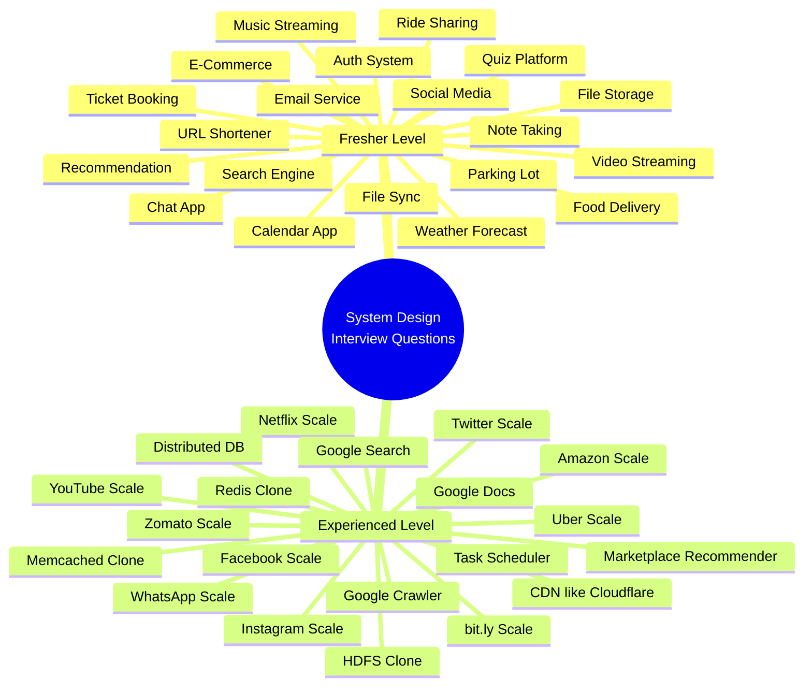

---

## Fresher Level System Design

> **Target Audience:** 0–3 years of experience
> **Focus:** Core concepts, basic architecture, single-service design, fundamental data modeling

---

### 1. Design a Simple URL Shortening Service

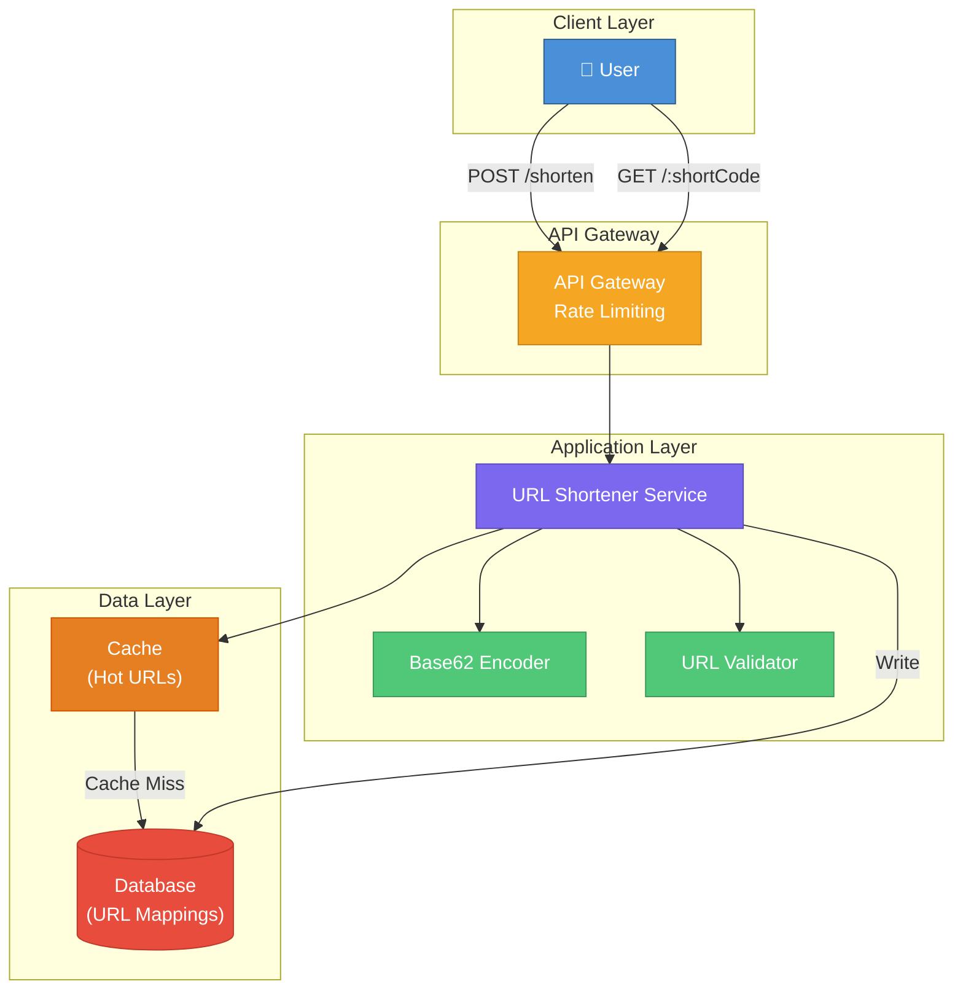

**📖 Step-by-Step Diagram Walkthrough:**

**Step 1 — User Request:** The user sends either a `POST /shorten` request (to create a short URL) or a `GET /:shortCode` request (to be redirected to the original URL). All requests hit the API Gateway first.

**Step 2 — API Gateway (Rate Limiting):** The gateway enforces rate limits (e.g., 100 requests/min per user) to prevent abuse. It authenticates the request and forwards it to the URL Shortener Service.

**Step 3 — URL Validator:** For creation requests, the URL Validator checks that the long URL is valid — proper format, reachable domain, not on a blocklist (malware/phishing).

**Step 4 — Base62 Encoder:** The service generates a unique short code. Two approaches:
- **Counter-based:** An auto-incrementing ID is converted to a Base62 string (a-z, A-Z, 0-9). A 7-character code gives ~3.5 trillion combinations.
- **Hash-based:** MD5/SHA-256 hash of the URL, taking the first 7 characters. Collisions must be handled with retry logic.

**Step 5 — Cache (Hot URLs):** For read requests (`GET /:shortCode`), the service first checks the in-memory cache (Redis/Memcached). Since URL shorteners are extremely read-heavy (~100:1 read-to-write ratio), caching the most frequently accessed URLs dramatically reduces database load. Uses LRU (Least Recently Used) eviction when the cache is full.

**Step 6 — Database (URL Mappings):** On cache miss, the service queries the database (e.g., DynamoDB, PostgreSQL). The mapping `shortCode → longURL` is stored. For writes, both the database and cache are updated. The database also stores metadata like creation timestamp, expiration date, and the creator's user ID.

**Step 7 — Redirect Response:** The service responds with a redirect:
- **301 (Permanent Redirect):** Browser caches the redirect — subsequent visits bypass the server entirely. Better for performance but you lose analytics.
- **302 (Temporary Redirect):** Browser always checks with the server first. Enables click tracking and analytics but adds latency.

**🎯 Key Trade-offs:**
- **Read-heavy optimization:** With a 100:1 ratio, cache hit rate is critical. Use Redis with LRU eviction.
- **Analytics pipeline:** Log every redirect to a message queue for async processing — clicks per day, geographic distribution, referrer tracking.
- **URL expiration:** Add TTL (Time to Live) to entries and run periodic cleanup jobs to remove expired URLs.

---

### 2. Design a Basic Chat Application

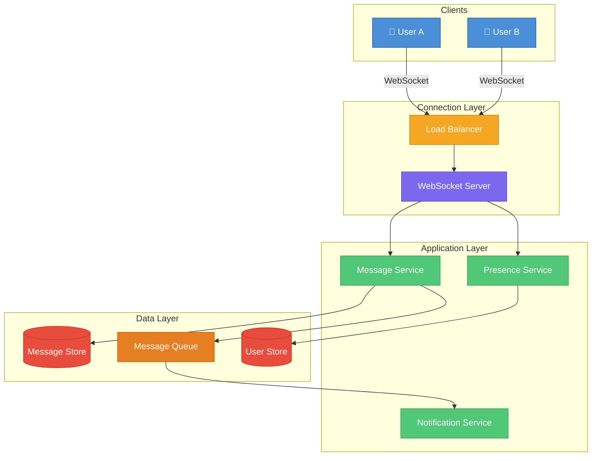

**📖 Step-by-Step Diagram Walkthrough:**

**Step 1 — User Connection:** User A and User B both establish persistent WebSocket connections through the Load Balancer. Unlike HTTP (request-response), WebSocket maintains a full-duplex, long-lived connection enabling real-time bidirectional communication.

**Step 2 — Load Balancer:** Distributes incoming WebSocket connections across multiple WebSocket Server instances. Uses sticky sessions (session affinity) so a user's connection stays on the same server.

**Step 3 — WebSocket Server:** Manages the persistent connections. When User A sends a message to User B, the WebSocket Server receives it and forwards it to the Message Service. The server maintains a mapping of `userId → connectionId`.

**Step 4 — Message Service:** Validates the message (size limits, content filtering), assigns a unique message ID and timestamp for ordering, then persists it to the Message Store. Messages are stored chronologically per conversation.

**Step 5 — Message Queue:** The message is published to a queue (e.g., RabbitMQ, Kafka). This decouples message processing from delivery — if User B is on a different WebSocket server, the queue routes it to the correct server. Also handles retry logic for failed deliveries.

**Step 6 — Presence Service:** Tracks which users are online/offline/typing. User heartbeats (sent every ~30 seconds) update the User Store. When a user disconnects, a grace period (e.g., 30s) prevents flapping between online/offline states.

**Step 7 — Notification Service:** If User B is offline, the Notification Service sends a push notification (APNs for iOS, FCM for Android). Messages are queued for offline users and delivered when they reconnect.

**🎯 Key Trade-offs:**
- **WebSocket vs Long Polling vs SSE:** WebSocket is best for chat (bidirectional, low latency). Long Polling is a fallback for firewalled environments. SSE is server-to-client only.
- **Message ordering:** Use server-assigned timestamps + sequence numbers per conversation. Lamport clocks for distributed ordering.
- **Group chat:** Fan-out to all group members via the message queue. Limit group sizes to control fan-out cost.

---

### 3. Design a File Storage System

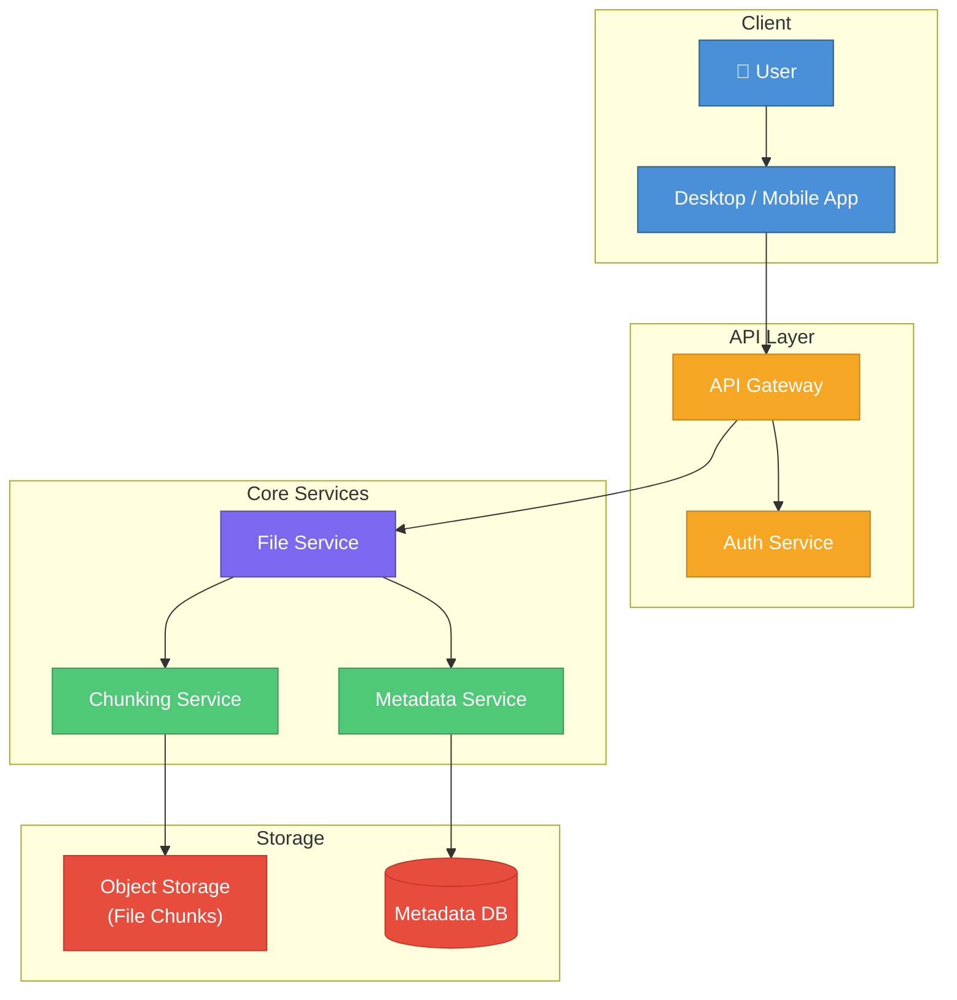

**📖 Step-by-Step Diagram Walkthrough:**

**Step 1 — User & App:** The user interacts through a desktop or mobile application. The app handles local file operations, change detection, and communicates with the backend via REST/gRPC APIs.

**Step 2 — API Gateway:** All requests pass through the gateway which handles SSL termination, request routing, and rate limiting. It ensures only authenticated users can access the system.

**Step 3 — Auth Service:** Validates user credentials and authorization. Checks if the user has permission to upload/download/share the requested file. Uses JWT tokens for stateless authentication.

**Step 4 — File Service:** The core orchestrator. For uploads: receives the file, coordinates chunking, and triggers metadata creation. For downloads: retrieves metadata, assembles chunks, and streams the file back to the user.

**Step 5 — Chunking Service:** Splits large files into fixed-size chunks (e.g., 4MB each). Each chunk is hashed (SHA-256) to create a unique identifier. This enables:
- **Deduplication:** If the same chunk already exists (same hash), skip uploading it. Saves storage dramatically for similar files.
- **Resumable uploads:** If an upload fails, only the remaining chunks need to be re-uploaded.
- **Parallel transfer:** Multiple chunks can be uploaded/downloaded simultaneously.

**Step 6 — Object Storage:** Chunks are stored in an object storage system (like S3, GCS). Each chunk is stored by its hash as the key. Object storage provides durability (11 9's) and horizontal scalability.

**Step 7 — Metadata Service & DB:** Stores file metadata — filename, path, owner, permissions, chunk list (ordered hashes), version history, timestamps. The Metadata DB (PostgreSQL/DynamoDB) maps `fileId → [chunk1_hash, chunk2_hash, ...]`.

**🎯 Key Trade-offs:**
- **Chunking granularity:** Smaller chunks = better deduplication + faster resumability, but more metadata overhead. 4MB is a common sweet spot.
- **Versioning:** Store full snapshots (expensive) vs delta-based versioning (complex but storage-efficient).
- **Conflict resolution:** Last-write-wins (simple) vs manual merge (user-friendly). Dropbox uses a "conflicted copy" approach.

---

### 4. Design a Simple Social Media Platform

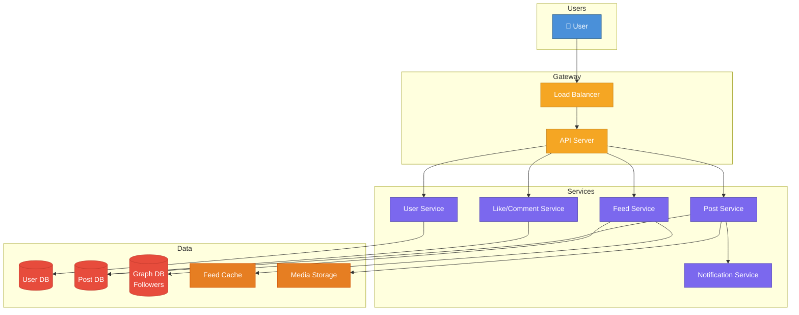

**📖 Step-by-Step Diagram Walkthrough:**

**Step 1 — User Request:** The user accesses the platform — creating posts, following others, liking content, or scrolling their feed. All requests pass through the Load Balancer.

**Step 2 — Load Balancer → API Server:** The Load Balancer (e.g., Nginx, HAProxy) distributes traffic using round-robin or least-connections algorithm. The API Server routes requests to the appropriate microservice.

**Step 3 — User Service → User DB:** Manages user profiles, authentication, and settings. Stores user data (name, email, bio, profile picture URL) in the User DB. Handles registration, login, and profile updates.

**Step 4 — Post Service → Post DB & Media Storage:** When a user creates a post:
1. Text content is stored in the Post DB (PostgreSQL/MySQL)
2. Media (images, videos) is uploaded to Media Storage (object storage like S3)
3. The Post DB stores the media URL, not the media itself
4. Post Service triggers the Notification Service to alert tagged users

**Step 5 — Feed Service → Feed Cache & Graph DB:** The most complex component. Two strategies:
- **Fan-out on write (push model):** When User A posts, the system immediately writes the post ID to the feed cache of every follower. Fast reads, expensive writes. Works for users with <10K followers.
- **Fan-out on read (pull model):** When User B opens their feed, the system fetches posts from all users they follow and merges them. Slow reads, cheap writes. Better for celebrities with millions of followers.

**Step 6 — Graph DB (Followers):** Stores the social graph — who follows whom. A graph database (Neo4j) or adjacency list in a relational DB. Queries like "mutual friends" and "suggested connections" are graph traversal problems.

**Step 7 — Like/Comment Service → Post DB:** Handles engagement. Like counts use counters (not count queries) for performance. Comments are stored as a separate table linked to post IDs.

**🎯 Key Trade-offs:**
- **Hybrid fan-out:** Use push for regular users, pull for celebrities (>100K followers). This avoids writing to millions of caches.
- **Feed ranking:** Chronological (simple) vs algorithmic (ML-based relevance scoring considering engagement, relationship, recency).
- **Privacy:** Row-level security on posts. Private accounts require follow-request approval before feed inclusion.

---

### 5. Design a Simple Search Engine

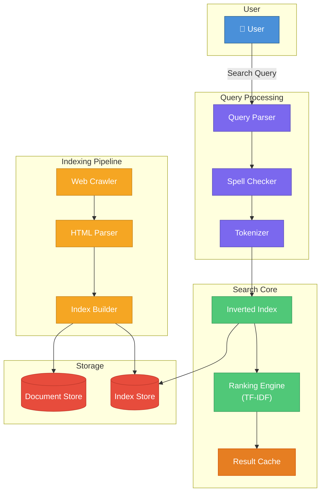

**📖 Step-by-Step Diagram Walkthrough:**

**Step 1 — Search Query:** The user types a search query (e.g., "best restaurants near me"). The Query Parser receives the raw query string.

**Step 2 — Query Parser → Spell Checker → Tokenizer:** The query goes through a processing pipeline:
1. **Query Parser:** Extracts intent, identifies operators (AND, OR, quotes for exact match)
2. **Spell Checker:** Uses edit distance (Levenshtein) and a dictionary to suggest corrections. "resturant" → "Did you mean: restaurant?"
3. **Tokenizer:** Breaks the query into individual tokens, removes stop words ("the", "is", "near"), applies stemming ("restaurants" → "restaurant")

**Step 3 — Inverted Index:** The core data structure of any search engine. Maps each word to a list of document IDs containing that word:
```
"restaurant" → [doc_12, doc_45, doc_89, doc_102, ...]
"best"       → [doc_3, doc_12, doc_45, doc_200, ...]
```
The intersection of posting lists gives documents containing ALL query terms.

**Step 4 — Ranking Engine (TF-IDF):** Not all matching documents are equally relevant. TF-IDF scores each document:
- **TF (Term Frequency):** How often the term appears in the document. More occurrences = more relevant.
- **IDF (Inverse Document Frequency):** How rare the term is across all documents. Rare terms are more informative.
- Score = TF × IDF for each term, summed across query terms.

**Step 5 — Result Cache:** Caches the top results for popular queries. Search engines observe that ~30% of queries are repeated. Cache invalidation triggers when the underlying index is updated.

**Step 6 — Web Crawler (Indexing Pipeline):** Runs asynchronously in the background. Starts from seed URLs, follows links, and downloads web pages. Respects `robots.txt` and implements politeness delays (e.g., 1 request per domain per second).

**Step 7 — HTML Parser → Index Builder:** The parser extracts meaningful text from HTML (ignoring scripts, styles). The Index Builder constructs the inverted index and stores it in the Index Store. Raw documents are stored in the Document Store for snippet generation.

**🎯 Key Trade-offs:**
- **Auto-complete:** Use a Trie data structure with popularity scores. Return top-K suggestions as the user types.
- **Synonyms:** Expand queries — "car" also searches for "automobile", "vehicle". Use a synonym dictionary.
- **Freshness vs quality:** Frequently crawl news sites (hourly), less frequently for static content (weekly).

---

### 6. Design a Simple E-Commerce Website

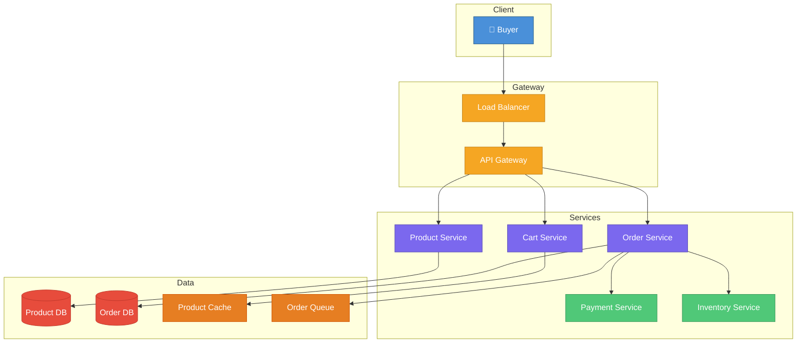

**📖 Step-by-Step Diagram Walkthrough:**

**Step 1 — Buyer Request:** The buyer browses products, adds items to cart, and places orders. All requests go through the Load Balancer → API Gateway.

**Step 2 — Load Balancer → API Gateway:** The Load Balancer distributes traffic. The API Gateway handles authentication, request validation, and routes to the correct service.

**Step 3 — Product Service → Product DB:** Manages the product catalog — titles, descriptions, prices, images, categories, reviews. The Product DB stores structured product data. For search, products are also indexed in Elasticsearch for full-text search with filters (price range, category, rating).

**Step 4 — Cart Service → Product Cache:** Manages the shopping cart. Two approaches:
- **Session-based cart:** Stored in the user's session/cookie. Lost when session expires. Simple but unreliable.
- **Persistent cart:** Stored server-side in Redis or a database. Survives across devices and sessions. Preferred approach.
The Product Cache (Redis) stores frequently accessed product data to avoid hitting the Product DB on every page load.

**Step 5 — Order Service → Order DB:** When the buyer clicks "Place Order":
1. Creates an order record with status `PENDING`
2. Validates all items are still in stock (calls Inventory Service)
3. Calculates totals (subtotal + tax + shipping)
4. Initiates payment (calls Payment Service)
5. Order state machine: `PENDING → PAYMENT_PROCESSING → CONFIRMED → SHIPPED → DELIVERED`

**Step 6 — Payment Service:** Integrates with payment gateways (Stripe, PayPal). Handles:
- Payment initiation and tokenization (never store raw card numbers)
- 3D Secure authentication
- Payment confirmation callbacks (webhooks)
- Refund processing

**Step 7 — Inventory Service:** Manages stock levels. Critical challenge — **race conditions:**
- Two users buying the last item simultaneously
- Solution: Use database-level locks or atomic decrement operations
- `UPDATE inventory SET quantity = quantity - 1 WHERE product_id = X AND quantity > 0`
- If affected rows = 0, the item is out of stock

**Step 8 — Order Queue:** After order confirmation, events are published to a message queue for async processing — send confirmation email, update analytics, trigger warehouse picking, notify shipping partner.

**🎯 Key Trade-offs:**
- **Inventory reservation:** When a user adds to cart, temporarily reserve stock for 15 minutes (TTL). Release if not purchased.
- **Eventual consistency:** Order confirmation email may arrive slightly after payment — this is acceptable.
- **Flash sales:** Pre-warm caches, use queue-based ordering to prevent thundering herd on inventory.

---

### 7. Design a Basic Ride-Sharing System

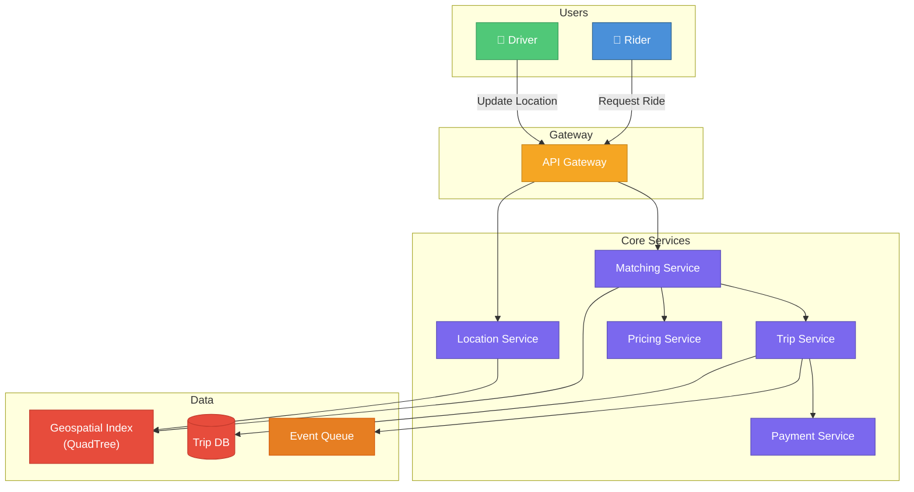

**📖 Step-by-Step Diagram Walkthrough:**

**Step 1 — Rider & Driver Requests:** Two types of users interact through the API Gateway:
- **Rider:** Sends a "Request Ride" with pickup and dropoff locations
- **Driver:** Continuously sends location updates (every 3-5 seconds via GPS)

**Step 2 — API Gateway:** Routes rider requests to the Matching Service and driver location updates to the Location Service. Handles authentication and rate limiting.

**Step 3 — Location Service → Geospatial Index:** Processes incoming driver locations and updates the Geospatial Index. The index uses a **QuadTree** or **Geohash** for efficient spatial queries:
- **QuadTree:** Recursively divides the map into quadrants. Finding nearby drivers is O(log n) — traverse the tree to the rider's quadrant and check neighboring quadrants.
- **Geohash:** Encodes latitude/longitude into a string (e.g., "9q8yyk"). Nearby locations share a common prefix. Simple range queries on the hash find neighbors.

**Step 4 — Matching Service → Geospatial Index:** When a ride is requested:
1. Query the Geospatial Index for all available drivers within a radius (e.g., 5km)
2. Rank candidates by: distance, ETA, driver rating, acceptance rate
3. Send the ride offer to the best-matched driver
4. If declined (or timeout after 15s), offer to the next candidate
5. Repeat until a driver accepts or all candidates are exhausted

**Step 5 — Pricing Service:** Calculates the fare before the rider confirms:
- **Base fare** + **per-km rate** + **per-minute rate** + **surge multiplier**
- **Surge pricing:** When demand exceeds supply in an area, the multiplier increases (1.5x, 2x, 3x). This incentivizes more drivers to enter the high-demand zone.

**Step 6 — Trip Service → Trip DB:** Once a driver accepts, a trip record is created with status `MATCHED`. The state machine: `REQUESTED → MATCHED → DRIVER_EN_ROUTE → ARRIVED → IN_PROGRESS → COMPLETED`

**Step 7 — Payment Service:** After trip completion, charges the rider's payment method. Handles split payments, tips, and refunds.

**Step 8 — Event Queue:** Publishes trip events for async processing — update driver earnings, send receipt email, log analytics for route optimization.

**🎯 Key Trade-offs:**
- **ETA calculation:** Use road network graph (not straight-line distance). Dijkstra's algorithm or ML models trained on historical trip data.
- **Driver location freshness:** Stale locations cause bad matches. Set TTL on location data (30s) — if no update, mark driver as unavailable.
- **Scalability:** Partition the geospatial index by geographic region (city-level sharding).

---

### 8. Design a Basic Video Streaming Service

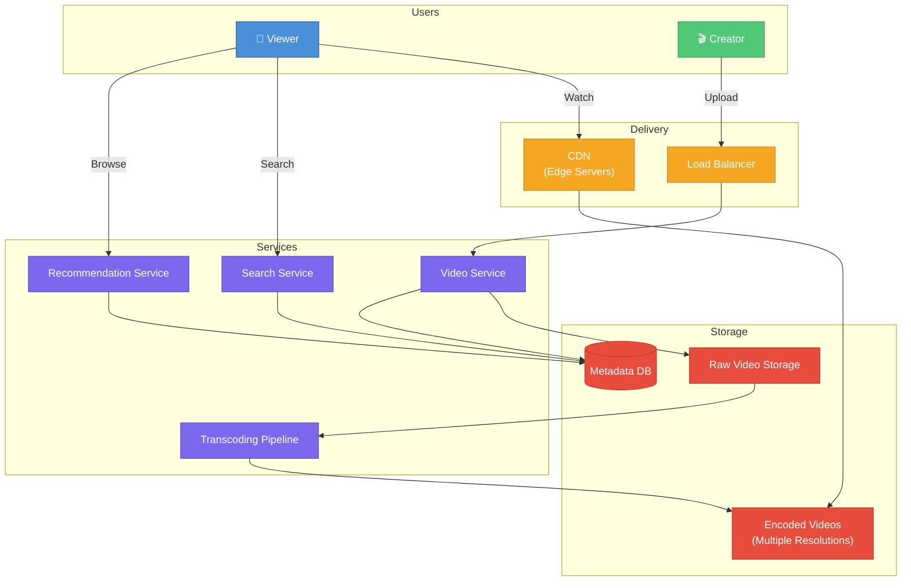

**📖 Step-by-Step Diagram Walkthrough:**

**Step 1 — Creator Upload:** The content creator uploads a raw video file through the Load Balancer to the Video Service. Large files (often GB-sized) use chunked/resumable upload protocols (e.g., tus protocol) to handle network interruptions.

**Step 2 — Raw Video Storage:** The Video Service stores the original, unprocessed video in raw storage (object storage like S3). This serves as the source of truth — never deleted, used for re-transcoding if needed.

**Step 3 — Transcoding Pipeline:** The most compute-intensive step. The raw video is transcoded into multiple formats:
- **Resolutions:** 240p, 360p, 480p, 720p, 1080p, 4K
- **Codecs:** H.264 (compatibility), H.265/HEVC (better compression), VP9/AV1 (royalty-free)
- **Bitrates:** Each resolution has multiple bitrate versions for different network speeds
- A single 1-hour 4K video may produce 20+ output files. This runs on a distributed worker farm (FFmpeg-based).

**Step 4 — Encoded Videos Storage:** All transcoded versions are stored in encoded video storage, organized by `videoId/resolution/segment`. Videos are split into small segments (2-10 seconds each) to enable adaptive streaming.

**Step 5 — Metadata DB:** Stores video metadata — title, description, tags, upload timestamp, duration, thumbnail URLs, transcoding status, view count, and the manifest file location (list of all available quality levels).

**Step 6 — CDN (Edge Servers):** When a viewer watches a video, it's served from the nearest CDN edge server (not the origin). Popular videos are cached at the edge. The CDN uses:
- **Adaptive Bitrate Streaming (ABR):** The player monitors bandwidth and automatically switches between quality levels mid-stream
- **HLS (HTTP Live Streaming):** Apple's protocol, widely supported
- **DASH:** An open standard alternative

**Step 7 — Search & Recommendation:** Viewers discover content through search (full-text on metadata) and recommendations (collaborative filtering based on watch history).

**🎯 Key Trade-offs:**
- **Transcoding cost vs quality:** More output formats = better user experience but exponentially higher storage and compute cost. Prioritize popular resolutions.
- **Thumbnail generation:** Extract frames at regular intervals (every 10s) plus ML-selected "best" frame for the video thumbnail.
- **Video chunking:** 2-second segments allow fast seeking and quality switching. Larger segments reduce HTTP overhead but increase initial buffering.

---

### 9. Design a Simple Recommendation System

```mermaid
graph TB
    subgraph User
        U["👤 User"]
    end

    subgraph API
        API["API Server"]
    end

    subgraph Recommendation Engine
        CF["Collaborative Filtering"]
        CB["Content-Based Filtering"]
        HY["Hybrid Ranker"]
    end

    subgraph Data Pipeline
        EL["Event Logger"]
        FE["Feature Extractor"]
        MT["Model Trainer<br/>(Batch)"]
    end

    subgraph Storage
        UH[("User History")]
        IP[("Item Profiles")]
        MODEL["Trained Model"]
        CACHE["Result Cache"]
    end

    U --> API
    API --> HY
    HY --> CF --> UH
    HY --> CB --> IP
    HY --> CACHE
    U -->|"Actions"| EL --> FE
    FE --> MT --> MODEL
    CF --> MODEL

    style U fill:#4A90D9,stroke:#2C5F8A,color:#fff
    style API fill:#F5A623,stroke:#C4841C,color:#fff
    style CF fill:#7B68EE,stroke:#5A4DB5,color:#fff
    style CB fill:#7B68EE,stroke:#5A4DB5,color:#fff
    style HY fill:#7B68EE,stroke:#5A4DB5,color:#fff
    style EL fill:#50C878,stroke:#3A9A5C,color:#fff
    style FE fill:#50C878,stroke:#3A9A5C,color:#fff
    style MT fill:#50C878,stroke:#3A9A5C,color:#fff
    style UH fill:#E74C3C,stroke:#C0392B,color:#fff
    style IP fill:#E74C3C,stroke:#C0392B,color:#fff
    style MODEL fill:#E67E22,stroke:#D35400,color:#fff
    style CACHE fill:#E67E22,stroke:#D35400,color:#fff
```

**📖 Step-by-Step Diagram Walkthrough:**

**Step 1 — User Request:** The user opens the app/website. The API Server receives a request for personalized recommendations for this specific user.

**Step 2 — Hybrid Ranker:** The recommendation engine uses a hybrid approach combining multiple strategies, then blends and ranks the final results:

**Step 3 — Collaborative Filtering (CF) → User History:** "Users who liked what you liked, also liked these." CF finds patterns across users:
- **User-User CF:** Find similar users (same viewing/purchase history), recommend what they liked
- **Item-Item CF:** Find similar items (co-purchased, co-viewed), recommend related items
- Works on the User History database containing past interactions (views, purchases, ratings)

**Step 4 — Content-Based Filtering → Item Profiles:** "Based on the attributes of items you liked." Analyzes item features (genre, category, description) and matches them to user preferences:
- If a user watches many sci-fi movies, recommend other sci-fi movies
- Uses the Item Profiles database containing feature vectors for every item

**Step 5 — Result Cache:** Pre-computed recommendations are cached per user. Cache TTL is typically 1-4 hours. Serves ~90% of requests without hitting the recommendation engine.

**Step 6 — Event Logger → Feature Extractor (Data Pipeline):** Every user action (click, view, purchase, skip, dwell time) is logged. The Feature Extractor transforms raw events into ML features:
- User features: age group, location, past purchase categories, average spend
- Item features: category, price range, popularity score, recency
- Interaction features: click-through rate, time spent, bounce rate

**Step 7 — Model Trainer (Batch):** Periodically (daily/weekly) retrains the ML model on all accumulated data. The trained model is stored in the Model Store and used by the Collaborative Filtering engine for predictions.

**🎯 Key Trade-offs:**
- **Cold start problem:** New users have no history → show popularity-based recommendations. New items have no interactions → use content-based features until enough data accumulates.
- **Real-time vs batch:** Batch provides higher quality (more data), real-time captures immediate intent (user just searched for shoes). Best systems combine both.
- **A/B testing:** Run experiments comparing recommendation algorithms. Measure click-through rate, conversion rate, and engagement time. Statistically significant results determine which model to deploy.

---

### 10. Design a Basic Food Delivery App

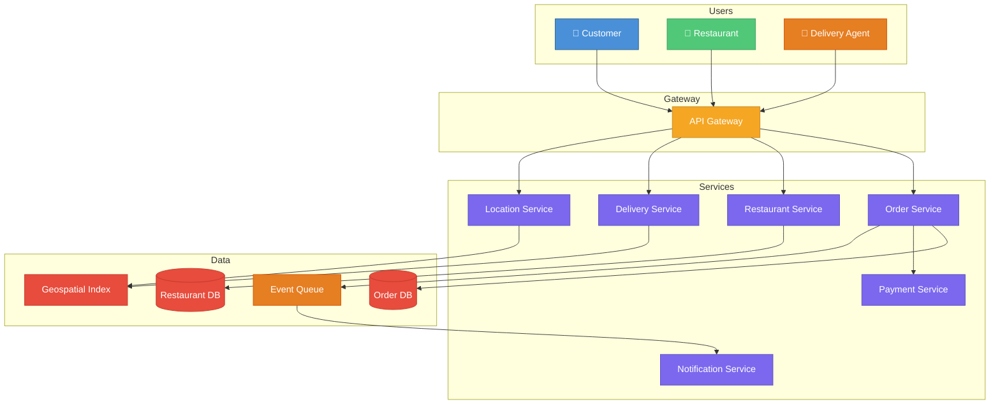

**📖 Step-by-Step Diagram Walkthrough:**

**Step 1 — Three User Types:** The system serves three distinct users, each with different needs:
- **Customer:** Browses restaurants, places orders, tracks delivery
- **Restaurant:** Manages menu, accepts/rejects orders, updates preparation status
- **Delivery Agent:** Goes online/offline, accepts delivery assignments, updates location

**Step 2 — API Gateway:** Single entry point for all three user types. Routes requests to the appropriate service based on the endpoint and user role. Handles JWT authentication for each user type.

**Step 3 — Restaurant Service → Restaurant DB:** Manages restaurant profiles — name, address, operating hours, cuisine type, rating, delivery radius. The Restaurant DB stores structured restaurant data. Search is powered by geospatial queries (find restaurants within 5km) combined with filters (cuisine, rating, price range).

**Step 4 — Order Service → Order DB:** The core orchestrator. Order state machine:
`PLACED → ACCEPTED (by restaurant) → PREPARING → READY_FOR_PICKUP → PICKED_UP (by delivery agent) → EN_ROUTE → DELIVERED`
Each state transition triggers events (notifications, ETA updates).

**Step 5 — Delivery Service → Geospatial Index:** Assigns delivery agents to orders:
1. When an order is "READY_FOR_PICKUP", query nearby available agents using the Geospatial Index
2. Rank by: proximity to restaurant, current load (already carrying orders?), acceptance rate
3. Send assignment notification to the best agent
4. If declined/timeout (30s), cascade to the next agent

**Step 6 — Location Service → Geospatial Index:** Processes real-time location updates from delivery agents (every 5 seconds). Updates the Geospatial Index for matching and provides live tracking data to customers.

**Step 7 — Payment Service:** Handles the complex payment split:
- Customer pays: food cost + delivery fee + platform fee + taxes
- Restaurant receives: food cost - platform commission (~20-30%)
- Delivery agent receives: delivery fee + tips

**Step 8 — Event Queue → Notification Service:** Order events are published to a message queue. The Notification Service sends real-time updates:
- Push notifications (order accepted, agent assigned, arriving in 5 min)
- SMS fallback for critical updates
- In-app real-time tracking via WebSocket

**🎯 Key Trade-offs:**
- **Batching deliveries:** Assign multiple orders to one agent (from same area) to reduce cost but increase delivery time.
- **ETA accuracy:** ML models trained on historical data (time of day, traffic, restaurant prep time). Update ETA in real-time as the agent moves.
- **Peak load:** Lunch (12-2pm) and dinner (7-9pm) surges. Pre-scale infrastructure, increase delivery fees to incentivize more agents.

---

### 11. Design a Parking Lot Management System

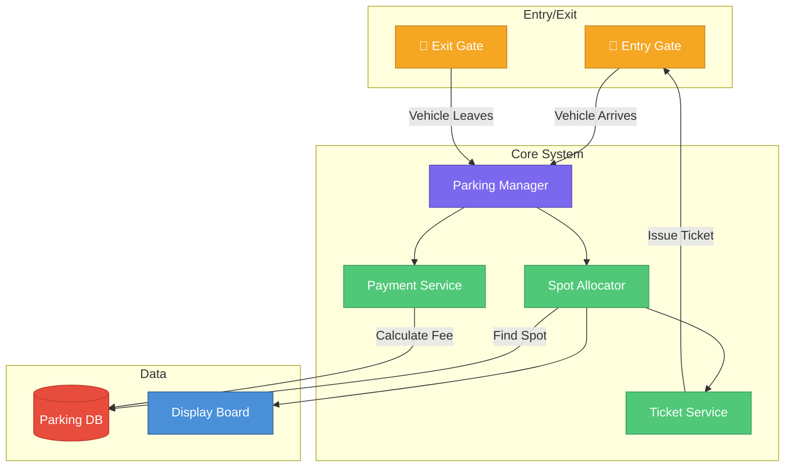

**📖 Step-by-Step Diagram Walkthrough:**

**Step 1 — Vehicle Arrives at Entry Gate:** A vehicle arrives at the entry gate. Sensors detect the vehicle type (motorcycle, car, bus/truck). A camera reads the license plate via OCR (Optical Character Recognition).

**Step 2 — Parking Manager:** The central controller receives the vehicle arrival event. It coordinates between the Spot Allocator, Ticket Service, and Payment Service. Implements the core business logic.

**Step 3 — Spot Allocator → Parking DB:** Finds an available parking spot:
1. Queries the DB for spots matching the vehicle type (compact, regular, large)
2. **Allocation strategies:**
   - **Nearest to entrance:** Minimizes walking distance for the customer
   - **Nearest to elevator:** Preferred for multi-floor lots
   - **Spread evenly:** Distributes vehicles across floors to reduce congestion
3. Marks the spot as `OCCUPIED` in the database
4. **Concurrency handling:** Uses optimistic locking — `UPDATE spots SET status='OCCUPIED', version=version+1 WHERE id=X AND status='AVAILABLE' AND version=Y`. If affected rows = 0, another vehicle took the spot; retry with a different spot.

**Step 4 — Ticket Service → Entry Gate:** Generates a parking ticket containing:
- Ticket ID (unique barcode/QR code)
- Vehicle license plate
- Assigned spot number (floor + spot)
- Entry timestamp
- Prints or displays the ticket at the gate, then raises the barrier.

**Step 5 — Display Board:** The Spot Allocator updates the display board showing available spots per floor and per type. Real-time updates help drivers navigate to available areas.

**Step 6 — Vehicle Leaves at Exit Gate:** The driver scans their ticket at the exit gate. The Parking Manager retrieves the ticket details.

**Step 7 — Payment Service → Parking DB:** Calculates the parking fee:
- **Pricing models:** Hourly rate, daily maximum cap, monthly subscription, free first 30 minutes
- Fee = (exit_time - entry_time) × hourly_rate, capped at daily_max
- Accepts payment (card, mobile, cash) and marks the spot as `AVAILABLE`

**🎯 Key Trade-offs:**
- **OOP design:** Model with classes: `Vehicle` (type, plate), `ParkingSpot` (floor, number, type, status), `Ticket` (id, entry_time, vehicle, spot), `ParkingLot` (floors, entrances, capacity)
- **Multi-entrance:** Multiple entry/exit gates require distributed locking to prevent double-assigning the same spot.
- **Reservation system:** Allow users to pre-book a spot — mark it as `RESERVED` with TTL. If the vehicle doesn't arrive within 15 minutes, release it.

---

### 12. Design a Simple Music Streaming Service

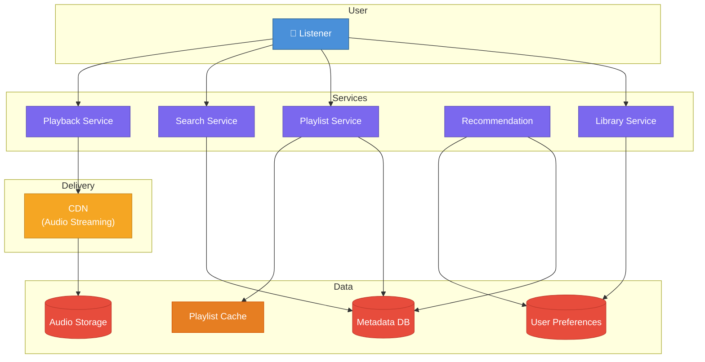

**📖 Step-by-Step Diagram Walkthrough:**

**Step 1 — Listener Request:** The user opens the music app and interacts with various services — playing songs, searching for music, managing playlists, or browsing their library.

**Step 2 — Playback Service → CDN → Audio Storage:** When the user hits play:
1. The Playback Service determines the audio file URL and streaming quality based on user's subscription tier and network speed
2. The CDN serves the audio file from the nearest edge server. Popular songs (top 1% = ~80% of plays) are almost always cached.
3. Audio is streamed progressively — playback starts before the full file downloads
4. **Formats:** MP3 (128/320kbps for compatibility), AAC (better quality at same bitrate), FLAC (lossless for premium users)

**Step 3 — Search Service → Metadata DB:** Full-text search across songs, artists, albums, and playlists. The Metadata DB stores:
- Song: title, artist, album, duration, genre, release year, lyrics
- Artist: name, bio, discography, follower count
- Album: title, track list, artwork URL, release date
Search uses Elasticsearch for fuzzy matching ("beatles" matches "The Beatles") and autocomplete.

**Step 4 — Playlist Service → Playlist Cache & Metadata DB:** Manages playlist CRUD:
- **Create:** New playlist with name, description, cover image
- **Add/Remove:** Add or remove songs (order matters)
- **Collaborative:** Multiple users can edit the same playlist
- Playlists are cached in Redis for fast retrieval. Hot playlists (editorial, trending) are pre-warmed in cache.

**Step 5 — Library Service → User Preferences:** Manages the user's personal library — liked songs, followed artists, saved albums, recently played. User Preferences also stores:
- Listening history (for recommendations)
- Audio quality preferences
- Offline download list

**Step 6 — Recommendation Service:** Analyzes User Preferences and Metadata to generate personalized suggestions:
- "Discover Weekly" — collaborative filtering on listening patterns
- "Radio" — seed song + audio feature similarity (tempo, key, energy)
- Uses both user preferences and song metadata (genre, mood, tempo) for hybrid recommendations.

**🎯 Key Trade-offs:**
- **Offline downloads:** Encrypt downloaded files with user-specific keys. Files are DRM-protected and expire if subscription lapses.
- **Royalty tracking:** Every play event is logged with song ID, duration played (must play >30 seconds to count), and user region. Aggregated and reported to rights holders for royalty payments.
- **Streaming vs download:** Stream by default to save storage. Pre-buffer the next song in a playlist for gapless playback.

---

### 13. Design a Basic Online Ticket Booking System

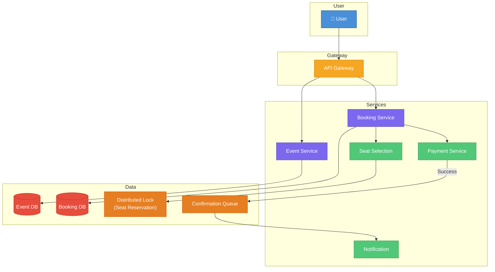

**📖 Step-by-Step Diagram Walkthrough:**

**Step 1 — User Browses Events:** The user searches for events (concerts, movies, flights). The API Gateway routes the request to the Event Service.

**Step 2 — Event Service → Event DB:** Returns event details — date, venue, available categories, pricing tiers. The Event DB stores the event catalog with seat maps (for assigned seating) or capacity counts (for general admission).

**Step 3 — Booking Service → Seat Selection:** The user selects specific seats. This is the most critical step — preventing double booking:

**Step 4 — Seat Selection → Distributed Lock (Seat Reservation):** Two locking strategies:
- **Pessimistic Locking:** When a user selects a seat, immediately lock it in the database using `SELECT ... FOR UPDATE`. No other user can select it. Simple but holds database connections.
- **Optimistic Locking:** Allow multiple users to select the same seat. At booking time, use a version check: `UPDATE seats SET status='BOOKED', version=version+1 WHERE seat_id=X AND version=Y AND status='AVAILABLE'`. If affected rows = 0, another user booked it first.
- **Temporary Reservation with TTL:** Best approach — when a user selects seats, create a temporary reservation (status = `HELD`) with a 10-minute TTL. If payment isn't completed within 10 minutes, the reservation expires and seats are released automatically.

**Step 5 — Booking Service → Payment Service:** After seat selection, the user proceeds to payment:
1. Create a booking record with status `PENDING_PAYMENT`
2. Initiate payment via the Payment Service
3. **Payment timeout:** If payment doesn't complete within the TTL (10 min), cancel the booking and release the seats
4. If payment fails, mark booking as `PAYMENT_FAILED` and release seats

**Step 6 — Confirmation Queue → Notification:** On successful payment:
1. Update booking status to `CONFIRMED`
2. Publish to the Confirmation Queue
3. Notification Service sends:
   - Email with e-ticket (PDF with QR code)
   - SMS confirmation
   - Push notification

**🎯 Key Trade-offs:**
- **High-demand events (concert tickets):** Use a queue-based system — users enter a virtual waiting room, assigned positions randomly or by arrival time. Process bookings sequentially from the queue.
- **Waitlist:** If an event is sold out, allow users to join a waitlist. When a cancellation occurs, offer the ticket to the first waitlisted user (with a time-limited hold).
- **Idempotency:** Payment callbacks may be received multiple times. Use idempotency keys to prevent charging twice.

---

### 14. Design a Simple Note-Taking Application

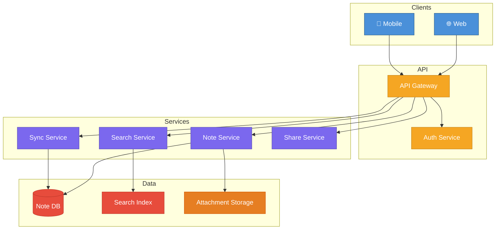

**Key Discussion Points:**
- Rich text / Markdown storage
- Offline-first architecture
- Conflict resolution (CRDT vs OT)
- Tagging and folder organization
- Full-text search indexing

---

### 15. Design a Weather Forecasting System

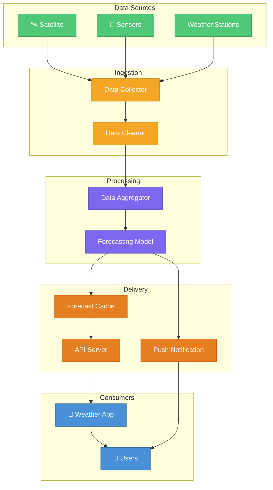

**Key Discussion Points:**
- Time-series data ingestion
- Geospatial data modeling
- Forecast accuracy and model selection
- Caching strategies for hot locations
- Severe weather alert system

---

### 16. Design a Basic Email Service

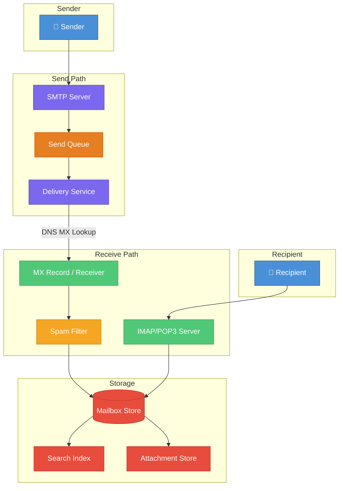

**Key Discussion Points:**
- SMTP/IMAP/POP3 protocols
- Spam filtering (Bayesian, rule-based)
- Email storage (per-user mailbox)
- Attachment handling and size limits
- DNS MX record resolution

---

### 17. Design a File Synchronization System

```mermaid
graph TB
    subgraph Devices
        D1["💻 Device A"]
        D2["💻 Device B"]
        D3["📱 Device C"]
    end

    subgraph Sync Layer
        SS["Sync Server"]
        CD["Change Detector<br/>(File Watcher)"]
        CR["Conflict Resolver"]
    end

    subgraph Storage
        CS["Cloud Storage<br/>(Chunks)"]
        MDB[("Metadata DB<br/>Version History)"]
        MQ["Change Queue"]
    end

    D1 -->|"File Changes"| CD
    D2 -->|"File Changes"| CD
    D3 -->|"File Changes"| CD
    CD --> SS
    SS --> CR
    SS --> MQ
    MQ -->|"Propagate"| D1
    MQ -->|"Propagate"| D2
    MQ -->|"Propagate"| D3
    SS --> CS
    SS --> MDB

    style D1 fill:#4A90D9,stroke:#2C5F8A,color:#fff
    style D2 fill:#4A90D9,stroke:#2C5F8A,color:#fff
    style D3 fill:#4A90D9,stroke:#2C5F8A,color:#fff
    style SS fill:#7B68EE,stroke:#5A4DB5,color:#fff
    style CD fill:#50C878,stroke:#3A9A5C,color:#fff
    style CR fill:#50C878,stroke:#3A9A5C,color:#fff
    style CS fill:#E74C3C,stroke:#C0392B,color:#fff
    style MDB fill:#E74C3C,stroke:#C0392B,color:#fff
    style MQ fill:#E67E22,stroke:#D35400,color:#fff
```

**Key Discussion Points:**
- File diff and delta sync
- Conflict detection and resolution
- Chunked transfer for large files
- Eventual consistency model
- Bandwidth optimization

---

### 18. Design a Simple Calendar Application

```mermaid
graph TB
    subgraph Users
        U1["👤 User A"]
        U2["👤 User B"]
    end

    subgraph API
        API["API Server"]
    end

    subgraph Services
        ES["Event Service"]
        RS["Reminder Service"]
        AV["Availability Service"]
        SH["Sharing Service"]
    end

    subgraph Data
        EDB[("Event DB")]
        NS["Notification Service"]
        CACHE["Availability Cache"]
    end

    U1 --> API
    U2 --> API
    API --> ES --> EDB
    API --> RS --> NS
    API --> AV --> CACHE
    API --> SH
    AV --> EDB

    style U1 fill:#4A90D9,stroke:#2C5F8A,color:#fff
    style U2 fill:#4A90D9,stroke:#2C5F8A,color:#fff
    style API fill:#F5A623,stroke:#C4841C,color:#fff
    style ES fill:#7B68EE,stroke:#5A4DB5,color:#fff
    style RS fill:#7B68EE,stroke:#5A4DB5,color:#fff
    style AV fill:#7B68EE,stroke:#5A4DB5,color:#fff
    style SH fill:#7B68EE,stroke:#5A4DB5,color:#fff
    style EDB fill:#E74C3C,stroke:#C0392B,color:#fff
    style NS fill:#50C878,stroke:#3A9A5C,color:#fff
    style CACHE fill:#E67E22,stroke:#D35400,color:#fff
```

**Key Discussion Points:**
- Recurring event representation (RFC 5545)
- Time zone handling
- Free/busy slot computation
- Calendar sharing and ACL
- Reminder scheduling

---

### 19. Design a Basic Online Quiz Platform

```mermaid
graph TB
    subgraph Users
        ST["👤 Student"]
        TC["👨‍🏫 Teacher"]
    end

    subgraph API
        API["API Gateway"]
    end

    subgraph Services
        QS["Quiz Service"]
        SS["Submission Service"]
        GS["Grading Service"]
        LB["Leaderboard"]
    end

    subgraph Data
        QDB[("Quiz DB")]
        SDB[("Submission DB")]
        CACHE["Leaderboard Cache"]
        TM["Timer Service"]
    end

    TC -->|"Create Quiz"| API --> QS --> QDB
    ST -->|"Take Quiz"| API --> SS --> SDB
    SS --> TM
    SS --> GS --> SDB
    GS --> LB --> CACHE

    style ST fill:#4A90D9,stroke:#2C5F8A,color:#fff
    style TC fill:#50C878,stroke:#3A9A5C,color:#fff
    style API fill:#F5A623,stroke:#C4841C,color:#fff
    style QS fill:#7B68EE,stroke:#5A4DB5,color:#fff
    style SS fill:#7B68EE,stroke:#5A4DB5,color:#fff
    style GS fill:#7B68EE,stroke:#5A4DB5,color:#fff
    style LB fill:#7B68EE,stroke:#5A4DB5,color:#fff
    style QDB fill:#E74C3C,stroke:#C0392B,color:#fff
    style SDB fill:#E74C3C,stroke:#C0392B,color:#fff
    style CACHE fill:#E67E22,stroke:#D35400,color:#fff
    style TM fill:#E67E22,stroke:#D35400,color:#fff
```

**Key Discussion Points:**
- Question bank design and randomization
- Timer management (server-side)
- Anti-cheating measures
- Auto-grading vs manual grading
- Real-time leaderboard updates

---

### 20. Design a User Authentication System

```mermaid
graph TB
    subgraph Client
        U["👤 User"]
        APP["Application"]
    end

    subgraph Auth Layer
        GW["API Gateway"]
        AS["Auth Service"]
    end

    subgraph Auth Methods
        EP["Email/Password"]
        OA["OAuth 2.0<br/>(Google, GitHub)"]
        MFA["MFA Service<br/>(TOTP/SMS)"]
    end

    subgraph Token Management
        JWT["JWT Issuer"]
        RT["Refresh Token Store"]
        BL["Token Blacklist"]
    end

    subgraph Data
        UDB[("User DB")]
        SDB[("Session Store")]
    end

    U --> APP --> GW --> AS
    AS --> EP
    AS --> OA
    AS --> MFA
    AS --> JWT
    JWT --> RT
    JWT --> BL
    AS --> UDB
    AS --> SDB

    style U fill:#4A90D9,stroke:#2C5F8A,color:#fff
    style APP fill:#4A90D9,stroke:#2C5F8A,color:#fff
    style GW fill:#F5A623,stroke:#C4841C,color:#fff
    style AS fill:#7B68EE,stroke:#5A4DB5,color:#fff
    style EP fill:#50C878,stroke:#3A9A5C,color:#fff
    style OA fill:#50C878,stroke:#3A9A5C,color:#fff
    style MFA fill:#50C878,stroke:#3A9A5C,color:#fff
    style JWT fill:#E67E22,stroke:#D35400,color:#fff
    style RT fill:#E67E22,stroke:#D35400,color:#fff
    style BL fill:#E67E22,stroke:#D35400,color:#fff
    style UDB fill:#E74C3C,stroke:#C0392B,color:#fff
    style SDB fill:#E74C3C,stroke:#C0392B,color:#fff
```

**Key Discussion Points:**
- Password hashing (bcrypt, Argon2)
- JWT vs session-based auth
- OAuth 2.0 / OpenID Connect flows
- MFA implementation (TOTP, WebAuthn)
- Rate limiting and brute-force protection

---

---

## Experienced Level System Design

> **Target Audience:** 3–15+ years of experience
> **Focus:** Distributed systems, fault tolerance, scalability, consistency models, data partitioning, advanced trade-offs

---

### 1. Design a URL Shortening Service like bit.ly

```mermaid
graph TB
    subgraph Global Users
        U1["👤 Region A Users"]
        U2["👤 Region B Users"]
    end

    subgraph Edge Layer
        CDN["Global CDN"]
        DNS["GeoDNS"]
    end

    subgraph API Layer
        LB1["Load Balancer R1"]
        LB2["Load Balancer R2"]
        API1["API Cluster R1"]
        API2["API Cluster R2"]
    end

    subgraph Core Services
        KG["Key Generation Service<br/>(Zookeeper Range)"]
        AS["Analytics Service"]
        RL["Rate Limiter"]
    end

    subgraph Data Layer
        DB1[("Primary DB<br/>(Sharded)")]
        DB2[("Read Replica")]
        CACHE["Distributed Cache<br/>(Redis Cluster)"]
        KAFKA["Kafka<br/>(Click Stream)"]
        DW[("Analytics DW")]
    end

    U1 --> DNS --> CDN
    U2 --> DNS
    CDN --> LB1 --> API1
    CDN --> LB2 --> API2
    API1 --> RL
    API1 --> KG
    API1 --> CACHE --> DB1
    API1 --> KAFKA --> DW
    DB1 --> DB2
    API2 --> CACHE
    API1 --> AS --> DW

    style U1 fill:#4A90D9,stroke:#2C5F8A,color:#fff
    style U2 fill:#4A90D9,stroke:#2C5F8A,color:#fff
    style CDN fill:#F5A623,stroke:#C4841C,color:#fff
    style DNS fill:#F5A623,stroke:#C4841C,color:#fff
    style LB1 fill:#F5A623,stroke:#C4841C,color:#fff
    style LB2 fill:#F5A623,stroke:#C4841C,color:#fff
    style API1 fill:#7B68EE,stroke:#5A4DB5,color:#fff
    style API2 fill:#7B68EE,stroke:#5A4DB5,color:#fff
    style KG fill:#50C878,stroke:#3A9A5C,color:#fff
    style AS fill:#50C878,stroke:#3A9A5C,color:#fff
    style RL fill:#50C878,stroke:#3A9A5C,color:#fff
    style DB1 fill:#E74C3C,stroke:#C0392B,color:#fff
    style DB2 fill:#E74C3C,stroke:#C0392B,color:#fff
    style CACHE fill:#E67E22,stroke:#D35400,color:#fff
    style KAFKA fill:#E67E22,stroke:#D35400,color:#fff
    style DW fill:#E74C3C,stroke:#C0392B,color:#fff
```

**Key Discussion Points:**
- Key generation: Zookeeper range allocation vs snowflake IDs
- Database sharding strategy (hash-based on short URL)
- 100:1 read-to-write ratio optimization
- Multi-region deployment with GeoDNS
- Click analytics pipeline (Kafka → data warehouse)
- Cache-aside pattern with Redis cluster
- URL expiration and cleanup jobs

---

### 2. Design a Distributed Key-Value Store like Redis

```mermaid
graph TB
    subgraph Client
        C["Client SDK"]
    end

    subgraph Routing
        PROXY["Smart Proxy"]
        HR["Consistent Hashing Ring"]
    end

    subgraph Cluster Nodes
        N1["Node 1<br/>(Primary)"]
        N2["Node 2<br/>(Primary)"]
        N3["Node 3<br/>(Primary)"]
        R1["Replica 1"]
        R2["Replica 2"]
        R3["Replica 3"]
    end

    subgraph Per-Node Architecture
        MEM["In-Memory Store<br/>(Hash Table)"]
        WAL["Write-Ahead Log"]
        SNAP["Snapshot (RDB)"]
        AOF["Append-Only File"]
    end

    subgraph Coordination
        GOS["Gossip Protocol"]
        FD["Failure Detector"]
        ELEC["Leader Election"]
    end

    C --> PROXY --> HR
    HR --> N1
    HR --> N2
    HR --> N3
    N1 --> R1
    N2 --> R2
    N3 --> R3
    N1 --> MEM
    MEM --> WAL
    WAL --> AOF
    WAL --> SNAP
    N1 <--> GOS
    N2 <--> GOS
    N3 <--> GOS
    GOS --> FD --> ELEC

    style C fill:#4A90D9,stroke:#2C5F8A,color:#fff
    style PROXY fill:#F5A623,stroke:#C4841C,color:#fff
    style HR fill:#F5A623,stroke:#C4841C,color:#fff
    style N1 fill:#7B68EE,stroke:#5A4DB5,color:#fff
    style N2 fill:#7B68EE,stroke:#5A4DB5,color:#fff
    style N3 fill:#7B68EE,stroke:#5A4DB5,color:#fff
    style R1 fill:#9B88FE,stroke:#7B68EE,color:#fff
    style R2 fill:#9B88FE,stroke:#7B68EE,color:#fff
    style R3 fill:#9B88FE,stroke:#7B68EE,color:#fff
    style MEM fill:#50C878,stroke:#3A9A5C,color:#fff
    style WAL fill:#50C878,stroke:#3A9A5C,color:#fff
    style SNAP fill:#E74C3C,stroke:#C0392B,color:#fff
    style AOF fill:#E74C3C,stroke:#C0392B,color:#fff
    style GOS fill:#E67E22,stroke:#D35400,color:#fff
    style FD fill:#E67E22,stroke:#D35400,color:#fff
    style ELEC fill:#E67E22,stroke:#D35400,color:#fff
```

**Key Discussion Points:**
- Consistent hashing with virtual nodes
- Replication strategies (leader-follower, quorum)
- Persistence: RDB snapshots vs AOF
- Memory management and eviction policies
- Gossip protocol for cluster membership
- Linearizability vs eventual consistency
- Data partitioning and resharding

---

### 3. Design a Scalable Social Network like Facebook

```mermaid
graph TB
    subgraph Users
        U["👤 2B+ Users"]
    end

    subgraph Edge
        CDN["Global CDN"]
        LB["L7 Load Balancer"]
    end

    subgraph API Layer
        GW["API Gateway"]
        GQL["GraphQL Federation"]
    end

    subgraph Core Services
        US["User Service"]
        FS["Feed Service"]
        GS["Graph Service<br/>(TAO)"]
        MS["Messenger"]
        NS["Notification"]
        SS["Search Service"]
        ADS["Ad Service"]
    end

    subgraph Feed Pipeline
        FW["Fan-out Service"]
        FR["Feed Ranker<br/>(ML)"]
        FC["Feed Cache"]
    end

    subgraph Data Tier
        MYSQL[("MySQL<br/>(Sharded)")]
        TAO["TAO Cache<br/>(Social Graph)"]
        MC["Memcached<br/>(Multi-Layer)"]
        HDFS["HDFS<br/>(Media)"]
        KAFKA["Kafka"]
        HIVE[("Hive DW")]
    end

    U --> CDN --> LB --> GW --> GQL
    GQL --> US
    GQL --> FS
    GQL --> GS
    GQL --> MS
    GQL --> SS
    GQL --> ADS
    FS --> FW --> FC
    FW --> FR
    US --> MYSQL
    GS --> TAO --> MYSQL
    FS --> MC
    FS --> KAFKA --> HIVE
    US --> HDFS

    style U fill:#4A90D9,stroke:#2C5F8A,color:#fff
    style CDN fill:#F5A623,stroke:#C4841C,color:#fff
    style LB fill:#F5A623,stroke:#C4841C,color:#fff
    style GW fill:#F5A623,stroke:#C4841C,color:#fff
    style GQL fill:#F5A623,stroke:#C4841C,color:#fff
    style US fill:#7B68EE,stroke:#5A4DB5,color:#fff
    style FS fill:#7B68EE,stroke:#5A4DB5,color:#fff
    style GS fill:#7B68EE,stroke:#5A4DB5,color:#fff
    style MS fill:#7B68EE,stroke:#5A4DB5,color:#fff
    style NS fill:#7B68EE,stroke:#5A4DB5,color:#fff
    style SS fill:#7B68EE,stroke:#5A4DB5,color:#fff
    style ADS fill:#7B68EE,stroke:#5A4DB5,color:#fff
    style FW fill:#50C878,stroke:#3A9A5C,color:#fff
    style FR fill:#50C878,stroke:#3A9A5C,color:#fff
    style FC fill:#50C878,stroke:#3A9A5C,color:#fff
    style MYSQL fill:#E74C3C,stroke:#C0392B,color:#fff
    style TAO fill:#E67E22,stroke:#D35400,color:#fff
    style MC fill:#E67E22,stroke:#D35400,color:#fff
    style HDFS fill:#E74C3C,stroke:#C0392B,color:#fff
    style KAFKA fill:#E67E22,stroke:#D35400,color:#fff
    style HIVE fill:#E74C3C,stroke:#C0392B,color:#fff
```

**Key Discussion Points:**
- Social graph storage (TAO — read-optimized graph cache)
- Fan-out on write (pre-compute feeds for active users) vs fan-out on read (celebrities)
- Multi-layer caching (L1 Memcached → L2 TAO → L3 MySQL)
- News feed ranking (ML-based relevance scoring)
- Sharding strategy for user data (user_id based)
- GraphQL federation for microservices
- Content moderation pipeline
- Privacy and access control at scale

---

### 4. Design a Scalable Recommendation System like Netflix

```mermaid
graph TB
    subgraph Users
        U["👤 200M+ Users"]
    end

    subgraph Online Serving
        API["API Gateway"]
        RS["Recommendation Server"]
        CACHE["Recommendation Cache"]
        AB["A/B Testing Framework"]
    end

    subgraph ML Pipeline
        FE["Feature Engineering"]
        CF["Collaborative Filtering<br/>(Matrix Factorization)"]
        DL["Deep Learning Models<br/>(Neural CF)"]
        CB["Content-Based Models"]
        EN["Ensemble / Re-Ranker"]
    end

    subgraph Offline Pipeline
        KAFKA["Kafka<br/>(User Events)"]
        SPARK["Spark<br/>(Batch Processing)"]
        FS["Feature Store"]
        MS["Model Store"]
    end

    subgraph Data
        VDB[("Video Catalog")]
        UDB[("User Profiles")]
        EDB[("Event History")]
    end

    U --> API --> RS
    RS --> CACHE
    RS --> AB
    RS --> EN
    EN --> CF
    EN --> DL
    EN --> CB
    CF --> FS
    DL --> MS
    U -->|"Watch/Rate/Browse"| KAFKA
    KAFKA --> SPARK
    SPARK --> FS
    SPARK --> MS
    FS --> UDB
    FS --> EDB
    CB --> VDB

    style U fill:#4A90D9,stroke:#2C5F8A,color:#fff
    style API fill:#F5A623,stroke:#C4841C,color:#fff
    style RS fill:#7B68EE,stroke:#5A4DB5,color:#fff
    style CACHE fill:#E67E22,stroke:#D35400,color:#fff
    style AB fill:#7B68EE,stroke:#5A4DB5,color:#fff
    style FE fill:#50C878,stroke:#3A9A5C,color:#fff
    style CF fill:#50C878,stroke:#3A9A5C,color:#fff
    style DL fill:#50C878,stroke:#3A9A5C,color:#fff
    style CB fill:#50C878,stroke:#3A9A5C,color:#fff
    style EN fill:#50C878,stroke:#3A9A5C,color:#fff
    style KAFKA fill:#E67E22,stroke:#D35400,color:#fff
    style SPARK fill:#E67E22,stroke:#D35400,color:#fff
    style FS fill:#E74C3C,stroke:#C0392B,color:#fff
    style MS fill:#E74C3C,stroke:#C0392B,color:#fff
    style VDB fill:#E74C3C,stroke:#C0392B,color:#fff
    style UDB fill:#E74C3C,stroke:#C0392B,color:#fff
    style EDB fill:#E74C3C,stroke:#C0392B,color:#fff
```

**Key Discussion Points:**
- Two-stage ranking: candidate generation → re-ranking
- Matrix factorization (ALS) and neural collaborative filtering
- Feature store for real-time and batch features
- A/B testing framework for model evaluation
- Cold start: onboarding quiz, popularity-based fallback
- Real-time personalization vs batch pre-computation
- Multi-objective optimization (engagement, diversity, freshness)

---

### 5. Design a Distributed File System like HDFS

```mermaid
graph TB
    subgraph Client
        C["HDFS Client"]
    end

    subgraph Master
        NN["NameNode<br/>(Metadata)"]
        SNN["Secondary NameNode<br/>(Checkpoint)"]
    end

    subgraph Data Nodes
        DN1["DataNode 1"]
        DN2["DataNode 2"]
        DN3["DataNode 3"]
        DN4["DataNode 4"]
    end

    subgraph Block Storage
        B1["Block A-1"]
        B2["Block A-2"]
        B3["Block A-3"]
    end

    subgraph Reliability
        REP["Replication Manager<br/>(Factor = 3)"]
        HB["Heartbeat Monitor"]
        RR["Rack-Aware Placement"]
    end

    C -->|"1. Get Block Locations"| NN
    NN -->|"2. Return DataNode List"| C
    C -->|"3. Read/Write Blocks"| DN1
    C -->|"3. Read/Write Blocks"| DN2
    NN --> SNN
    DN1 --> B1
    DN2 --> B2
    DN3 --> B3
    DN1 <-->|"Heartbeat"| HB
    DN2 <-->|"Heartbeat"| HB
    DN3 <-->|"Heartbeat"| HB
    DN4 <-->|"Heartbeat"| HB
    HB --> NN
    NN --> REP --> RR

    style C fill:#4A90D9,stroke:#2C5F8A,color:#fff
    style NN fill:#7B68EE,stroke:#5A4DB5,color:#fff
    style SNN fill:#9B88FE,stroke:#7B68EE,color:#fff
    style DN1 fill:#50C878,stroke:#3A9A5C,color:#fff
    style DN2 fill:#50C878,stroke:#3A9A5C,color:#fff
    style DN3 fill:#50C878,stroke:#3A9A5C,color:#fff
    style DN4 fill:#50C878,stroke:#3A9A5C,color:#fff
    style B1 fill:#E74C3C,stroke:#C0392B,color:#fff
    style B2 fill:#E74C3C,stroke:#C0392B,color:#fff
    style B3 fill:#E74C3C,stroke:#C0392B,color:#fff
    style REP fill:#E67E22,stroke:#D35400,color:#fff
    style HB fill:#E67E22,stroke:#D35400,color:#fff
    style RR fill:#F5A623,stroke:#C4841C,color:#fff
```

**Key Discussion Points:**
- NameNode as single point of failure → HA with Zookeeper
- Block size (128MB default), replication factor
- Rack-aware replica placement
- Write pipeline (chain replication)
- Edit log and checkpoint mechanism
- Data locality for MapReduce
- Handling NameNode memory limits (Federation)

---

### 6. Design a Real-Time Messaging System like WhatsApp

```mermaid
graph TB
    subgraph Users
        U1["👤 User A"]
        U2["👤 User B"]
    end

    subgraph Connection Layer
        GW1["WS Gateway 1"]
        GW2["WS Gateway 2"]
        CM["Connection Manager<br/>(User → Gateway Map)"]
    end

    subgraph Message Flow
        MR["Message Router"]
        MQ["Message Queue<br/>(per user)"]
        SEQ["Sequencer<br/>(Ordering)"]
    end

    subgraph Services
        GS["Group Service"]
        PS["Presence Service"]
        NS["Push Notification"]
        E2E["E2E Encryption<br/>(Signal Protocol)"]
    end

    subgraph Data
        CASS[("Cassandra<br/>(Messages)")]
        REDIS["Redis<br/>(Sessions)"]
        ZK["Zookeeper<br/>(Coordination)"]
    end

    U1 -->|"WebSocket"| GW1
    U2 -->|"WebSocket"| GW2
    GW1 --> MR
    MR --> CM
    MR --> MQ
    MQ --> SEQ --> CASS
    MR --> GW2
    GW1 --> E2E
    MR --> GS
    GW1 --> PS --> REDIS
    MR -->|"User Offline"| NS
    CM --> ZK

    style U1 fill:#4A90D9,stroke:#2C5F8A,color:#fff
    style U2 fill:#4A90D9,stroke:#2C5F8A,color:#fff
    style GW1 fill:#F5A623,stroke:#C4841C,color:#fff
    style GW2 fill:#F5A623,stroke:#C4841C,color:#fff
    style CM fill:#F5A623,stroke:#C4841C,color:#fff
    style MR fill:#7B68EE,stroke:#5A4DB5,color:#fff
    style MQ fill:#7B68EE,stroke:#5A4DB5,color:#fff
    style SEQ fill:#7B68EE,stroke:#5A4DB5,color:#fff
    style GS fill:#50C878,stroke:#3A9A5C,color:#fff
    style PS fill:#50C878,stroke:#3A9A5C,color:#fff
    style NS fill:#50C878,stroke:#3A9A5C,color:#fff
    style E2E fill:#50C878,stroke:#3A9A5C,color:#fff
    style CASS fill:#E74C3C,stroke:#C0392B,color:#fff
    style REDIS fill:#E67E22,stroke:#D35400,color:#fff
    style ZK fill:#E67E22,stroke:#D35400,color:#fff
```

**Key Discussion Points:**
- End-to-end encryption (Signal Protocol / Double Ratchet)
- Connection management at scale (millions of concurrent WebSockets)
- Message delivery guarantees (at-least-once with dedup)
- Sent / Delivered / Read receipts
- Group messaging fan-out
- Offline message queue and push notifications
- Cassandra for message storage (partition by user_id + time)

---

### 7. Design a Web Crawler like Google

```mermaid
graph TB
    subgraph Seed
        SEED["Seed URLs"]
    end

    subgraph Frontier
        PQ["Priority Queue<br/>(URL Frontier)"]
        POL["Politeness Scheduler<br/>(per domain)"]
        DUP["URL Deduplicator<br/>(Bloom Filter)"]
    end

    subgraph Crawl Workers
        F1["Fetcher 1"]
        F2["Fetcher 2"]
        F3["Fetcher N"]
        DNS["DNS Resolver<br/>(Cache)"]
    end

    subgraph Processing
        HP["HTML Parser"]
        LE["Link Extractor"]
        CE["Content Extractor"]
        RD["Robot.txt Checker"]
    end

    subgraph Storage
        CS[("Content Store<br/>(Distributed)")]
        US[("URL DB")]
        IDX["Indexer Pipeline"]
    end

    SEED --> PQ
    PQ --> POL --> F1
    PQ --> POL --> F2
    PQ --> POL --> F3
    F1 --> DNS
    F1 --> HP
    HP --> RD
    HP --> LE --> DUP
    DUP -->|"New URLs"| PQ
    HP --> CE --> CS
    CE --> IDX
    DUP --> US

    style SEED fill:#4A90D9,stroke:#2C5F8A,color:#fff
    style PQ fill:#7B68EE,stroke:#5A4DB5,color:#fff
    style POL fill:#7B68EE,stroke:#5A4DB5,color:#fff
    style DUP fill:#7B68EE,stroke:#5A4DB5,color:#fff
    style F1 fill:#F5A623,stroke:#C4841C,color:#fff
    style F2 fill:#F5A623,stroke:#C4841C,color:#fff
    style F3 fill:#F5A623,stroke:#C4841C,color:#fff
    style DNS fill:#F5A623,stroke:#C4841C,color:#fff
    style HP fill:#50C878,stroke:#3A9A5C,color:#fff
    style LE fill:#50C878,stroke:#3A9A5C,color:#fff
    style CE fill:#50C878,stroke:#3A9A5C,color:#fff
    style RD fill:#50C878,stroke:#3A9A5C,color:#fff
    style CS fill:#E74C3C,stroke:#C0392B,color:#fff
    style US fill:#E74C3C,stroke:#C0392B,color:#fff
    style IDX fill:#E67E22,stroke:#D35400,color:#fff
```

**Key Discussion Points:**
- URL frontier with priority (PageRank, freshness)
- Politeness: per-domain rate limiting, robots.txt
- URL deduplication (Bloom filter, content fingerprinting)
- Distributed crawling across thousands of machines
- Handling traps (infinite URLs, spider traps)
- Incremental crawl vs full re-crawl
- Content change detection and recrawl scheduling

---

### 8. Design a Distributed Cache like Memcached

```mermaid
graph TB
    subgraph Clients
        C1["App Server 1"]
        C2["App Server 2"]
        C3["App Server N"]
    end

    subgraph Client Library
        CH["Consistent Hashing"]
        CP["Connection Pool"]
    end

    subgraph Cache Cluster
        M1["Memcached Node 1"]
        M2["Memcached Node 2"]
        M3["Memcached Node 3"]
        M4["Memcached Node 4"]
    end

    subgraph Per-Node
        SLAB["Slab Allocator"]
        HT["Hash Table"]
        LRU["LRU Eviction"]
    end

    subgraph Backend
        DB[("Database<br/>(Source of Truth)")]
    end

    C1 --> CH
    C2 --> CH
    C3 --> CH
    CH --> CP
    CP --> M1
    CP --> M2
    CP --> M3
    CP --> M4
    M1 --> SLAB --> HT --> LRU
    C1 -->|"Cache Miss"| DB

    style C1 fill:#4A90D9,stroke:#2C5F8A,color:#fff
    style C2 fill:#4A90D9,stroke:#2C5F8A,color:#fff
    style C3 fill:#4A90D9,stroke:#2C5F8A,color:#fff
    style CH fill:#F5A623,stroke:#C4841C,color:#fff
    style CP fill:#F5A623,stroke:#C4841C,color:#fff
    style M1 fill:#7B68EE,stroke:#5A4DB5,color:#fff
    style M2 fill:#7B68EE,stroke:#5A4DB5,color:#fff
    style M3 fill:#7B68EE,stroke:#5A4DB5,color:#fff
    style M4 fill:#7B68EE,stroke:#5A4DB5,color:#fff
    style SLAB fill:#50C878,stroke:#3A9A5C,color:#fff
    style HT fill:#50C878,stroke:#3A9A5C,color:#fff
    style LRU fill:#50C878,stroke:#3A9A5C,color:#fff
    style DB fill:#E74C3C,stroke:#C0392B,color:#fff
```

**Key Discussion Points:**
- Consistent hashing for key distribution
- Slab allocator for memory management
- Cache invalidation strategies (TTL, write-through, write-behind)
- Thundering herd / cache stampede prevention
- Hot key problem and mitigation
- No inter-node communication (shared-nothing)
- Failure handling: rehashing without cascading misses

---

### 9. Design a CDN like Cloudflare

```mermaid
graph TB
    subgraph Users
        U1["👤 US User"]
        U2["👤 EU User"]
        U3["👤 Asia User"]
    end

    subgraph DNS
        GDNS["Anycast DNS"]
    end

    subgraph Edge PoPs
        E1["PoP US-East"]
        E2["PoP EU-West"]
        E3["PoP Asia-South"]
    end

    subgraph Edge Services
        EC["Edge Cache"]
        WAF["WAF / DDoS Shield"]
        SSL["TLS Termination"]
        COMP["Compression<br/>(Brotli/gzip)"]
    end

    subgraph Mid-Tier
        MT["Mid-Tier Cache<br/>(Shield)"]
    end

    subgraph Origin
        OR["Origin Server"]
        OS["Origin Storage"]
    end

    U1 --> GDNS --> E1
    U2 --> GDNS --> E2
    U3 --> GDNS --> E3
    E1 --> SSL --> WAF --> EC
    EC -->|"Cache Miss"| MT
    MT -->|"Miss"| OR --> OS
    E2 --> EC
    E3 --> EC
    EC --> COMP

    style U1 fill:#4A90D9,stroke:#2C5F8A,color:#fff
    style U2 fill:#4A90D9,stroke:#2C5F8A,color:#fff
    style U3 fill:#4A90D9,stroke:#2C5F8A,color:#fff
    style GDNS fill:#F5A623,stroke:#C4841C,color:#fff
    style E1 fill:#7B68EE,stroke:#5A4DB5,color:#fff
    style E2 fill:#7B68EE,stroke:#5A4DB5,color:#fff
    style E3 fill:#7B68EE,stroke:#5A4DB5,color:#fff
    style EC fill:#50C878,stroke:#3A9A5C,color:#fff
    style WAF fill:#50C878,stroke:#3A9A5C,color:#fff
    style SSL fill:#50C878,stroke:#3A9A5C,color:#fff
    style COMP fill:#50C878,stroke:#3A9A5C,color:#fff
    style MT fill:#E67E22,stroke:#D35400,color:#fff
    style OR fill:#E74C3C,stroke:#C0392B,color:#fff
    style OS fill:#E74C3C,stroke:#C0392B,color:#fff
```

**Key Discussion Points:**
- Anycast routing for nearest PoP selection
- Cache hierarchy: Edge → Shield (mid-tier) → Origin
- Cache invalidation and purge APIs
- TLS termination at edge
- DDoS mitigation and WAF rules
- Content compression (Brotli, gzip)
- Edge computing (Workers/Functions at edge)
- Cache key design and vary headers

---

### 10. Design a Scalable Search Engine like Google

```mermaid
graph TB
    subgraph User
        U["👤 User"]
    end

    subgraph Query Path
        QP["Query Processor"]
        QR["Query Rewriter<br/>(Synonyms, Spell)"]
        SC["Shard Coordinator"]
    end

    subgraph Index Cluster
        IS1["Index Shard 1"]
        IS2["Index Shard 2"]
        IS3["Index Shard N"]
    end

    subgraph Ranking
        PR["PageRank"]
        ML["ML Ranker<br/>(LambdaMART)"]
        PS["Personalization"]
        SN["Snippet Generator"]
    end

    subgraph Indexing Pipeline
        CR["Distributed Crawler"]
        PP["Document Processor"]
        IB["Index Builder<br/>(MapReduce)"]
    end

    subgraph Storage
        BT["Bigtable<br/>(Web Index)"]
        GFS["GFS<br/>(Raw Pages)"]
        KG["Knowledge Graph"]
    end

    U --> QP --> QR --> SC
    SC --> IS1
    SC --> IS2
    SC --> IS3
    IS1 --> ML
    IS2 --> ML
    ML --> PR
    ML --> PS
    ML --> SN --> U
    CR --> PP --> IB
    IB --> BT
    IB --> IS1
    PP --> GFS
    ML --> KG

    style U fill:#4A90D9,stroke:#2C5F8A,color:#fff
    style QP fill:#F5A623,stroke:#C4841C,color:#fff
    style QR fill:#F5A623,stroke:#C4841C,color:#fff
    style SC fill:#F5A623,stroke:#C4841C,color:#fff
    style IS1 fill:#7B68EE,stroke:#5A4DB5,color:#fff
    style IS2 fill:#7B68EE,stroke:#5A4DB5,color:#fff
    style IS3 fill:#7B68EE,stroke:#5A4DB5,color:#fff
    style PR fill:#50C878,stroke:#3A9A5C,color:#fff
    style ML fill:#50C878,stroke:#3A9A5C,color:#fff
    style PS fill:#50C878,stroke:#3A9A5C,color:#fff
    style SN fill:#50C878,stroke:#3A9A5C,color:#fff
    style CR fill:#E67E22,stroke:#D35400,color:#fff
    style PP fill:#E67E22,stroke:#D35400,color:#fff
    style IB fill:#E67E22,stroke:#D35400,color:#fff
    style BT fill:#E74C3C,stroke:#C0392B,color:#fff
    style GFS fill:#E74C3C,stroke:#C0392B,color:#fff
    style KG fill:#E74C3C,stroke:#C0392B,color:#fff
```

**Key Discussion Points:**
- Inverted index partitioning (document vs term partitioned)
- PageRank computation (iterative MapReduce)
- Multi-signal ranking (freshness, authority, relevance, personalization)
- Query auto-complete with trie + top-k
- Knowledge graph integration
- Serving latency budget (scatter-gather across shards)
- Index serving: real-time vs batch indexing
- Spell correction and query understanding

---

### 11. Design a Ride-Sharing System like Uber

```mermaid
graph TB
    subgraph Users
        R["👤 Riders"]
        D["🚗 Drivers (Millions)"]
    end

    subgraph Gateway
        LB["L4/L7 Load Balancer"]
        API["API Gateway"]
    end

    subgraph Core Services
        DM["Dispatch / Matching<br/>(DISCO)"]
        LS["Location Service<br/>(Ringpop)"]
        TS["Trip Service"]
        PS["Pricing Service<br/>(Surge)"]
        ETA["ETA Service"]
        PAY["Payment Service"]
    end

    subgraph Location Platform
        GEO["Geospatial Index<br/>(H3 / S2 Cells)"]
        CELL["Cell-Based Partitioning"]
    end

    subgraph Data
        CASS[("Cassandra")]
        MYSQL[("MySQL<br/>(Schemaless)")]
        REDIS["Redis<br/>(Driver Locations)"]
        KAFKA["Kafka"]
        HIVE[("Hive / Presto)"]
    end

    R --> LB --> API
    D --> LB
    API --> DM
    API --> LS --> GEO --> CELL
    API --> TS --> CASS
    API --> PS
    API --> ETA
    DM --> GEO
    DM --> REDIS
    TS --> PAY
    TS --> MYSQL
    LS --> KAFKA --> HIVE

    style R fill:#4A90D9,stroke:#2C5F8A,color:#fff
    style D fill:#50C878,stroke:#3A9A5C,color:#fff
    style LB fill:#F5A623,stroke:#C4841C,color:#fff
    style API fill:#F5A623,stroke:#C4841C,color:#fff
    style DM fill:#7B68EE,stroke:#5A4DB5,color:#fff
    style LS fill:#7B68EE,stroke:#5A4DB5,color:#fff
    style TS fill:#7B68EE,stroke:#5A4DB5,color:#fff
    style PS fill:#7B68EE,stroke:#5A4DB5,color:#fff
    style ETA fill:#7B68EE,stroke:#5A4DB5,color:#fff
    style PAY fill:#7B68EE,stroke:#5A4DB5,color:#fff
    style GEO fill:#50C878,stroke:#3A9A5C,color:#fff
    style CELL fill:#50C878,stroke:#3A9A5C,color:#fff
    style CASS fill:#E74C3C,stroke:#C0392B,color:#fff
    style MYSQL fill:#E74C3C,stroke:#C0392B,color:#fff
    style REDIS fill:#E67E22,stroke:#D35400,color:#fff
    style KAFKA fill:#E67E22,stroke:#D35400,color:#fff
    style HIVE fill:#E74C3C,stroke:#C0392B,color:#fff
```

**Key Discussion Points:**
- Geospatial indexing: H3/S2 cells for efficient proximity queries
- DISCO matching engine (supply-demand optimization)
- Real-time location ingestion at scale (millions of updates/sec)
- Surge pricing algorithm (dynamic demand-supply)
- ETA prediction (ML on road graphs)
- Trip state machine and idempotency
- Ringpop for consistent hashing of location service
- Schemaless (Uber's MySQL wrapper for flexible schema)

---

### 12. Design a Video Streaming Service like YouTube

```mermaid
graph TB
    subgraph Users
        V["👤 Viewers<br/>(2B+ Monthly)"]
        C["🎬 Creators"]
    end

    subgraph Edge
        CDN["Global CDN<br/>(Google Edge)"]
    end

    subgraph Upload Pipeline
        UP["Upload Service"]
        TC["Transcoding Farm<br/>(FFmpeg Workers)"]
        TH["Thumbnail Generator"]
        AI["Content Moderation<br/>(ML Pipeline)"]
    end

    subgraph Serving
        VS["Video Serving"]
        SS["Search / Discovery"]
        RS["Recommendation<br/>(Deep Neural Net)"]
        CS["Comment Service"]
        LS["Like / Subscribe"]
        ADS["Ad Insertion<br/>(VAST/VPAID)"]
    end

    subgraph Data
        BT[("Bigtable<br/>(Metadata)")]
        BLOB["Colossus/GFS<br/>(Video Blobs)"]
        VQ["Video Queue<br/>(Pub/Sub)"]
        MYSQL[("Vitess<br/>(MySQL Sharded)")]
        ML["ML Feature Store"]
    end

    C -->|"Upload"| UP --> VQ
    VQ --> TC --> BLOB
    VQ --> TH
    VQ --> AI
    UP --> BT
    V --> CDN --> BLOB
    V --> SS --> BT
    V --> RS --> ML
    V --> CS --> MYSQL
    V --> LS --> MYSQL
    V --> ADS

    style V fill:#4A90D9,stroke:#2C5F8A,color:#fff
    style C fill:#50C878,stroke:#3A9A5C,color:#fff
    style CDN fill:#F5A623,stroke:#C4841C,color:#fff
    style UP fill:#7B68EE,stroke:#5A4DB5,color:#fff
    style TC fill:#7B68EE,stroke:#5A4DB5,color:#fff
    style TH fill:#7B68EE,stroke:#5A4DB5,color:#fff
    style AI fill:#7B68EE,stroke:#5A4DB5,color:#fff
    style VS fill:#50C878,stroke:#3A9A5C,color:#fff
    style SS fill:#50C878,stroke:#3A9A5C,color:#fff
    style RS fill:#50C878,stroke:#3A9A5C,color:#fff
    style CS fill:#50C878,stroke:#3A9A5C,color:#fff
    style LS fill:#50C878,stroke:#3A9A5C,color:#fff
    style ADS fill:#50C878,stroke:#3A9A5C,color:#fff
    style BT fill:#E74C3C,stroke:#C0392B,color:#fff
    style BLOB fill:#E74C3C,stroke:#C0392B,color:#fff
    style VQ fill:#E67E22,stroke:#D35400,color:#fff
    style MYSQL fill:#E74C3C,stroke:#C0392B,color:#fff
    style ML fill:#E67E22,stroke:#D35400,color:#fff
```

**Key Discussion Points:**
- Video transcoding pipeline (resolution, codec, bitrate)
- Adaptive bitrate streaming (DASH/HLS)
- Vitess for horizontally sharded MySQL
- Recommendation: Two-tower model, candidate generation → ranking
- Content moderation (CSAM detection, copyright — Content ID)
- Ad insertion and monetization (pre-roll, mid-roll)
- Live streaming architecture
- View count accuracy at scale (approximate counting)

---

### 13. Design an Online Food Delivery System like Zomato

```mermaid
graph TB
    subgraph Users
        CU["👤 Customers"]
        RE["🍕 Restaurants"]
        DA["🛵 Delivery Partners"]
    end

    subgraph Gateway
        LB["Load Balancer"]
        API["API Gateway"]
    end

    subgraph Core Services
        RS["Restaurant Service"]
        MS["Menu Service"]
        OS["Order Orchestrator"]
        DS["Delivery Service"]
        LS["Location Service"]
        PS["Pricing / Promo"]
        PAY["Payment Service"]
        RT["Rating / Review"]
        NS["Notification Hub"]
    end

    subgraph Real-Time
        WS["WebSocket Gateway"]
        KAFKA["Kafka<br/>(Order Events)"]
        GEO["Geospatial Index<br/>(Geohash)"]
    end

    subgraph Data
        PG[("PostgreSQL<br/>(Orders)")]
        ES["Elasticsearch<br/>(Restaurant Search)"]
        REDIS["Redis<br/>(Sessions, Cart)"]
        MONGO[("MongoDB<br/>(Menu Catalog)")]
        S3["Object Store<br/>(Images)"]
    end

    CU --> LB --> API
    RE --> API
    DA --> WS
    API --> RS --> ES
    API --> MS --> MONGO
    API --> OS --> PG
    OS --> DS --> GEO
    OS --> PAY
    OS --> KAFKA --> NS
    DS --> LS --> GEO
    API --> PS
    API --> RT --> PG
    WS --> REDIS
    MS --> S3

    style CU fill:#4A90D9,stroke:#2C5F8A,color:#fff
    style RE fill:#50C878,stroke:#3A9A5C,color:#fff
    style DA fill:#E67E22,stroke:#D35400,color:#fff
    style LB fill:#F5A623,stroke:#C4841C,color:#fff
    style API fill:#F5A623,stroke:#C4841C,color:#fff
    style RS fill:#7B68EE,stroke:#5A4DB5,color:#fff
    style MS fill:#7B68EE,stroke:#5A4DB5,color:#fff
    style OS fill:#7B68EE,stroke:#5A4DB5,color:#fff
    style DS fill:#7B68EE,stroke:#5A4DB5,color:#fff
    style LS fill:#7B68EE,stroke:#5A4DB5,color:#fff
    style PS fill:#7B68EE,stroke:#5A4DB5,color:#fff
    style PAY fill:#7B68EE,stroke:#5A4DB5,color:#fff
    style RT fill:#7B68EE,stroke:#5A4DB5,color:#fff
    style NS fill:#7B68EE,stroke:#5A4DB5,color:#fff
    style WS fill:#F5A623,stroke:#C4841C,color:#fff
    style KAFKA fill:#E67E22,stroke:#D35400,color:#fff
    style GEO fill:#50C878,stroke:#3A9A5C,color:#fff
    style PG fill:#E74C3C,stroke:#C0392B,color:#fff
    style ES fill:#E74C3C,stroke:#C0392B,color:#fff
    style REDIS fill:#E67E22,stroke:#D35400,color:#fff
    style MONGO fill:#E74C3C,stroke:#C0392B,color:#fff
    style S3 fill:#E74C3C,stroke:#C0392B,color:#fff
```

**Key Discussion Points:**
- Three-sided marketplace orchestration
- Order state machine (placed → accepted → preparing → picked → delivered)
- Delivery partner allocation (geohash-based proximity + availability)
- Restaurant search with Elasticsearch (location, cuisine, rating)
- Real-time order tracking (WebSocket + location streaming)
- Dynamic delivery fee calculation
- Peak load handling (lunch/dinner surges)
- Loyalty programs and promo engine

---

### 14. Design a Collaborative Document Editing System like Google Docs

```mermaid
graph TB
    subgraph Users
        U1["👤 User A"]
        U2["👤 User B"]
        U3["👤 User C"]
    end

    subgraph Connection
        WS["WebSocket Server"]
        SR["Session Router"]
    end

    subgraph Collaboration Engine
        OT["OT Engine<br/>(Operational Transform)"]
        CS["Cursor Sync"]
        VS["Version Service"]
    end

    subgraph Services
        DS["Document Service"]
        PS["Permission Service"]
        CM["Comment Service"]
        HS["History / Revision"]
    end

    subgraph Data
        DOC[("Document Store<br/>(Structured)")]
        OPS[("Operation Log")]
        BLOB["Asset Storage"]
        CACHE["Active Doc Cache"]
    end

    U1 -->|"WebSocket"| WS
    U2 -->|"WebSocket"| WS
    U3 -->|"WebSocket"| WS
    WS --> SR
    SR --> OT
    OT --> CS
    OT --> VS
    OT --> OPS
    SR --> DS --> DOC
    DS --> PS
    DS --> CM
    DS --> HS --> OPS
    OT --> CACHE
    DS --> BLOB

    style U1 fill:#4A90D9,stroke:#2C5F8A,color:#fff
    style U2 fill:#4A90D9,stroke:#2C5F8A,color:#fff
    style U3 fill:#4A90D9,stroke:#2C5F8A,color:#fff
    style WS fill:#F5A623,stroke:#C4841C,color:#fff
    style SR fill:#F5A623,stroke:#C4841C,color:#fff
    style OT fill:#7B68EE,stroke:#5A4DB5,color:#fff
    style CS fill:#7B68EE,stroke:#5A4DB5,color:#fff
    style VS fill:#7B68EE,stroke:#5A4DB5,color:#fff
    style DS fill:#50C878,stroke:#3A9A5C,color:#fff
    style PS fill:#50C878,stroke:#3A9A5C,color:#fff
    style CM fill:#50C878,stroke:#3A9A5C,color:#fff
    style HS fill:#50C878,stroke:#3A9A5C,color:#fff
    style DOC fill:#E74C3C,stroke:#C0392B,color:#fff
    style OPS fill:#E74C3C,stroke:#C0392B,color:#fff
    style BLOB fill:#E74C3C,stroke:#C0392B,color:#fff
    style CACHE fill:#E67E22,stroke:#D35400,color:#fff
```

**Key Discussion Points:**
- Operational Transformation (OT) vs CRDT for real-time collaboration
- Operation serialization and transformation functions
- Cursor position tracking and broadcasting
- Version history and revision diffing
- Conflict-free merging of concurrent edits
- Document permission model (viewer, commenter, editor)
- Session affinity (sticky sessions for active documents)
- Offline editing and reconciliation

---

### 15. Design an E-Commerce Platform like Amazon

```mermaid
graph TB
    subgraph Users
        B["👤 Buyers"]
        S["🏪 Sellers"]
    end

    subgraph Edge
        CDN["CDN"]
        LB["Load Balancer"]
    end

    subgraph API
        GW["API Gateway"]
        BFF["BFF Layer"]
    end

    subgraph Product Domain
        PC["Product Catalog"]
        SR["Search<br/>(Elasticsearch)"]
        RV["Reviews"]
    end

    subgraph Order Domain
        CT["Cart Service"]
        OD["Order Service"]
        INV["Inventory<br/>(Distributed Lock)"]
        PAY["Payment<br/>(Saga Pattern)"]
        SH["Shipping"]
    end

    subgraph Platform
        REC["Recommendation"]
        PR["Pricing Engine"]
        NS["Notification"]
        FP["Fraud Detection"]
    end

    subgraph Data
        DDB[("DynamoDB<br/>(Cart, Session)")]
        RDS[("RDS<br/>(Orders)")]
        ES["Elasticsearch"]
        S3["S3<br/>(Product Images)"]
        SQS["SQS / SNS"]
        KAFKA["Kafka"]
    end

    B --> CDN --> LB --> GW --> BFF
    S --> GW
    BFF --> PC --> ES
    BFF --> SR --> ES
    BFF --> CT --> DDB
    BFF --> OD --> RDS
    OD --> INV
    OD --> PAY
    OD --> SH
    OD --> SQS --> NS
    BFF --> REC
    BFF --> RV --> RDS
    PC --> S3
    OD --> KAFKA --> FP

    style B fill:#4A90D9,stroke:#2C5F8A,color:#fff
    style S fill:#50C878,stroke:#3A9A5C,color:#fff
    style CDN fill:#F5A623,stroke:#C4841C,color:#fff
    style LB fill:#F5A623,stroke:#C4841C,color:#fff
    style GW fill:#F5A623,stroke:#C4841C,color:#fff
    style BFF fill:#F5A623,stroke:#C4841C,color:#fff
    style PC fill:#7B68EE,stroke:#5A4DB5,color:#fff
    style SR fill:#7B68EE,stroke:#5A4DB5,color:#fff
    style RV fill:#7B68EE,stroke:#5A4DB5,color:#fff
    style CT fill:#7B68EE,stroke:#5A4DB5,color:#fff
    style OD fill:#7B68EE,stroke:#5A4DB5,color:#fff
    style INV fill:#7B68EE,stroke:#5A4DB5,color:#fff
    style PAY fill:#7B68EE,stroke:#5A4DB5,color:#fff
    style SH fill:#7B68EE,stroke:#5A4DB5,color:#fff
    style REC fill:#50C878,stroke:#3A9A5C,color:#fff
    style PR fill:#50C878,stroke:#3A9A5C,color:#fff
    style NS fill:#50C878,stroke:#3A9A5C,color:#fff
    style FP fill:#50C878,stroke:#3A9A5C,color:#fff
    style DDB fill:#E74C3C,stroke:#C0392B,color:#fff
    style RDS fill:#E74C3C,stroke:#C0392B,color:#fff
    style ES fill:#E74C3C,stroke:#C0392B,color:#fff
    style S3 fill:#E74C3C,stroke:#C0392B,color:#fff
    style SQS fill:#E67E22,stroke:#D35400,color:#fff
    style KAFKA fill:#E67E22,stroke:#D35400,color:#fff
```

**Key Discussion Points:**
- Saga pattern for distributed order transactions
- Inventory management (pessimistic lock, reservation TTL)
- Search relevance (Elasticsearch with boosting)
- BFF (Backend for Frontend) pattern
- Event-driven architecture (order events → shipping, notification, analytics)
- Fraud detection pipeline
- Flash sale / high-traffic handling
- Multi-seller marketplace catalog

---

### 16. Design a Recommendation System for an Online Marketplace

```mermaid
graph TB
    subgraph Users
        U["👤 Users"]
    end

    subgraph Real-Time Layer
        API["API Server"]
        RTS["Real-Time Scoring"]
        FC["Feature Cache"]
    end

    subgraph Candidate Generation
        CG1["Similar Items<br/>(Item-Item CF)"]
        CG2["User History<br/>(User-Item CF)"]
        CG3["Trending / Popular"]
        CG4["Search-Based<br/>(Query Expansion)"]
    end

    subgraph Ranking
        L2R["Learning to Rank<br/>(GBDT/DNN)"]
        DIV["Diversity Filter"]
        BUS["Business Rules<br/>(Boost/Suppress)"]
    end

    subgraph Offline
        SPARK["Spark<br/>(Feature Engineering)"]
        TRAIN["Model Training<br/>(GPU Cluster)"]
        EMB["Embedding Generation<br/>(ANN Index)"]
    end

    subgraph Data
        EVENT[("Event Store<br/>(Clicks, Purchases)")]
        ITEM[("Item Catalog")]
        FSTORE["Feature Store"]
        ANN["ANN Index<br/>(FAISS/ScaNN)"]
    end

    U --> API --> RTS
    RTS --> FC --> FSTORE
    RTS --> CG1
    RTS --> CG2
    RTS --> CG3
    RTS --> CG4
    CG1 --> ANN
    CG2 --> ANN
    CG1 --> L2R --> DIV --> BUS --> U
    U -->|"Events"| EVENT
    EVENT --> SPARK --> FSTORE
    SPARK --> TRAIN
    TRAIN --> EMB --> ANN
    CG3 --> ITEM

    style U fill:#4A90D9,stroke:#2C5F8A,color:#fff
    style API fill:#F5A623,stroke:#C4841C,color:#fff
    style RTS fill:#7B68EE,stroke:#5A4DB5,color:#fff
    style FC fill:#E67E22,stroke:#D35400,color:#fff
    style CG1 fill:#50C878,stroke:#3A9A5C,color:#fff
    style CG2 fill:#50C878,stroke:#3A9A5C,color:#fff
    style CG3 fill:#50C878,stroke:#3A9A5C,color:#fff
    style CG4 fill:#50C878,stroke:#3A9A5C,color:#fff
    style L2R fill:#7B68EE,stroke:#5A4DB5,color:#fff
    style DIV fill:#7B68EE,stroke:#5A4DB5,color:#fff
    style BUS fill:#7B68EE,stroke:#5A4DB5,color:#fff
    style SPARK fill:#E67E22,stroke:#D35400,color:#fff
    style TRAIN fill:#E67E22,stroke:#D35400,color:#fff
    style EMB fill:#E67E22,stroke:#D35400,color:#fff
    style EVENT fill:#E74C3C,stroke:#C0392B,color:#fff
    style ITEM fill:#E74C3C,stroke:#C0392B,color:#fff
    style FSTORE fill:#E74C3C,stroke:#C0392B,color:#fff
    style ANN fill:#E74C3C,stroke:#C0392B,color:#fff
```

**Key Discussion Points:**
- Multi-stage ranking pipeline (retrieval → scoring → re-ranking)
- Embedding-based retrieval with ANN (FAISS, ScaNN)
- Feature store for real-time and batch features
- Diversity and exploration-exploitation trade-off
- Business rules layer (promoted items, suppressed items)
- A/B testing and interleaving experiments
- Cold start for new items and new users
- Real-time feedback loop

---

### 17. Design a Fault-Tolerant Distributed Database System

```mermaid
graph TB
    subgraph Client
        C["Client Application"]
    end

    subgraph Query Layer
        QC["Query Coordinator"]
        QO["Query Optimizer"]
        QE["Query Executor"]
    end

    subgraph Consensus Layer
        L["Leader"]
        F1["Follower 1"]
        F2["Follower 2"]
        RAFT["Raft / Paxos<br/>Consensus"]
    end

    subgraph Storage Engine
        LSM["LSM Tree<br/>(Write Path)"]
        BT["B+ Tree<br/>(Read Path)"]
        WAL["Write-Ahead Log"]
        SS["SSTables"]
    end

    subgraph Distributed Features
        SH["Sharding<br/>(Range / Hash)"]
        REP["Replication<br/>(Quorum)"]
        TX["Distributed Txn<br/>(2PC / TrueTime)"]
        FD["Failure Detector<br/>(Phi Accrual)"]
    end

    C --> QC --> QO --> QE
    QE --> L
    L --> RAFT
    RAFT --> F1
    RAFT --> F2
    L --> LSM --> WAL
    LSM --> SS
    QE --> BT --> SS
    L --> SH
    L --> REP
    QE --> TX
    RAFT --> FD

    style C fill:#4A90D9,stroke:#2C5F8A,color:#fff
    style QC fill:#F5A623,stroke:#C4841C,color:#fff
    style QO fill:#F5A623,stroke:#C4841C,color:#fff
    style QE fill:#F5A623,stroke:#C4841C,color:#fff
    style L fill:#7B68EE,stroke:#5A4DB5,color:#fff
    style F1 fill:#9B88FE,stroke:#7B68EE,color:#fff
    style F2 fill:#9B88FE,stroke:#7B68EE,color:#fff
    style RAFT fill:#7B68EE,stroke:#5A4DB5,color:#fff
    style LSM fill:#50C878,stroke:#3A9A5C,color:#fff
    style BT fill:#50C878,stroke:#3A9A5C,color:#fff
    style WAL fill:#50C878,stroke:#3A9A5C,color:#fff
    style SS fill:#E74C3C,stroke:#C0392B,color:#fff
    style SH fill:#E67E22,stroke:#D35400,color:#fff
    style REP fill:#E67E22,stroke:#D35400,color:#fff
    style TX fill:#E67E22,stroke:#D35400,color:#fff
    style FD fill:#E67E22,stroke:#D35400,color:#fff
```

**Key Discussion Points:**
- Raft vs Paxos consensus protocol
- LSM Tree vs B+ Tree storage engine trade-offs
- Write-ahead logging for durability
- Quorum reads/writes (R + W > N)
- Distributed transactions (2PC, Spanner's TrueTime)
- Sharding strategies (range vs hash partitioning)
- Failure detection (Phi Accrual failure detector)
- Linearizability, serializability, and snapshot isolation
- Compaction strategies for LSM trees

---

### 18. Design a Scalable Event-Driven System like Twitter

```mermaid
graph TB
    subgraph Users
        U["👤 330M+ Users"]
    end

    subgraph Edge
        CDN["CDN"]
        LB["Load Balancer"]
    end

    subgraph Write Path
        TS["Tweet Service"]
        FO["Fan-Out Service"]
        TL["Timeline Service"]
    end

    subgraph Read Path
        TLC["Timeline Cache<br/>(Redis)"]
        MR["Tweet Merger"]
        RK["Ranker"]
    end

    subgraph Services
        SS["Search Service<br/>(Earlybird)"]
        TR["Trends Service"]
        NS["Notification"]
        MM["Media Service"]
    end

    subgraph Data
        MYSQL[("MySQL<br/>(Tweets, Users)")]
        REDIS["Redis Cluster<br/>(Timelines)"]
        MH["Manhattan<br/>(KV Store)"]
        KAFKA["Kafka<br/>(Event Bus)"]
        ES["Earlybird<br/>(Real-Time Index)"]
        BLOB["Blob Store"]
    end

    U --> CDN --> LB
    LB --> TS --> MYSQL
    TS --> FO --> REDIS
    TS --> KAFKA
    KAFKA --> SS --> ES
    KAFKA --> TR
    KAFKA --> NS
    U -->|"Read Timeline"| TLC
    TLC --> MR --> RK --> U
    MR --> MYSQL
    TS --> MM --> BLOB
    FO --> MH

    style U fill:#4A90D9,stroke:#2C5F8A,color:#fff
    style CDN fill:#F5A623,stroke:#C4841C,color:#fff
    style LB fill:#F5A623,stroke:#C4841C,color:#fff
    style TS fill:#7B68EE,stroke:#5A4DB5,color:#fff
    style FO fill:#7B68EE,stroke:#5A4DB5,color:#fff
    style TL fill:#7B68EE,stroke:#5A4DB5,color:#fff
    style TLC fill:#50C878,stroke:#3A9A5C,color:#fff
    style MR fill:#50C878,stroke:#3A9A5C,color:#fff
    style RK fill:#50C878,stroke:#3A9A5C,color:#fff
    style SS fill:#7B68EE,stroke:#5A4DB5,color:#fff
    style TR fill:#7B68EE,stroke:#5A4DB5,color:#fff
    style NS fill:#7B68EE,stroke:#5A4DB5,color:#fff
    style MM fill:#7B68EE,stroke:#5A4DB5,color:#fff
    style MYSQL fill:#E74C3C,stroke:#C0392B,color:#fff
    style REDIS fill:#E67E22,stroke:#D35400,color:#fff
    style MH fill:#E74C3C,stroke:#C0392B,color:#fff
    style KAFKA fill:#E67E22,stroke:#D35400,color:#fff
    style ES fill:#E74C3C,stroke:#C0392B,color:#fff
    style BLOB fill:#E74C3C,stroke:#C0392B,color:#fff
```

**Key Discussion Points:**
- Hybrid fan-out: pre-compute for regular users, merge on read for celebrities
- Twitter's Earlybird: real-time inverted index for tweet search
- Manhattan KV store for timeline storage
- Trend detection (sliding window + count-min sketch)
- Event sourcing with Kafka
- Tweet ranking algorithm (recency, engagement, relevance)
- Handling celebrity tweets (millions of followers)
- Rate limiting and abuse prevention

---

### 19. Design a Scalable Photo-Sharing Platform like Instagram

```mermaid
graph TB
    subgraph Users
        U["👤 2B+ Users"]
    end

    subgraph Edge
        CDN["CDN<br/>(Photo Delivery)"]
        LB["Load Balancer"]
    end

    subgraph Services
        US["Upload Service"]
        FS["Feed Service"]
        SS["Stories Service"]
        EX["Explore / Discover"]
        LS["Like / Comment"]
        DM["Direct Messages"]
        NS["Notification"]
    end

    subgraph Media Pipeline
        IP["Image Processor<br/>(Resize, Filter)"]
        ML["ML Pipeline<br/>(Tags, Moderation)"]
    end

    subgraph Feed Generation
        FO["Fan-Out Service"]
        FC["Feed Cache"]
        RK["ML Ranker"]
    end

    subgraph Data
        CASS[("Cassandra<br/>(Feed, Activity)")]
        PG[("PostgreSQL<br/>(Users, Relations)")]
        REDIS["Redis<br/>(Feed Cache)"]
        S3["S3<br/>(Photos/Videos)"]
        KAFKA["Kafka"]
    end

    U --> CDN --> S3
    U --> LB
    LB --> US --> IP --> S3
    IP --> ML
    US --> KAFKA
    LB --> FS --> FC --> REDIS
    KAFKA --> FO --> CASS
    FO --> FC
    LB --> SS --> CASS
    LB --> EX --> RK
    LB --> LS --> CASS
    LB --> DM
    KAFKA --> NS
    LS --> PG

    style U fill:#4A90D9,stroke:#2C5F8A,color:#fff
    style CDN fill:#F5A623,stroke:#C4841C,color:#fff
    style LB fill:#F5A623,stroke:#C4841C,color:#fff
    style US fill:#7B68EE,stroke:#5A4DB5,color:#fff
    style FS fill:#7B68EE,stroke:#5A4DB5,color:#fff
    style SS fill:#7B68EE,stroke:#5A4DB5,color:#fff
    style EX fill:#7B68EE,stroke:#5A4DB5,color:#fff
    style LS fill:#7B68EE,stroke:#5A4DB5,color:#fff
    style DM fill:#7B68EE,stroke:#5A4DB5,color:#fff
    style NS fill:#7B68EE,stroke:#5A4DB5,color:#fff
    style IP fill:#50C878,stroke:#3A9A5C,color:#fff
    style ML fill:#50C878,stroke:#3A9A5C,color:#fff
    style FO fill:#50C878,stroke:#3A9A5C,color:#fff
    style FC fill:#50C878,stroke:#3A9A5C,color:#fff
    style RK fill:#50C878,stroke:#3A9A5C,color:#fff
    style CASS fill:#E74C3C,stroke:#C0392B,color:#fff
    style PG fill:#E74C3C,stroke:#C0392B,color:#fff
    style REDIS fill:#E67E22,stroke:#D35400,color:#fff
    style S3 fill:#E74C3C,stroke:#C0392B,color:#fff
    style KAFKA fill:#E67E22,stroke:#D35400,color:#fff
```

**Key Discussion Points:**
- Photo storage and CDN delivery (multiple resolutions)
- Cassandra for feed and activity streams
- PostgreSQL for relational data (users, follow graph)
- Feed ranking (ML-based interest prediction)
- Stories: ephemeral content with 24h TTL
- Explore page: interest-based discovery (embedding similarity)
- Image processing pipeline (filters, resizing, EXIF stripping)
- Content moderation (nudity detection, spam, hate speech)

---

### 20. Design a Distributed Task Scheduling System

```mermaid
graph TB
    subgraph Clients
        C1["Service A"]
        C2["Service B"]
        C3["Cron Jobs"]
    end

    subgraph Scheduler
        API["Scheduler API"]
        SC["Schedule Manager"]
        PQ["Priority Queue<br/>(Delay Queue)"]
    end

    subgraph Coordination
        ZK["Zookeeper<br/>(Leader Election)"]
        LDR["Leader Scheduler"]
        FD["Failure Detector"]
    end

    subgraph Workers
        W1["Worker Pool 1"]
        W2["Worker Pool 2"]
        W3["Worker Pool N"]
        HB["Heartbeat Manager"]
    end

    subgraph Data
        TDB[("Task DB<br/>(State Machine)")]
        DLQ["Dead Letter Queue"]
        LOG[("Execution Log")]
        MQ["Task Queue<br/>(Partitioned)"]
    end

    C1 --> API
    C2 --> API
    C3 --> API
    API --> SC --> PQ
    SC --> ZK --> LDR
    LDR --> MQ
    MQ --> W1
    MQ --> W2
    MQ --> W3
    W1 --> HB --> FD
    W1 -->|"Complete/Fail"| TDB
    FD -->|"Worker Dead"| MQ
    TDB -->|"Failed Tasks"| DLQ
    W1 --> LOG

    style C1 fill:#4A90D9,stroke:#2C5F8A,color:#fff
    style C2 fill:#4A90D9,stroke:#2C5F8A,color:#fff
    style C3 fill:#4A90D9,stroke:#2C5F8A,color:#fff
    style API fill:#F5A623,stroke:#C4841C,color:#fff
    style SC fill:#7B68EE,stroke:#5A4DB5,color:#fff
    style PQ fill:#7B68EE,stroke:#5A4DB5,color:#fff
    style ZK fill:#E67E22,stroke:#D35400,color:#fff
    style LDR fill:#7B68EE,stroke:#5A4DB5,color:#fff
    style FD fill:#E67E22,stroke:#D35400,color:#fff
    style W1 fill:#50C878,stroke:#3A9A5C,color:#fff
    style W2 fill:#50C878,stroke:#3A9A5C,color:#fff
    style W3 fill:#50C878,stroke:#3A9A5C,color:#fff
    style HB fill:#50C878,stroke:#3A9A5C,color:#fff
    style TDB fill:#E74C3C,stroke:#C0392B,color:#fff
    style DLQ fill:#E74C3C,stroke:#C0392B,color:#fff
    style LOG fill:#E74C3C,stroke:#C0392B,color:#fff
    style MQ fill:#E67E22,stroke:#D35400,color:#fff
```

**Key Discussion Points:**
- Task state machine (scheduled → queued → running → completed/failed)
- At-least-once vs exactly-once execution guarantees
- Leader election for scheduler HA (Zookeeper/etcd)
- Delayed and recurring task scheduling (cron expression parsing)
- Worker heartbeat and task re-assignment on failure
- Dead letter queue for permanently failed tasks
- Priority-based scheduling and fairness
- Idempotent task execution
- Horizontal scaling of worker pools
- Task dependency DAG execution

---

## Quick Reference Matrix

### Fresher Level — Concept Focus

| # | System | Key Concepts | Difficulty |
|---|--------|-------------|------------|
| 1 | URL Shortener | Hashing, Cache, DB | ⭐ |
| 2 | Chat App | WebSocket, Queue | ⭐⭐ |
| 3 | File Storage | Chunking, Object Store | ⭐⭐ |
| 4 | Social Media | Feed, Graph, Media | ⭐⭐⭐ |
| 5 | Search Engine | Inverted Index, Ranking | ⭐⭐⭐ |
| 6 | E-Commerce | Cart, Payment, Inventory | ⭐⭐ |
| 7 | Ride Sharing | Geospatial, Matching | ⭐⭐⭐ |
| 8 | Video Streaming | Transcoding, CDN, HLS | ⭐⭐⭐ |
| 9 | Recommendation | CF, Content-Based, ML | ⭐⭐ |
| 10 | Food Delivery | 3-Sided Marketplace | ⭐⭐⭐ |
| 11 | Parking Lot | OOP, State Machine | ⭐ |
| 12 | Music Streaming | Audio Codec, Playlist | ⭐⭐ |
| 13 | Ticket Booking | Locking, Reservation | ⭐⭐ |
| 14 | Note Taking | Sync, Search, Offline | ⭐⭐ |
| 15 | Weather System | Time-Series, Pipeline | ⭐⭐ |
| 16 | Email Service | SMTP, IMAP, Spam | ⭐⭐ |
| 17 | File Sync | Delta Sync, Conflict | ⭐⭐⭐ |
| 18 | Calendar App | Recurring Events, TZ | ⭐⭐ |
| 19 | Quiz Platform | Timer, Grading | ⭐ |
| 20 | Auth System | JWT, OAuth, MFA | ⭐⭐ |

### Experienced Level — Scale Focus

| # | System | Key Scale Challenges | Difficulty |
|---|--------|---------------------|------------|
| 1 | bit.ly | Sharding, Analytics Pipeline | ⭐⭐⭐ |
| 2 | Redis | Consistent Hashing, Replication | ⭐⭐⭐⭐⭐ |
| 3 | Facebook | TAO, Fan-Out, Multi-Layer Cache | ⭐⭐⭐⭐⭐ |
| 4 | Netflix | ML Pipeline, Feature Store | ⭐⭐⭐⭐ |
| 5 | HDFS | Block Replication, NameNode HA | ⭐⭐⭐⭐ |
| 6 | WhatsApp | E2E Encryption, Millions WS | ⭐⭐⭐⭐ |
| 7 | Google Crawler | URL Frontier, Bloom Filter | ⭐⭐⭐⭐ |
| 8 | Memcached | Slab Allocator, Cache Stampede | ⭐⭐⭐ |
| 9 | Cloudflare CDN | Anycast, Edge Compute, WAF | ⭐⭐⭐⭐ |
| 10 | Google Search | Sharded Index, PageRank, ML Rank | ⭐⭐⭐⭐⭐ |
| 11 | Uber | H3 Cells, DISCO, Surge Pricing | ⭐⭐⭐⭐⭐ |
| 12 | YouTube | Transcoding Farm, Vitess, Ads | ⭐⭐⭐⭐⭐ |
| 13 | Zomato | 3-Sided Marketplace, RT Tracking | ⭐⭐⭐⭐ |
| 14 | Google Docs | OT/CRDT, Real-Time Collab | ⭐⭐⭐⭐⭐ |
| 15 | Amazon | Saga Pattern, Fraud Detection | ⭐⭐⭐⭐⭐ |
| 16 | Marketplace Recs | ANN Index, Feature Store, L2R | ⭐⭐⭐⭐ |
| 17 | Distributed DB | Raft/Paxos, LSM, 2PC | ⭐⭐⭐⭐⭐ |
| 18 | Twitter | Hybrid Fan-Out, Earlybird | ⭐⭐⭐⭐ |
| 19 | Instagram | Cassandra, Explore ML, Stories | ⭐⭐⭐⭐ |
| 20 | Task Scheduler | Leader Election, DLQ, DAG | ⭐⭐⭐⭐ |

---

## 🎯 Color Legend for All Diagrams

| Color | Meaning |
|-------|---------|
| 🔵 Blue (`#4A90D9`) | Users / Clients |
| 🟡 Orange (`#F5A623`) | Gateway / Load Balancer / Edge |
| 🟣 Purple (`#7B68EE`) | Core Services |
| 🟢 Green (`#50C878`) | Supporting Services / Processing |
| 🔴 Red (`#E74C3C`) | Persistent Storage / Databases |
| 🟠 Dark Orange (`#E67E22`) | Cache / Queues / Coordination |

---

> **💡 Tip:** For interview preparation, start with the Fresher level to build your fundamentals,
> then progressively tackle Experienced level questions. Focus on trade-offs, not just architecture.
